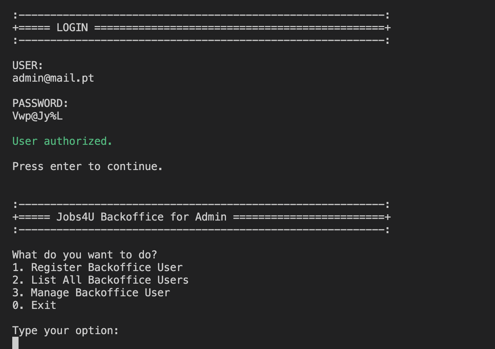
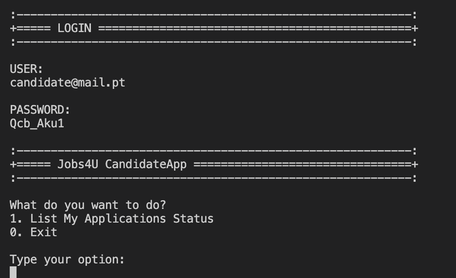

# Jobs4U - Sistema de Gestão de Recrutamento e Seleção

## Capturas de Ecrã

### Aplicação BackOffice


### Aplicação de Candidato


## 1. Descrição

O Jobs4U é uma aplicação desenvolvida para ajudar empresas de recrutamento a simplificar e otimizar processos relacionados com a seleção e recrutamento de candidatos. O sistema oferece processos de recrutamento automatizados com interfaces para todos os utilizadores envolvidos no Jobs4U (administradores de sistema, gestores de clientes, operadores e candidatos).

A aplicação agiliza todo o processo de recrutamento, desde a publicação de vagas até à seleção de candidatos, suportando funcionalidades como:
- Gestão de ofertas de emprego
- Processamento de candidaturas
- Verificação de requisitos
- Gestão de entrevistas
- Classificação de candidatos
- Comunicação com clientes e candidatos

## 2. Estrutura do Projeto

O projeto está organizado em vários componentes:

- **Aplicação BackOffice**: Aplicação principal utilizada por administradores, gestores de clientes e operadores
- **Aplicação de Candidato**: Aplicação de consola para candidatos visualizarem candidaturas e receberem notificações
- **Bot de Ficheiros de Candidaturas**: Processa ficheiros de candidatura para importação no sistema
- **Servidor de Acompanhamento**: Gere a comunicação entre candidatos e a base de dados
- **Plugins de Requisitos de Emprego e Entrevistas**: Processamento de linguagem baseado em ANTLR para avaliação de requisitos e entrevistas

## 3. Requisitos do Sistema

- Java JDK 11 ou superior
- Maven 3.6 ou superior
- ANTLR 4.10 ou superior
- Compilador C/C++ (GCC ou equivalente)
- Motor de Base de Dados H2 (incluído no projeto)
- Git

## 4. Guia de Instalação

### 4.1 Passos Comuns para Todas as Plataformas

1. Clonar o repositório:
   ```bash
   git clone https://github.com/seu-utilizador/jobs4u.git
   ```

2. Certifique-se de que o JAVA_HOME está configurado para a pasta de instalação do JDK e que o Maven está no PATH do sistema.

### 4.2 Instalação Específica por Plataforma

#### 4.2.1 Windows

1. Instalar as ferramentas necessárias:
    - Descarregue e instale o Java JDK 11+ a partir de [Oracle](https://www.oracle.com/java/technologies/javase-jdk11-downloads.html)
    - Descarregue e instale o Maven a partir de [Apache Maven](https://maven.apache.org/download.cgi)
    - Descarregue e instale o Git a partir de [Git para Windows](https://gitforwindows.org/)
    - Instale o ANTLR usando o Maven (incluído nas dependências do projeto)
    - Instale um compilador C/C++:
      ```
      // Opção 1: MinGW
      choco install mingw
      
      // Opção 2: Visual Studio Build Tools
      // Descarregue e instale a partir de https://visualstudio.microsoft.com/downloads/
      ```

2. Configure as variáveis de ambiente:
   ```
   setx JAVA_HOME "C:\Program Files\Java\jdk-11"
   setx PATH "%PATH%;%JAVA_HOME%\bin;C:\Program Files\Maven\bin"
   ```

3. Construa o projeto:
   ```
   .\build-all.bat
   ```

#### 4.2.2 macOS

1. Instale as ferramentas necessárias usando Homebrew:
   ```bash
   # Instale o Homebrew se ainda não estiver instalado
   /bin/bash -c "$(curl -fsSL https://raw.githubusercontent.com/Homebrew/install/HEAD/install.sh)"
   
   # Instale Java, Maven e ANTLR
   brew install openjdk@11
   brew install maven
   brew install antlr
   
   # Instale o compilador C (incluído no macOS, mas certifique-se de que as ferramentas de linha de comando do Xcode estão instaladas)
   xcode-select --install
   ```

2. Configure as variáveis de ambiente:
   ```bash
   echo 'export JAVA_HOME=$(/usr/libexec/java_home -v 17)' >> ~/.zshrc
   echo 'export PATH=$JAVA_HOME/bin:$PATH' >> ~/.zshrc
   source ~/.zshrc
   ```

3. Construa o projeto:
   ```bash
   chmod +x build-all.sh
   ./build-all.sh
   ```

#### 4.2.3 Linux (Ubuntu/Debian)

1. Instale as ferramentas necessárias:
   ```bash
   # Atualize a lista de pacotes
   sudo apt update
   
   # Instale Java, Maven e ferramentas de compilação
   sudo apt install -y openjdk-11-jdk maven build-essential
   
   # Instale ANTLR
   sudo apt install -y antlr
   ```

2. Configure as variáveis de ambiente:
   ```bash
   echo 'export JAVA_HOME=/usr/lib/jvm/java-11-openjdk-amd64' >> ~/.bashrc
   echo 'export PATH=$JAVA_HOME/bin:$PATH' >> ~/.bashrc
   source ~/.bashrc
   ```

3. Construa o projeto:
   ```bash
   chmod +x build-all.sh
   ./build-all.sh
   ```

### 4.3 Considerações Especiais para Componentes ANTLR e C

#### Configuração do ANTLR

O projeto utiliza ANTLR para processamento de linguagem em requisitos de emprego e entrevistas. O processo de compilação gere automaticamente o ANTLR, mas se precisar de trabalhar diretamente com ficheiros de gramática:

1. Certifique-se de que o ANTLR está instalado:
   ```bash
   # Verificar a instalação do ANTLR
   antlr -version
   ```

2. Compilar manualmente ficheiros de gramática (se necessário):
   ```bash
   # Navegue para o diretório de gramática
   cd src/main/antlr4

   # Gere ficheiros ANTLR
   antlr -no-listener -visitor JobRequirements.g4
   antlr -no-listener -visitor InterviewModel.g4
   ```

#### Componentes C com Mutex e Threads

O Bot de Ficheiros de Candidaturas utiliza componentes C com mutex e threads para processamento de ficheiros. Para compilar estes componentes manualmente:

**Windows:**
```batch
cd scomp
nmake -f makefile
```

**macOS/Linux:**
```bash
cd scomp
make
```

## 5. Executar o Sistema

Depois de construir o projeto com `build-all.sh`, pode executar as diferentes aplicações. Cada comando abaixo deve ser executado a partir do diretório raiz do projeto.

### 5.1 Aplicação BackOffice

A aplicação BackOffice funciona de forma independente e não requer o servidor Follow-Up.

```bash
cd jobs4u.backofficeApp
mvn dependency:copy-dependencies
java -cp "target/jobs4u.backofficeApp-0.1.0.jar:target/dependency/*" BackOffice
cd ..  # Voltar ao diretório raiz
```

### 5.2 Servidor Follow-Up

O servidor Follow-Up deve estar em execução antes de iniciar a aplicação de Candidato. Escuta na porta 1027 e gere autenticação e notificações.

```bash
cd jobs4u.followUpServer
mvn dependency:copy-dependencies
java -cp "target/jobs4u.followUpServer-0.1.0.jar:target/dependency/*:../jobs4u.core/target/jobs4u.core-0.1.0.jar:../jobs4u.persistence/target/jobs4u.persistence-0.1.0.jar:../jobs4u.infrastructure.application/target/jobs4u.infrastructure.application-0.1.0.jar:../jobs4u.common/target/jobs4u.common-0.1.0.jar" FollowUpServerApp
cd ..  # Voltar ao diretório raiz
```

**Importante:** Mantenha este servidor em execução num terminal separado enquanto utiliza a aplicação de Candidato.

### 5.3 Aplicação de Candidato

**Requer que o servidor Follow-Up esteja em execução primeiro.**

```bash
cd jobs4u.candidateApp
mvn dependency:copy-dependencies
java -cp "target/jobs4u.candidateApp-0.1.0.jar:target/dependency/*:../jobs4u.core/target/jobs4u.core-0.1.0.jar:../jobs4u.persistence/target/jobs4u.persistence-0.1.0.jar:../jobs4u.infrastructure.application/target/jobs4u.infrastructure.application-0.1.0.jar:../jobs4u.common/target/jobs4u.common-0.1.0.jar" Candidate
cd ..  # Voltar ao diretório raiz
```

### 5.4 Modo Bootstrap

A aplicação BackOffice pode ser executada em modo bootstrap, o que inicializa a base de dados com dados de exemplo. Quando solicitado, digite 'y' para executar em modo bootstrap.

## 6. Configuração do Sistema

### 6.1 Configuração da Base de Dados

O sistema utiliza um motor de base de dados H2 para persistência de dados. As configurações de ligação à base de dados podem ser modificadas no ficheiro `application.properties`:

```
# Ligação à Base de Dados
database.url=jdbc:h2:./db/jobs4u
database.user=jobs4u
database.password=password
```

### 6.2 Configuração do Servidor

As configurações do Servidor de Acompanhamento podem ser configuradas em `server.properties`:

```
# Configuração do Servidor
server.port=1027
server.timeout=30000
server.hostname=localhost
```

## 7. Executar Testes

Para executar os testes automatizados:

```bash
mvn test
```

## 8. Documentação do Projeto

A documentação detalhada do projeto está disponível na pasta `docs` do repositório. Isto inclui:
- Diagramas de sequência para histórias de utilizador
- Modelo de domínio
- Documentação técnica

Pode gerar diagramas PlantUML para documentação executando:

```bash
./generate-plantuml-diagrams.sh
```

## 9. Resolução de Problemas

### Problemas Comuns

1. **Erros de ligação à base de dados**
    - Verifique se a base de dados H2 está corretamente configurada em `application.properties`
    - Verifique se os ficheiros da base de dados não estão bloqueados por outro processo

2. **Problemas de gramática ANTLR**
    - Regenere ficheiros ANTLR usando os comandos na Secção 4.3
    - Verifique se há erros de sintaxe nos ficheiros de gramática

3. **Falhas na compilação de componentes C**
    - Verifique se o compilador C apropriado está instalado
    - Verifique se há bibliotecas ou dependências em falta

### Problemas Específicos por Plataforma

#### Windows
- Se ocorrerem problemas relacionados com o caminho, certifique-se de que as variáveis PATH do sistema estão corretamente definidas
- Para compilação de componentes C, verifique se o Visual Studio Build Tools ou MinGW está corretamente instalado

#### macOS
- Se ocorrerem problemas de permissões com scripts, execute `chmod +x *.sh` para torná-los executáveis
- Para problemas com ANTLR, verifique a instalação com `brew info antlr`

#### Linux
- Se ocorrerem problemas de bibliotecas partilhadas, execute `sudo ldconfig` para atualizar a cache de bibliotecas partilhadas
- Para problemas de compilação de componentes C, verifique se o pacote build-essential está instalado
