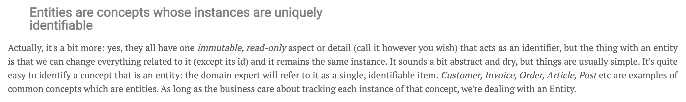
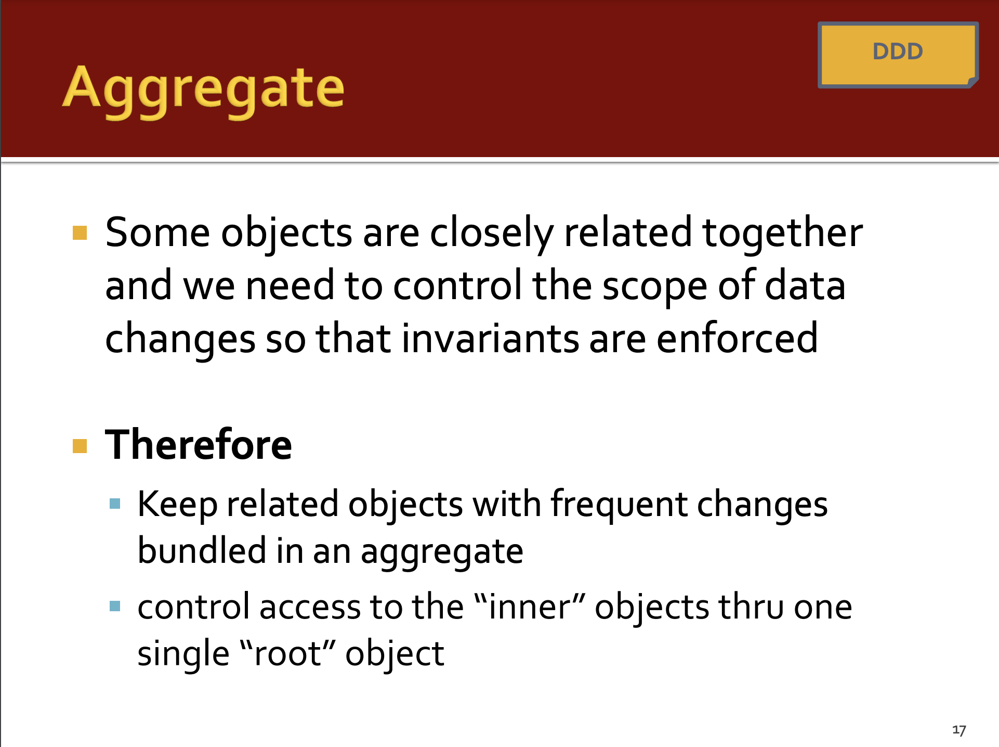
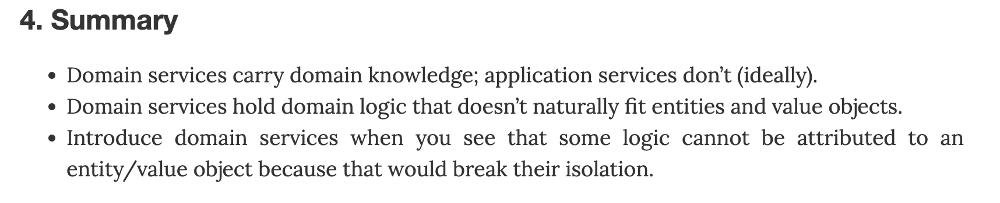
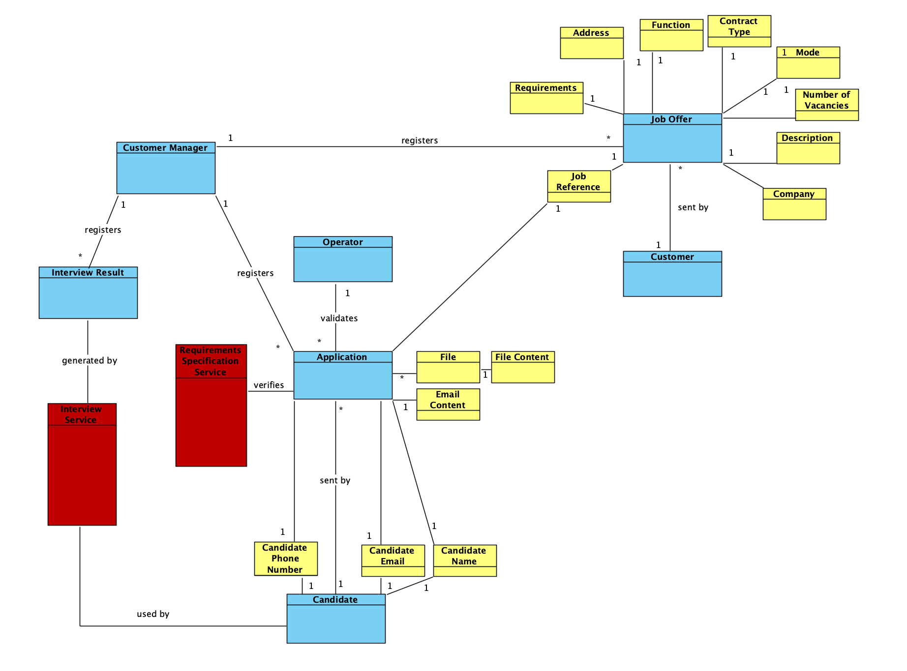

# US G006

*Elaborate the Domain Model using DDD.*

## 1. Context

*This is a new task. DDD stands for "Domain-Driven Design" which is a software develompent appproach that focuses on the processes and rules of the projects domain.*

## 2. Requirements

**US G006** As Project Manager, I want the team to elaborate a Domain Model using DDD.

**Acceptance Criteria:**

- G006.1. The entities should be identified.
- G006.2. The value objects should be identified.
- G006.3. The aggregates should be identified.
- G006.4. If responsibility atribution of a task is not clear, a service should be created for executing it.

**Dependencies/References:**

*Regarding this requirement we understand that it relates to the future Class Diagram.*

## 3. Analysis

### 3.1. Entities and Value Objects 

The folowing screenshot was taken from https://blog.sapiensworks.com/post/2016/07/29/DDD-Entities-Value-Objects-Explained.

 
So, entities need to be single identifiable items that matter to the buisness.
Based on this information, we defined the following entities inside the business domain:

- Customer Manager
- Customer
- Candidate
- Operator
- Job Offer
- Application
- Application Result
- Interview
- Interview Result
- Language Engineer
- Requirement Specefications Module
- Interview Module

On the other hand, value objects are objects that are not defined by their identity, but rather by a set of attributes. They are immutable and are used to describe entities.
We associated each entity with it´s respective value objects.

For example:

### 3.2. Aggregates
The folowing screenshot was taken from https://moodle.isep.ipp.pt/ (Author: Prof. Pedro Gandra Sousa)

Based on this definition, we aggregated the entities with their respective value objects since they are related.

For example:

### 3.3. Services
The follwing screenshot was taken from https://enterprisecraftsmanship.com/posts/domain-vs-application-services/

When the responsibility atribution of a task is not clear, a service can be created for executing it.
There were also some taks that we identified as services because they would overwelm the entities if they were included in them.
For example, the evaluation of an interview could have been included in the Interview entity, but it would make it too complex.

Example:

## 4. Design

### 4.1. Realization

### Domain Model 1

*This was the first domain model aproach.*

*Problems:*
* Usage of system users which are irrelevant for the domain model.
* Not kwoing the difference between entities and value objects yet.
* Not knowing how "Interview" should be represented.
* Too simple.

*At this point we started asking the client questions and improved our aproach.*

**Question:** "As entrevistas são feitas presencialmente? Se sim, quem é responsável por registar essas respostas no sistema?"

**Answer:** "O meio usado para as entrevistas está fora do âmbito do sistema. Podem ser presenciais, remotas (ex: telefone ou outro meio). Independentemente do meio, o Customer Manager é o responsável por registar as respostas no sistema, através da submissão (upload) do ficheiro de texto com as respostas do candidato."

**Question:** "Quem é responsável por analisar as candidaturas (applications)?"

**Answer:** "Será o Customer Manager. Este analisa as candidaturas e decide o ranking dos candidatos."

### Domain Model 2

*In our second aproach, we started to distinguish entities from value objects and added services.*

*Problems:*
* Sharing value objects might not be necessary.
* It is not the Candidate who uses the "Interview Serivce", but the Customer Manager.
* The services do not have the correct names.
* Each object must be identified with a stereotype (entity, value object, service).
* The "requirement specification service" does not generate anything.

### Domain Model 3.1 and 3.2
By the end of Sprint A we had two alternatives for the domain model.

#### Domain Model 3.1

#### Domain Model 3.2

In domain model 3.1, the Application Result connects to the Job Opening and the Interview to the Candidate.
On the other hand, in domain model 3.2, the Application Result and the Interview Result both connect to the Application which connects to the Job Opening.

We decided that 3.2 was the best option because the client refered to us that Applications hold other information like interviews and application results.
It also shows in a better way how the entities are connected.
In Domain Model 3.2 we also deleted the File Service since it's an Application Service and not a Domain Service.

### 4.2. Applied Patterns
We applied a Domain-Driven Design approach to the development of the domain model.

### 4.3. Tests

**Test 1:** *Verifies that the entities were identified.*

**Refers to Acceptance Criteria:** G006.1

The entities were identified.

**Test 2:** *Verifies that the vale objects were identified.*

**Refers to Acceptance Criteria:** G006.2

The value Objects were identified.

**Test 3:** *Verifies that the aggregates were identified.*

**Refers to Acceptance Criteria:** G006.3

Every entity belongs to an aggregate.

**Test 4:** *Verifies that services were identified, when needed.*

**Refers to Acceptance Criteria:** G006.4

Two services were identified. One for the evaluation of the interviews and another for the requirement specifications.

## 5. Implementation

This is the domain model that was created using Visual Paradigm.

## 6. Integration/Demonstration

n/a

## 7. Observations

The is only the Domain Model during Sprint A. Throughout the project, the domain model will be updated and improved.