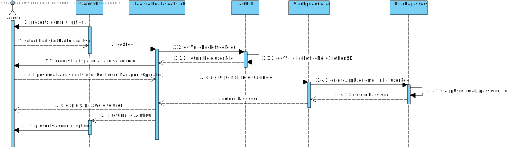
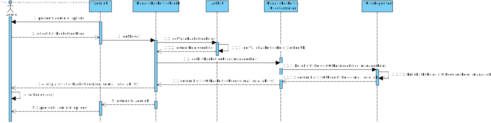
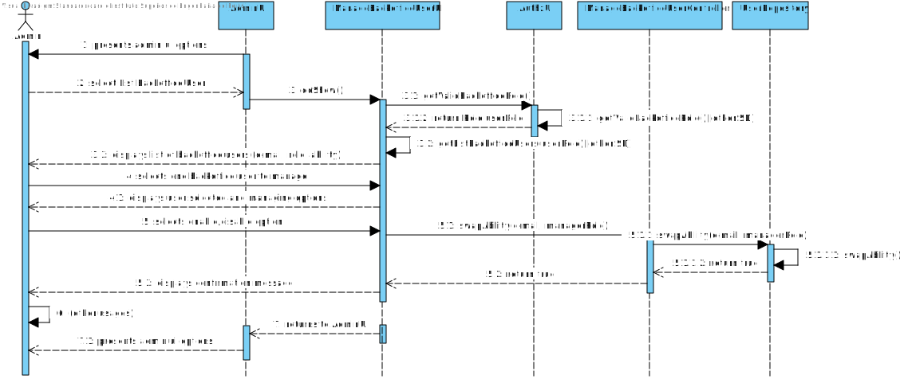

# US 1000 - Register, disable/enable, and list users of the backoffice.

## 1. Context

This is the first time the US is assigned.
The US will allow the ADMIN user to manage all backoffice users existence and access within the system.
It will also allow to monitor the users present in the system and their status.

## 2. Requirements

**US 1000** As Administrator, I want to be able to register, disable/enable, and list users of the backoffice.

**Acceptance Criteria:**

- 1000.1. Only the admin can register, disable/enable backoffice users.
- 1000.2. On user registration, it must be enabled by default.
- 1000.3. Enable/Disable users must only restraint access to system, and no other type of interaction.
- 1000.4. A user can be enabled/disabled multiple times.
- 1000.5. A user has to have a status (enable by default).

**Dependencies/References:**

It has dependency on [G007](../us_g007/readme.md), due to authentication and authorization process.

**Question and Answers**

> *"A11. (...) No entanto, são referidos no nome da empresa e o seu endereço no âmbito de um job opening.
Quanto aos utilizadores (representante da empresa que acede à Customer App) eu diria que serão dados similares ao do Candidate.
Quando aos funcionários da empresa, eu diria que é importante garantir que é usado o email para identificar qualquer utilizador do sistema.
Penso que será importante para cada utilizador termos o nome completo assim como um short user name (que deverá ser único).
Actualização em 2024-03-21: O Product Owner reconsiderou e decidiu que o short user name é dispensável uma vez que para autenticação dos utilizadores se deve usar apenas o email e a password."*

> *"A97. No contexto da US1000 deve ser possível ativar e desativar utilizadores. 
Suponho que por omissão devem estar ativos."*

> *"A20. (...) Relativamente aos papéis “internos” eu diria que devemos considerar uma hierarquia de acessos.
O Admin pode fazer “tudo” o que os outros fazem.
Segue-se o Customer Manager e por último o Operator."*

> *"A78. (...) US2000a is for the Operator to manually register a candidate and his/her user in the system.
US2002 is for import of the applications from the data iin the files produced by the application file bot.
If the candidate does not exist, it should be created.
I think there is no registration of a candidate by the admin."*

> *"A23. O enable/disable dos users é apenas para controlar os acessos ao sistema.
O estado, no processo de candidatura, é o estado da candidatura de um candidato a um job opening, não está diretamente relacionado com o enable/disable dos users."* 

> *"Q72. Tiago - Multiple enable/disable (US1000) – Can a user (from the backoffice, for example) be enabled/disabled multiple times? A72. Yes"*

## 3. Analysis

From the context and requirements, it was identified the following major features to take in consideration towards the design. <br>
- A user needs to have an ability towards the system: enable/disable -, and no null or dubious ability. <br>
- The ADMIN is the only user that can manage backoffice users (registration and enabling), and only those. <br>
- Listing the users must present the e-mail and role assigned. <br>
- Bootstrapping data can be generated. <br>

## 4. Design

### 4.1. Realization

Admin UI has an option to register a backoffice user. <br>
Admin UI has an option to list backoffice users. <br>
Admin UI has an option to enable/disable users after listing them. <br>

The user registration will use previous implemented methods. <br>
These methods will be adjusted to ensure that ADMIN can only register backoffice users. <br>
It will also be added the value object ABILITY to the AppUser, and to be set as enable, by default, upon user registry. <br>

The listing of backoffice users will use the previous implemented method of findAll(), adapted in a way that: <br>
- Only an ADMIN role can use this version. <br>
- Only backoffice users are listed here. <br>

The enable/disable feature will work as a switch button. <br>
Taking this action on backoffice users will only be possible by ADMIN users. <br>
The action only changes the current ability on the user: if it is enabled, it will be disabled, and vice-versa. <br>

#### Register Backoffice User

| Interaction ID                                                                   | Question: Which class is responsible for...           | Answer               | Justification (with patterns) |
|:---------------------------------------------------------------------------------|:------------------------------------------------------|:---------------------|:------------------------------|
| Step 1 : System presents ADMIN options                                           | ... presenting the ADMIN options?                     | AdminUI              | Pure Fabrication              |
| Step 2 : User selects an option                                                  | ... gathering option?                                 | AdminUI              | Pure Fabrication              |
|                                                                                  | ... calling specific option UI?                       | AdminUI              | Pure Fabrication              |
| Step 3 : System checks permission to register backoffice users                   | ... starting request of permission authorization?     | RegisterBackofficeUI | Pure Fabrication              |
|                                                                                  | ... requesting current session user role?             | AdminUI              | Pure Fabrication              |
|                                                                                  | ... coordinating authentication process?              | AuthzController      | Controller                    |
|                                                                                  | ... getting the role of current session user?         | UserRepository       | Information Expert            |
| Step 4 : System request to type e-mail and select role of the user to be created | ... requesting data and presenting role options?      | RegisterBackofficeUI | Pure Fabrication              |
| Step 5 : User types e-mail and selects role of the user to be created            | ... gathering data?                                   | RegisterBackofficeUI | Pure Fabrication              |
| Step 6 : System creates backoffice user                                          | ... coordinating signup process?                      | SignUpController     | Controller                    |
|                                                                                  | ... validating permissions to create backoffice user? | UserRepository       | Information Expert            |
|                                                                                  | ... creating the backoffice user?                     | UserRepository       | Creator                       |
| Step 7 : System presents the password of the user created                        | ... show result?                                      | RegisterBackofficeUI | Pure Fabrication              |

#### List Backoffice User

| Interaction ID                                                               | Question: Which class is responsible for... | Answer                         | Justification (with patterns) |
|:-----------------------------------------------------------------------------|:--------------------------------------------|:-------------------------------|:------------------------------|
| Step 1 : (uses step 1, 2 and 3 of Register Backoffice User table)            | ...                                         | ...                            | ...                           |
| Step 2 : System builds a list of backoffice users (e-mail, role and ability) | ... requesting list to be built?            | ManageBackofficeUserUI         | Pure Fabrication              |
|                                                                              | ... coordinating list capture?              | ManageBackofficeUserController | Controller                    |
|                                                                              | ... building the backoffice users list?     | UserRepository                 | Information Expert            |
| Step 3 : System presents the list of users (e-mail, role and ability)        | ... show result?                            | ManageBackofficeUserUI         | Pure Fabrication              |


#### Enable/Disable Backoffice User

| Interaction ID                                                         | Question: Which class is responsible for... | Answer                         | Justification (with patterns) |
|:-----------------------------------------------------------------------|:--------------------------------------------|:-------------------------------|:------------------------------|
| Step 1 : (uses step 1, 2 and 3 of Register Backoffice User table)      | ...                                         | ...                            | ...                           |
| Step 2 : (uses step 1, 2 and 3 of List Backoffice User table)          | ...                                         | ...                            | ...                           |
| Step 3 : User selects one backoffice user                              | ... gathering user selected?                | ManageBackofficeUserUI         | Pure Fabrication              |
| Step 4 : System displays backoffice user selected and managing options | ... display backoffice user selected?       | ManageBackofficeUserUI         | Pure Fabrication              |
|                                                                        | ... display managing options?               | ManageBackofficeUserUI         | Pure Fabrication              |
| Step 5 : User selects enable/disable option                            | ... gather option selected?                 | ManageBackofficeUserUI         | Pure Fabrication              |
|                                                                        | ... coordinating ability swap?              | ManageBackofficeUserController | Controller                    |
|                                                                        | ... swapping the backoffice user ability?   | UserRepository                 | Information Expert            |
| Step 6 : System presents feedback                                      | ... show result?                            | ManageBackofficeUserUI         | Pure Fabrication              |

According to the taken rationale, the conceptual classes promoted to software classes are:

* Ability

Other software classes (i.e. Pure Fabrication) identified:

* AdminUI
* RegisterBackofficeUI
* ManageBackofficeUserUI
* AuthzController
* SignUpController
* ManageBackofficeUserController
* UserRepository

### 4.2. Sequence Diagram







### 4.3. Tests

**Test 1:** *Verifies that only admin users can use functionalities to register, enable/disable and list users.*
<br> **Refers to Acceptance Criteria:** 1000.1.

```java
@Test
public void verifyOnlyAdminCanUseUsFunctionalities() {  }
````

**Test 2:** *Validates that ability is set to enable upon user creation.*
<br> **Refers to Acceptance Criteria:** 1000.2.

```java
@Test
public void verifyAbilityIsSetAsEnabledWhenUserIsRegistered() {  }
````

**Test 3:** *Checks if enabled users can access the system and disabled users can't, with proper message to contact admin.*
<br> **Refers to Acceptance Criteria:** 1000.3.

```java
@Test
public void verifyAccessOnlyToEnabledUsers() {  }
````

**Test 4:** *Verify that a user can be enabled and disabled multiple times.*
<br> **Refers to Acceptance Criteria:** 1000.4.

```java
@Test
public void verifyMultipleEnablingDisabling() {  }
````

## 5. Implementation

(TODO) <br>

> Commit list (descending)
>
> (...)

## 6. Integration/Demonstration

Changes to previous US had to be made, in order to support the ability parameter. <br>
Also, registration and enabling required a new layer of validation. <br>
This layer checks if the role that made the action, has permissions to act on the intended role user. <br>

## 7. Observations

A bootstrap was created to generate base users and other data upon app start. <br>
Persistence .xml was set do <drop-and-create>. <br>