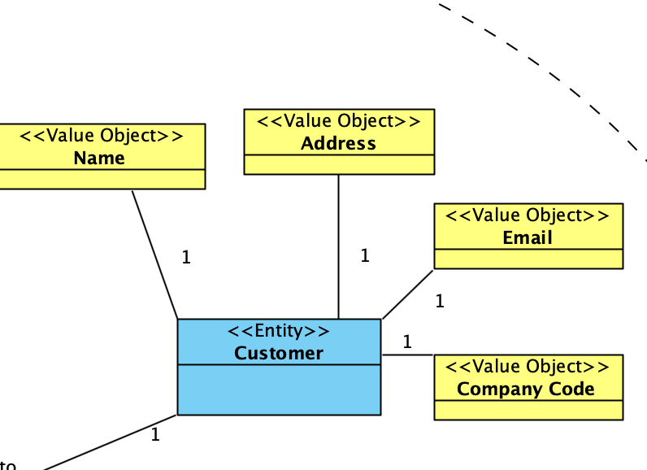
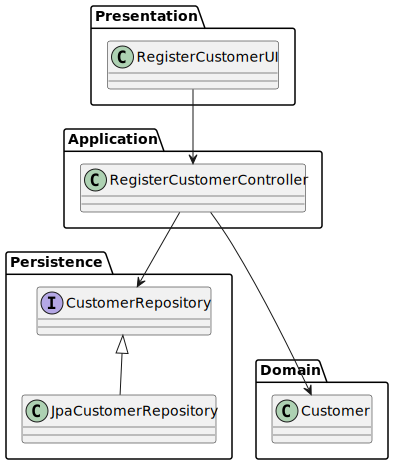
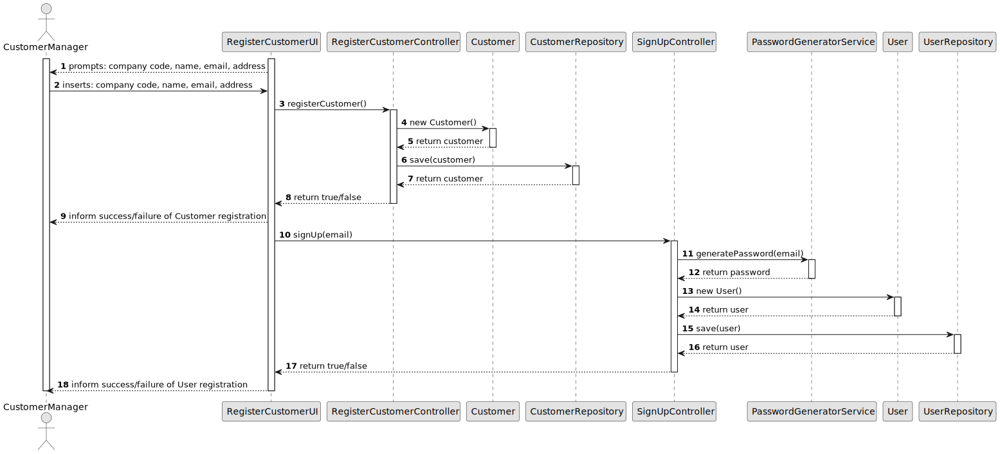

# US 1001

## 1. Context

*Customers from different companies will send Job offers to Customer Managers of Jobs4U.
The way these Job Offers are sent is out of the scope of the System.
Each Customer Manager should be able to register a Customer in the system that automatically creates a user for that customer.*

## 2. Requirements

**US 1001** As Customer Manager I want to register a customer and that the system automatically creates a user for that customer.

**Acceptance Criteria:**

- 1001.1. The Customer Manager must provide the following information: Company Code, Company Name, Company Email, Company Address.

- 1001.2. The Company Code must be 10 characters long at most.

- 1001.3. The Company Code must be unique.


**Dependencies/References:**

*Regarding this requirement we understand that it relates to US1002. JobOpening must be associated to a Customer.*


## 3. Analysis
### 3.1. Relevant Domain Model Excerpt


### 3.2. Questions and Answers
> **Question:** No enunciado não está explicita a informação a recolher para os Customers? Qual a informação necessária? E quando aos funcionários da empresa?
> 
> **Answer:** De facto isso não está explicito. No entanto, são referidos no nome da empresa e o seu endereço no âmbito de um job opening. Quanto aos utilizadores (representante da empresa que acede à Customer App) eu diria que serão dados similares ao do Candidate. Quando aos funcionários da empresa, eu diria que é importante garantir que é usado o email para identificar qualquer utilizador do sistema. Penso que será importante para cada utilizador termos o nome completo assim como um short user name (que deverá ser único). Actualização em 2024-03-21: O Product Owner reconsiderou e decidiu que o short user name é dispensável uma vez que para autenticação dos utilizadores se deve usar apenas o email e a password.

> **Question:** Customer tem que ter morada e nome da empresa ou se basta essa informação estar no job opening?
>
> **Answer:** Devemos registar nome e morada do customer. Para cada job opening a morada pode ser especifica (e diferente da morada do customer).


### 3.3. Other Remarks
After analysing more deeply the Specification Document and asking some questions to the client, we made the following adjustments to the domain model:
* Customer is a part of the same Aggregate as the Job Opening.
* Customer has a Company Code and an Email(for the user).

## 4. Design

### 4.1. Realization

| Interaction ID                                                                            | Question: Which class is responsible for...                                         | Answer                     | Justification (with patterns) |
|:------------------------------------------------------------------------------------------|:------------------------------------------------------------------------------------|:---------------------------|:------------------------------|
| Step 1 : Customer Manager requests to register a Customer                                 | 	... requesting Customer Info?                                                      | RegisterCustomerUI         | Pure Fabrication              |
| 		                                                                                        | 	... validating Customer Managers inputs?                                           | Customer                   | Information Expert            |
| Step 2 : System registers Customer                                                        | 	... coordination between users request and saving the Job Opening in the Database? | RegisterCustomerController | Controller                    |
|                                                                                           | 	... creating the Customer?                                                         | Customer                   | Creater                       |
|                                                                                           | 	... persisting the Job Opening?                                                    | CustomerRepository         | Information Expert            |
| Step 3 : System automatically creates a user                                              | 	... creating a user?                                                               | SignUpController           | Controller                    |
|                                                                                           | 	... persisting ther user?                                                          | UserRepository             | Information Expert            |
| Step 4 : System informs the Customer Manager of Success/insuccess of the operation			  		 | 	... Showing result?                                                                | RegisterCustomerUI         | Pure Fabrication              |

According to the taken rationale, the conceptual classes promoted to software classes are:

* Customer

Other software classes (i.e. Pure Fabrication) identified:

* RegisterCustomerUI
* RegisterCustomerController
* CustomerRepository
* SignUpController
* UserRepository


### 4.2. Class Diagram



### 4.3. Sequence Diagram



### 4.4. Tests

**Test 1:** *Verifies that the Customer has the folling information: Company Code, Company Name, Company Email, Company Address.*

**Refers to Acceptance Criteria:** G001.1


```java
@Test
void ensureCustomerHasFullInformation() {
    //Success
    assert (customer.getCode() != null);
    assert (customer.getName() != null);
    assert (customer.getEmail() != null);
    assert (customer.getAddress() != null);

    //Failure
    Assertions.assertThrows(IllegalArgumentException.class, () -> new Customer(null, null, null, null));
}

````

**Test 2:** *Verifies that the Company Code has a maximum of 10 caracteres*

**Refers to Acceptance Criteria:** G001.2

```java
@Test
void ensureCompanyCodeHasMaxLength() {
    //Success
    CompanyCode companyCode = customer.getCode();
    assert (companyCode.getCode().length() <= 10);

    //Failure
    Assertions.assertThrows(IllegalArgumentException.class, () -> new CompanyCode("12345678901"));
}

````


## 5. Implementation
**Customer**
    
```java
package jobOpeningManagement.domain;

import eapli.framework.domain.model.AggregateRoot;
import eapli.framework.general.domain.model.EmailAddress;
import jakarta.persistence.*;
import lombok.Getter;

import java.util.ArrayList;
import java.util.List;

@Entity
public class Customer implements AggregateRoot<CompanyCode> {
    @Id
    @GeneratedValue(strategy = GenerationType.IDENTITY)
    private Long id;
    @Getter
    @Embedded
    @Column(unique = true)
    private CompanyCode code;
    @Getter
    @Column
    private String name;
    @Getter
    @Column
    private EmailAddress email;
    @Getter
    @Embedded
    private Address address;
    @OneToMany(mappedBy = "company", cascade = CascadeType.ALL)
    private List<JobOpening> jobOpenings = new ArrayList<JobOpening>();

    protected Customer() {
        // for ORM
    }

    public Customer(CompanyCode code, String name, EmailAddress email, Address address) {
        if (code == null || name == null || email == null || address == null) {
            throw new IllegalArgumentException();
        }
        this.code = code;
        this.name = name;
        this.email = email;
        this.address = address;
    }

    @Override
    public String toString() {
        return "Customer{" +
                "getCode=" + code +
                ", name='" + name + '\'' +
                ", email='" + email + '\'' +
                ", address=" + address +
                '}';
    }

    @Override
    public boolean sameAs(Object other) {
        Customer customer = (Customer) other;
        return this.code.equals(customer.code);
    }

    @Override
    public CompanyCode identity() {
        return code;
    }
}


```

**RegisterCustomerUI**

```java
package presentation.CustomerManager;

import authzManagement.domain.User;
import authzManagement.repositories.UserRepository;
import eapli.framework.presentation.console.AbstractUI;
import infrastructure.persistance.PersistenceContext;
import jobOpeningManagement.application.RegisterCustomerController;
import jobOpeningManagement.domain.Address;
import jobOpeningManagement.domain.CompanyCode;
import authzManagement.application.SignUpController;
import authzManagement.domain.Email;
import utils.Utils;

public class RegisterCustomerUI extends AbstractUI {
    private RegisterCustomerController ctrl = new RegisterCustomerController();
    private SignUpController signUpController = new SignUpController();

    @Override
    protected boolean doShow() {
        UserRepository repo = PersistenceContext.repositories().users();
        User user = new User(new Email("user@isep.ipp.pt"), "password");
        repo.save(user);

        CompanyCode code = null;
        String name = "";
        Email email = null;
        Address address = null;

        do {
            code = new CompanyCode(Utils.readLineFromConsole("Company Code (10 caracteres max): "));
        }while(code == null);

        name = Utils.readLineFromConsole("Name: ");
        do{
            String emailString = Utils.readLineFromConsole("Email: ");
            email = new Email(emailString);
        }while(email == null);

        System.out.println("-ADDRESS-");
        String street, city, postalCode;
        street = Utils.readLineFromConsole(" Street: ");
        city = Utils.readLineFromConsole(" City: ");
        postalCode = Utils.readLineFromConsole(" Postal Code: ");
        address = new Address(street, city, postalCode);

        boolean success = ctrl.registerCustomer(code, name, email, address);
        if(success) {
            System.out.println("Customer registered successfully!");
            success = signUpController.signUp(email);
            if(success) {
                System.out.println("User registered successfully!");
                return true;
            }
            else{
                System.out.println("User registration failed!");
                ctrl.deleteCustomer(code);
                System.out.println("Customer deleted!");
            }
        }
        return false;
    }

    @Override
    public String headline() {
        return "CUSTOMER REGISTRATION";
    }
}


```
**RegisterCustomerController**

```java
package jobOpeningManagement.application;

import infrastructure.persistance.PersistenceContext;
import jobOpeningManagement.domain.Address;
import jobOpeningManagement.domain.CompanyCode;
import jobOpeningManagement.domain.Customer;
import jobOpeningManagement.repositories.CustomerRepository;
import authzManagement.domain.Email;

public class RegisterCustomerController {
    private CustomerRepository repo = PersistenceContext.repositories().customers();

    public boolean registerCustomer(CompanyCode code, String name, Email email, Address address) {
        Customer customer = new Customer(code, name, email, address);
        customer = repo.save(customer);
        return customer != null;
    }

    public boolean deleteCustomer(CompanyCode code) {
        Customer customer = repo.ofIdentity(code).get();
        repo.delete(customer);
        return true;
    }
}


```

**JpaCustomerRepository**

```java
package jpa;

import jakarta.persistence.EntityManager;
import jakarta.persistence.EntityManagerFactory;
import jakarta.persistence.Persistence;
import jakarta.persistence.Query;
import jobOpeningManagement.domain.CompanyCode;
import jobOpeningManagement.domain.Customer;
import jobOpeningManagement.repositories.CustomerRepository;

import java.util.List;
import java.util.Optional;

public class JpaCustomerRepository implements CustomerRepository {

    private EntityManager getEntityManager() {
        EntityManagerFactory factory = Persistence.
                createEntityManagerFactory("default");
        EntityManager manager = factory.createEntityManager();
        return manager;
    }

    @Override
    public <S extends Customer> S save(S entity) {
        EntityManager em = getEntityManager();
        em.getTransaction().begin();
        em.persist(entity);
        em.getTransaction().commit();
        em.close();
        return entity;
    }

    @Override
    public List<Customer> findAll() {
        Query query = getEntityManager().createQuery(
                "SELECT e FROM Customer e");
        List<Customer> list = query.getResultList();
        return list;
    }

    @Override
    public Optional<Customer> ofIdentity(CompanyCode id) {
        Query query = getEntityManager().createQuery(
                "SELECT e FROM Customer e WHERE e.code = :id");
        query.setParameter("id", id);
        Customer customer = (Customer) query.getSingleResult();
        return Optional.of(customer);
    }

    @Override
    public void delete(Customer entity) {
        EntityManager em = getEntityManager();
        em.getTransaction().begin();
        em.remove(entity);
        em.getTransaction().commit();
        em.close();
    }

    @Override
    public void deleteOfIdentity(CompanyCode entityId) {
        EntityManager em = getEntityManager();
        em.getTransaction().begin();
        Query query = em.createQuery(
                "DELETE FROM Customer e WHERE e.code = :id");
        query.setParameter("id", entityId);
        query.executeUpdate();
        em.getTransaction().commit();
        em.close();
    }

    @Override
    public long count() {
        Query query = getEntityManager().createQuery(
                "SELECT COUNT(e) FROM Customer e");
        return (long) query.getSingleResult();
    }
}


```

## 6. Integration/Demonstration

n/a

## 7. Observations

n/a