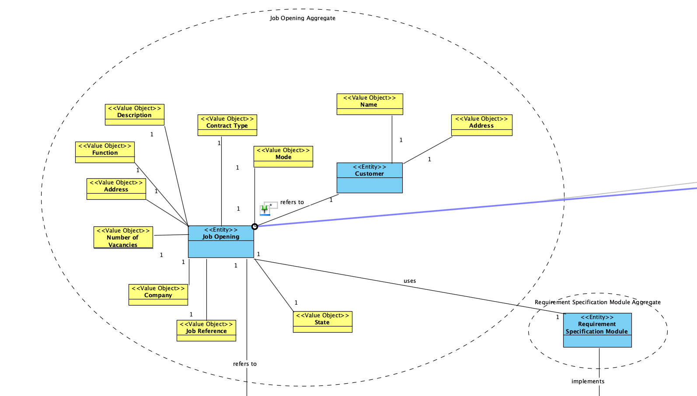
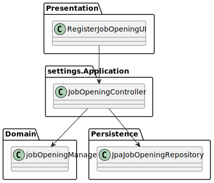
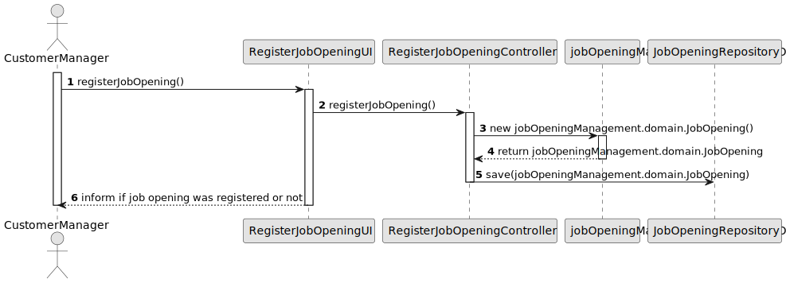

# US 1002

## 1. Context

*Customers from different companies will send Job offers to Customer Managers of Jobs4U.
The way these Job Offers are sent is out of the scope of the System.
Each Customer Manager should be able to register a Job Opening based on the Job Offer sent.*

## 2. Requirements

**US 1002** As Customer Manager, I want to register a job opening.

**Acceptance Criteria:**

- 1002.1. It shouldn't be possible to register a job opening that is already registered.

- 1002.2. The first state of the job opening should be "APPLICATION".
- 1002.1. It shouldn't be possible to register that is already registered.

- 1002.3. The job opening should have the following attributes:
  - Job Reference
  - Title
  - Contract Type
  - Mode
  - Address
  - Company
  - Number of vacancies
  - Description
  - Requirements
  - State

- 1002.4. Job Reference should be based on a Customer code followed by a sequential number (with 10 characters max).
**Dependencies/References:**

*Regarding this requirement we understand that it relates to US1008 because the Customer Manager must select one of the requirements specification that was previously loaded by the Language Engineer.*

## 3. Analysis
### 3.1. Relevant Domain Model Excerpt


### 3.2. Questions and Answers
> **Question:** No contexto em que o Customer Manager regista uma oferta de emprego, como são selecionados/definidos os requisitos para essa job offer?
> 
> **Answer:** O Customer manager regista a job opening (US 1002) e de seguida (normalmente) seleciona qual o requirements specification que é adequado a esse job opening. O requirements specification será um dos que foi “criado” pelo language engineer e registado no sistema.

> **Question:** No job opening é tudo de preenchimento obrigatório ou existem opcionais?
> 
> **Answer:** Os campos referidos na secção 2.2.2 são de preenchimento obrigatório. Os requirements vão ser dinâmicos uma vez que dependem do requirements specification selecionado para aquele job opening (que se baseia numa linguagem).

> **Question:** Sobre a job specification, deve ser o cliente a enviar os requisitos ou é a responsabilidade do customer manager? Qual o conceito de uma job specification?
>
> **Answer:** Tipicamente será o customer que informa o custerm manager dos requisitos mínimos para uma oferta de emprego. O Customer manager verifica se existe já um requirements specification adequado. Caso não existe, com a ajuda do Language Engineer é criado um novo.

> **Question:** Sobre a job specification, deve ser o cliente a enviar os requisitos ou é a responsabilidade do customer manager? Qual o conceito de uma job specification?
>
> **Answer:** Tipicamente será o customer que informa o custerm manager dos requisitos mínimos para uma oferta de emprego. O Customer manager verifica se existe já um requirements specification adequado. Caso não existe, com a ajuda do Language Engineer é criado um novo.


### 3.3. Other Remarks
After analysing more deeply the Specification Document and asking some questions to the client, we made the following adjustments to the domain model:
* Customer is a part of the same Aggregate as the Job Opening.
* Job Opening has a value object called state.
* Job Opening is connected to the Requirement Specification created by the Language Engineer.

## 4. Design

### 4.1. Realization

| Interaction ID                                                                    | Question: Which class is responsible for...                                         | Answer               | Justification (with patterns)            |
|:----------------------------------------------------------------------------------|:------------------------------------------------------------------------------------|:---------------------|:-----------------------------------------|
| Step 1 : Customer Manager requests to register a Job Opening                      | 	... requesting Job Opening Info?                                                   | RegisterJobOpeningUI | Pure Fabrication                         |
| 		                                                                                | 	... validating Customer Managers inputs?                                           | RegisterJobOpeningUI | Pure Fabrication                         |
| Step 2 : System registers Job Opening                                             | 	... coordination between users request and saving the Job Opening in the Database? | RegisterJobOpeningController | Controller                               |
|                                                                                   | 	... creating the Job Opening?                                                      | obOpening   | Creater                                  |
|                                                                                   | 	... saving the Job Opening in the Database?                                        | JobOpeningRepository | Information Expert,<br/>Pure Fabrication |
| Step 3 : Inform the Customer Manager of Success/insuccess of the operation			  		 | 	... Showing result?                                                                | RegisterJobOpeningUI | Pure Fabrication                         |

According to the taken rationale, the conceptual classes promoted to software classes are:

* Job Opening

Other software classes (i.e. Pure Fabrication) identified:

* RegisterJobOpeningUI
* RegisterJobOpeningController
* JobOpeningRepository


### 4.2. Class Diagram



### 4.3. Sequence Diagram



### 4.4. Tests

Include here the main tests used to validate the functionality. Focus on how they relate to the acceptance criteria.

**Test 1:** *Verifies that it is not possible to register a job opening that is already registered*

**Refers to Acceptance Criteria:** G002.1


```
@Test
void ensureJobOpeningIsUnique(){

}
````

**Test 2:** *Verifies that the first state of the job opening is "APPLICATION"*

**Refers to Acceptance Criteria:** G002.2

```
@Test
void ensureJobOpeningHasCorrectState(){

}
````

**Test 3:** *Verifies that the job opening has the following attributes: Job Reference, Title, Contract Type, Mode, Address, Company, Number of vacancies, Description, Requirements, State*

**Refers to Acceptance Criteria:** G002.3

```
@Test
void ensureJobOpeningHasAllAttributes(){

}
````

**Test 4:** *Verifies that the Job Reference is based on a Customer*

**Refers to Acceptance Criteria:** G002.4

```
@Test
void ensureJobReferenceIsFromExistingCustomer(){

}
````

**Test 5:** *Verifies that the Job Reference does not exceed maximum characters*

**Refers to Acceptance Criteria:** G002.4

```
@Test
void ensureJobReferenceDoesNotExceedMaxChars(){

}
````

**Test 6:** *Verifies that the Job Reference uses sequential numbers*

**Refers to Acceptance Criteria:** G002.4

```
@Test
void ensureJobReferenceUsesSequentialNumbers(){

}
````

## 5. Implementation

*In this section the team should present, if necessary, some evidencies that the implementation is according to the design. It should also describe and explain other important artifacts necessary to fully understand the implementation like, for instance, configuration files.*

*It is also a best practice to include a listing (with a brief summary) of the major commits regarding this requirement.*

## 6. Integration/Demonstration

*In this section the team should describe the efforts realized in order to integrate this functionality with the other parts/components of the system*

*It is also important to explain any scripts or instructions required to execute an demonstrate this functionality*

## 7. Observations

*This section should be used to include any content that does not fit any of the previous sections.*

*The team should present here, for instance, a critical prespective on the developed work including the analysis of alternative solutioons or related works*

*The team should include in this section statements/references regarding third party works that were used in the development this work.*