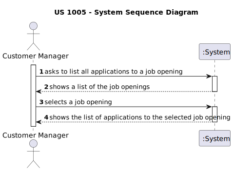

# US 1005

*List all applications for a Job Opening*

## 1. Context

*Whenever a Customer Manager intends to, he should be able to list all the applications that refer to a specific job opening*

## 2. Requirements

**US 1005** As Customer Manager, I want to list all applications for a job opening.

**Acceptance Criteria:**

- 1005.1. Each application must have the candidate identification and the state of his application.

**Dependencies/References:**

*Regarding this requirement we understand that it relates to:*

> 1002-  As Customer Manager, I want to register a job opening
> 
> 2002 - As Operator, I want to register an application of a candidate for a job opening and import all files received.

## 3. Analysis

**Questions/Answers:**

>"Q63:  Relativamente aos critérios para a listagem das candidaturas: Devem aparecer candidaturas que estão a decorrer ou podem aparecer candidaturas feitas no passado? 
Podem aparecer quaisquer candidaturas ou apenas as que tenham sido aceites? Que informação deverá ser mostrada em cada candidatura?"
> 
>"A63. Tal como refere a descrição da US, devem ser listadas todas as candidaturas para um job opening. Faz sentido mostrar todas as candidaturas,
independentemente do seu estado. Assim, para cada cada candidatura deve ser identificado o candidato e o estado da sua candidatura."
> 
> "Q129 Pinto – US1005- O customer manager vai receber a lista de todas as job Openings e selecionará uma, feito isto deve aparecer 
as job applications correspondentes. Que informações das job applications tem que ser mostradas ao listar?"
> 
> "A129. As candidaturas são de um candidato (pessoa), pelo acho que deve aparecer a identificação da candidatura (application), assim como 
a identificação do candidato e o seu nome."

### 3.1. System Sequence Diagram



## 4. Design

### 4.1. Realization

| Interaction ID                                                            | Question: Which class is responsible for... | Answer                | Justification (with patterns) |
|:--------------------------------------------------------------------------|:--------------------------------------------|:----------------------|:------------------------------|
| Step 1 : Customer Manager requests to list applications for a job opening | ... requesting Info?                        | ListApplicationsUI    | Pure Fabrication              |
| Step 2 : System builds list of applications                               | ... requesting list to be built?            | ListApplicationsUI    | Pure Fabrication              |
|                                                                           | ... coordinating list capture?              | ApplicationController | Controller                    |
|                                                                           | ... building the applications list?         | ApplicationRepository | Information Expert            |
| Step 3 : System presents the list of applications                         | ... show result?                            | ListApplicationUI     | Pure Fabrication              |


### 4.2. Class Diagram


### 4.3. Sequence Diagram


### 4.4. Tests

**Test 1:** *Verifies that the job opening ID exists*

```java
@Test
void ensureJobReferenceNotNull() {
    assert (application.getJobReference() != null);
}
````

## 5. Implementation

>

## 6. Integration/Demonstration

>

## 7. Observations

>