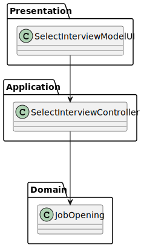
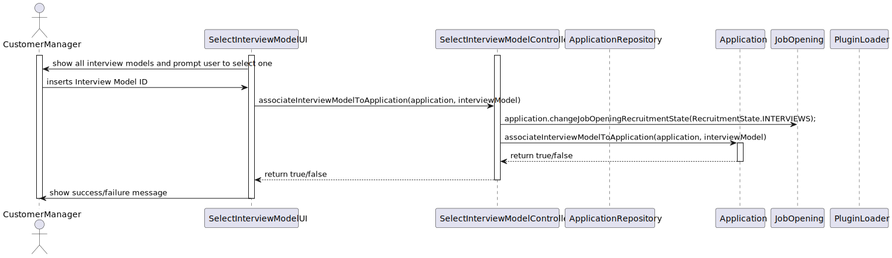

# US 1007

## 1. Context

*The recruitment process for a job opening follows a sequence of phases: application; resume
screen; interviews; analysis; result. The Customer Manager will change them thoughout the process.

## 2. Requirements

**US 1007** As Customer Manager, I want to setup the phases of the process for a job opening.


**Dependencies/References:**

n/a


## 3. Analysis

### 3.1. Questions and Answers
> **Question:** US1007, o identificar do processo de recrutamento pode ser um numero automático ou seja mais especifico?
>
> **Answer:** O job opening tem um identificar. O processo de recrutamento de um job opening é um “tributo” desse job opening. À partida não vejo necessidade de ter um identificador “especial” para o processo de recrutamento (i.e., fases do processo de recrutamento desse job opening).

> **Question:** O recruitment process pode ser identificado pelo job reference?
> 
> **Answer:** A US 1007 refere que quando o Customer Manager vai definir as fases do recrutamento para cada job opening. Penso que não haverá necessidade de ter um identificar explicito para o processo de recrutamento, uma vez que apenas existe um para cada job reference e é especifico de cada job reference. Em termos técnicos, se houver necessidade de um ID para o processo de recrutamento, não tenho nada contra que este seja igual ao job reference.

> **Question:** Em termos de user interface, neste caso para o customer manager como é que deverá ser realizado o setup do recruitment process.
>
> **Answer:** Não tenho requisitos específicos para a user interface. Deve usar princípios de boas práticas de desenho de user interfaces tendo em conta “The customer manager is responsible to setup the process, defining the dates for the phases and if the process includes interviews” (secção 2.2.1)

> **Question:** Quando o customer manager quer dar setup das fases de uma job opening, como é que ele escolhe a mesma? Lista-se todas as job openings de todos os customers que ele é responsável? Ou lista-se todos os customers e ele seleciona o desejado e só depois seleciona a Job Opening
>
> **Answer:** Eu queria evitar constrangir a forma como desenham a UI/UX (para esta ou outras US). Penso que devem usar as melhores práticas. Como product owner gostava que aplicassem as melhores praticas supondo que essas melhoram a interação dos utilizadores. Note ainda que existe a US1003


### 3.3. Other Remarks

## 4. Design

### 4.1. Class Diagram



### 4.2. Sequence Diagram




## 5. Implementation
****


**SelectInterviewModelController**

```java
package applicationManagement.application;

import applicationManagement.domain.Application;
import applicationManagement.repositories.ApplicationRepository;
import infrastructure.persistance.PersistenceContext;
import plugins.Plugin;
import plugins.PluginLoader;

import java.util.List;


public class SelectInterviewModelController {
    ApplicationRepository repo = PersistenceContext.repositories().applications();
    PluginLoader pluginLoader = new PluginLoader();
    String INTERVIEW_PLUGINS_DIRECTORY = "plugins/interview/jar";

    public Application findApplicationById(String id){
        return repo.ofIdentity(id).get();
    }

    public boolean checkIfApplicationHasInterviewModel(Application application){
        return application.checkIfApplicationHasInterviewModel();
    }

    public List<Plugin> getAllInterviewModels(){
        return pluginLoader.loadPlugins(INTERVIEW_PLUGINS_DIRECTORY);
    }

    public boolean associateInterviewModelToApplication(Application application, Object interviewModel){
        boolean success = false;
        success = application.associateInterviewModelToApplication(interviewModel);
        if(success){
            repo.update(application);
            return true;
        }
        return false;
    }
}


```

**Applications**

```java
package applicationManagement.domain;

import eapli.framework.domain.model.AggregateRoot;
import jakarta.persistence.*;
import jobOpeningManagement.domain.JobOpening;
import jobOpeningManagement.domain.RecruitmentState;
import lombok.Cleanup;
import lombok.Getter;
import org.apache.logging.log4j.core.tools.picocli.CommandLine;

import java.io.Serializable;
import java.util.Date;

import java.time.LocalDate;
import java.util.Objects;

@Getter
@Entity
@Table(uniqueConstraints = @UniqueConstraint(columnNames = {"jobReference", "email"}))
public class Application implements AggregateRoot<String>, Serializable {
    @Id
    @GeneratedValue(strategy = GenerationType.SEQUENCE)
    private Long id;

    @Column
    private String jobReference;

    @ManyToOne
    @JoinColumn(name = "email")
    private Candidate candidate;

    @ManyToOne
    @JoinColumn(name = "jobOpening")
    private JobOpening jobOpening;

    @Column
    private ApplicationStatus status;

    @Column
    private LocalDate date;

    @Column
    private String InterviewModel;

    @Column
    private String comment;

    @Column
    private Date applicationDate;

    @Column
    private String filePath;

    @Column
    private String applicationFilesPath;


    protected Application() {
        // for ORM
    }

    public Application(String jobReference, Candidate candidate, JobOpening jobOpening, ApplicationStatus status, Date applicationDate, String comment
            , String interviewModel, String filePath, String applicationFilesPath) {
        this.jobReference = jobReference;
        this.candidate = candidate;
        this.jobOpening = jobOpening;
        this.status = status;
        this.applicationDate = applicationDate;
        this.comment = comment;
        this.InterviewModel = interviewModel;
        this.date = LocalDate.now();
        this.filePath = filePath;
        this.applicationFilesPath = applicationFilesPath;
    }

    public void changeJobOpeningRecruitmentState(RecruitmentState newState) {
        jobOpening.setState(newState);
    }
}

```

**JobOpening**

```java
package jobOpeningManagement.domain;

import eapli.framework.domain.model.AggregateRoot;
import jakarta.persistence.*;
import lombok.Getter;

@Getter
@Entity
public class JobOpening implements AggregateRoot<String> {
    @Id
    @GeneratedValue(strategy = GenerationType.SEQUENCE)
    private Long id;

    @Column(unique = true)
    private String jobReference;

    @Column
    private String title;

    @Enumerated(EnumType.STRING)
    @Column
    private ContractType contractType;

    @Enumerated(EnumType.STRING)
    @Column
    private JobMode mode;

    @Embedded
    @Column
    private Address address;

    @ManyToOne
    @JoinColumn(name = "code")
    private Customer company;

    @Column
    private int numberOfVacancies;

    @Column
    private String jobSpecifications;

    @Column
    private String description;

    @Embedded
    @Column
    private Requirements requirements;

    @Enumerated(EnumType.STRING)
    @Column
    private RecruitmentState state;

    @Transient
    private static int counter = 0;


    protected JobOpening() {
        // for ORM
    }

    public JobOpening(String title, ContractType contractType, JobMode mode, Address address, Customer company, int numberOfVacancies, String description, Requirements requirements) {
        this.title = title;
        this.contractType = contractType;
        this.mode = mode;
        this.address = address;
        this.company = company;
        //ensure that the number of vacancies is a positive number
        if (numberOfVacancies <= 0) {
            throw new IllegalArgumentException("Number of vacancies must be a positive number");
        }
        this.numberOfVacancies = numberOfVacancies;
        this.description = description;
        this.requirements = requirements;
        state = RecruitmentState.APPLICATION;
        counter++;
        //Company code + sequential number
        generateJobReference();
    }

    public void setState(RecruitmentState state) {
        this.state = state;
    }
}

```


**RecruitmentState**

```java
public enum RecruitmentState {
    APPLICATION("Application"),
    SCREENING("Screening"),
    INTERVIEWS("InterviewS"),
    ANALYSIS("Analysis"),
    RESULT("Result");

    private final String state;

    RecruitmentState(String state){
        this.state = state;
    }

    public String getState(){
        return state;
    }

}

```

## 6. Integration/Demonstration

In the implementation of this US, we have only changed the status to interview because the plugin to manage the other phases of the recruitment process will only be developed in the next sprint.


## 7. Observations

n/a