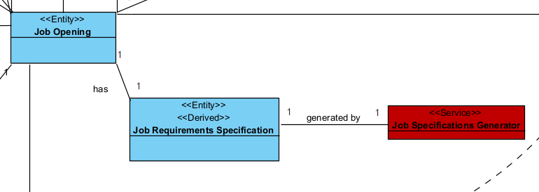
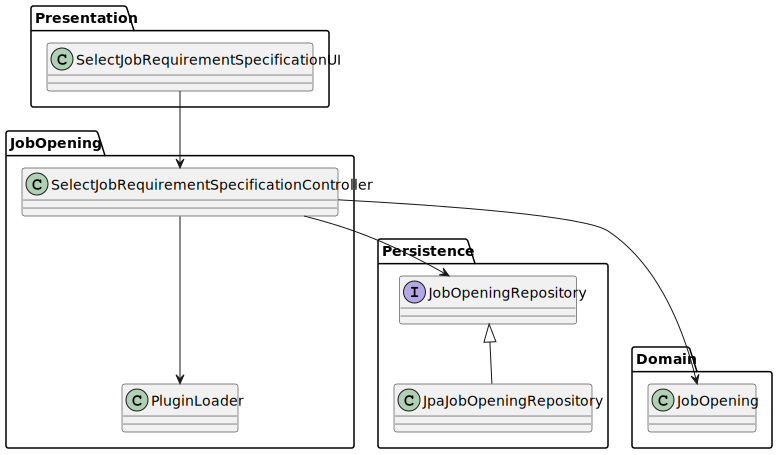
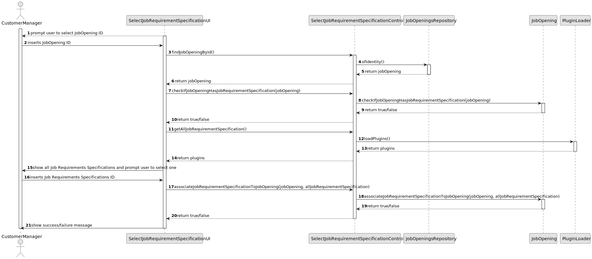

# US 1009

## 1. Context

*Any Job Opening has certain requirements specifications. The Customer Manager may use a plugin that what configured by the Language Engineer that will help him generate a text file with the requirements specifications of a Job Opening.*

## 2. Requirements

**US 1009** As Customer Manager, I want to select the requirements specification to be used for a job opening.

**Acceptance Criteria:**

- 1009.1. If the requirements for a Job Opening were already select, the Costumer Manager cannot change them.


**Dependencies/References:**

*It relates to the US1008 where the Language Engineer must create and deploy the plugins that the Customer Manager will use in this case.*


## 3. Analysis
### 3.1. Relevant Domain Model Excerpt


### 3.2. Questions and Answers
> **Question:**Acerca da User Story da seleção do Job Requirement Specification para o Job Opening, será que o Customer Manager poderá escolher um Job Opening que já tenha um Job Requirement Specification?
>
> **Answer:** Admito que essa situação seja possível para qualquer user story similar. Ou seja, a situação que descreve é equivalente a qualquer situação em que seja necessário fazer uma seleção mas que o utilizador se tenha enganado e deseje optar por outra opção. Deve-se, no entanto, garantir que o sistema se mantenha num estado consistente.


### 3.3. Other Remarks
The plugins (jar files) are in directory plugins/JobRequirements/jar.

## 4. Design

### 4.1. Realization

| Interaction ID                                                                                           | Question: Which class is responsible for...                                                 | Answer                                       | Justification (with patterns) |
|:---------------------------------------------------------------------------------------------------------|:--------------------------------------------------------------------------------------------|:---------------------------------------------|:------------------------------|
| Step 1 : Customer Manager requests to select a job requirements specifications for a certain job opening | 	... showing available job requirements specification models?                               | SelectJobRequirementSpecificationUI          | Pure Fabrication              |
| 		                                                                                                       | 	... showing available job openings?                                                        | SelectJobRequirementSpecificationUI          | Pure Fabrication              |
| Step 2 : System assotiates job requirements model to job opening                                         | 	... coordination between users request and selecting job requirements specification model? | SelectJobRequirementSpecificationController  | Controller                    |
| 		                                                                                                       | 	... accessing the plugin?                                                                  | PluginLoader                                 | Pure Fabrication              |
| 		                                                                                                       | 	... saving the job requirements specification model?                                       | JobOpening                                   | Information Expert            |
| Step 3 : System informs Customer Manager of success/failure of operation                                 | 	... showing success/failure?                                                               | SelectJobRequirementSpecificationUI          | Pure Fabrication              |


According to the taken rationale, the conceptual classes promoted to software classes are:

* Job Opening

Other software classes (i.e. Pure Fabrication) identified:

* SelectJobRequirementSpecificationUI
* SelectJobRequirementSpecificationController
* PluginLoader


### 4.2. Class Diagram



### 4.3. Sequence Diagram



## 5. Implementation
****

**SelectJobRequirementSpecificationUI**

```java
package presentation.CustomerManager;

import appUserManagement.domain.Role;
import applicationManagement.application.SelectJobRequirementSpecificationController;
import console.ConsoleUtils;
import infrastructure.authz.AuthzUI;
import jobOpeningManagement.domain.JobOpening;
import plugins.Plugin;
import textformat.AnsiColor;

import java.util.List;

public class SelectJobRequirementSpecificationUI {
    private SelectJobRequirementSpecificationController ctrl = new SelectJobRequirementSpecificationController();
    static Role managerRole;

    public void doShow(AuthzUI authzUI) {
        ConsoleUtils.buildUiHeader("Select Job Requirement Specification");

        // get user role, to be used as parameter on restricted user actions
        managerRole = authzUI.getValidBackofficeRole();
        if (!managerRole.showBackofficeAppAccess()) {
            ConsoleUtils.showMessageColor("You don't have permissions for this action.", AnsiColor.RED);
            return;
        }

        boolean success = false;
        String jobID = "";
        System.out.println("Insert Job Opening ID: ");
        jobID = ConsoleUtils.readLineFromConsole("Job Opening ID: ");
        JobOpening jobOpening = ctrl.findJobOpeningById(jobID);
        if (jobOpening == null) {
            System.out.println("Job Opening not found");
        }
        success = ctrl.checkIfJobOpeningHasJobRequirementSpecification(jobOpening);
        if (success) {
            System.out.println("Job Opening already has Job Requirement Specification");
        }
        List<Plugin> allJobRequirementSpecification = ctrl.getAllJobRequirementSpecification();
        int choice = selectJobRequirementSpecification(allJobRequirementSpecification);
        success = ctrl.associateJobRequirementSpecificationToJobOpening(jobOpening, allJobRequirementSpecification.get(choice).getPath());
        if (success) {
            System.out.println("Job Requirement Specification associated to Job Opening");
        } else {
            System.out.println("Error associating Job Requirement Specification to Job Opening");
        }
    }

    private int selectJobRequirementSpecification(List<Plugin> jobRequirements) {
        int i = 0;
        System.out.println("== JOB REQUIREMENT SPECIFICATIONS ==");
        for (Plugin interviewModel : jobRequirements) {
            System.out.println(i + ". " + interviewModel.toString());
            i++;
        }
        int choice;
        do {
            choice = ConsoleUtils.readIntegerFromConsole("Choose a model (enter the number): ");
        } while (choice < 0 || choice >= jobRequirements.size());
        return choice;
    }
}

```
**SelectJobRequirementSpecificationController**

```java
package jobOpeningManagement.application;

import infrastructure.persistance.PersistenceContext;
import jobOpeningManagement.domain.JobOpening;
import jobOpeningManagement.repositories.JobOpeningRepository;
import plugins.Plugin;
import plugins.PluginLoader;

import java.util.List;

public class SelectJobRequirementSpecificationController {
    JobOpeningRepository repo = PersistenceContext.repositories().jobOpenings();
    PluginLoader pluginLoader = new PluginLoader();
    String JOBREQUIREMENTSPECIFICATION_PLUGINS_DIRECTORY = "plugins/JobRequirements/jar";

    public JobOpening findJobOpeningById(String id){
        return repo.ofIdentity(id).get();
    }


    public boolean checkIfJobOpeningHasJobRequirementSpecification(JobOpening jobOpening) {
        return jobOpening.checkIfJobOpeningHasJobRequirementSpecification();
    }

    public List<Plugin> getAllJobRequirementSpecification(){
        return pluginLoader.loadPlugins(JOBREQUIREMENTSPECIFICATION_PLUGINS_DIRECTORY);
    }

    public boolean associateJobRequirementSpecificationToJobOpening(JobOpening jobOpening, String allJobRequirementSpecification){
        boolean success = false;
        success = jobOpening.associateJobRequirementSpecificationToJobOpening(allJobRequirementSpecification);
        if(success){
            repo.update(jobOpening);
            return true;
        }
        return false;
    }
}

```

**PluginLoader**

```java
package plugins;

import java.io.File;
import java.net.URL;
import java.net.URLClassLoader;
import java.util.ArrayList;
import java.util.List;

public class PluginLoader {
    public List<Plugin> loadPlugins(String pluginsDirectory) {
        File pluginsDir = new File(pluginsDirectory);
        List<Plugin> plugins = new ArrayList<>();
        if (pluginsDir.isDirectory()) {
            File[] files = pluginsDir.listFiles((dir, name) -> name.endsWith(".jar"));
            if (files != null) {
                for (File file : files) {
                    try {
                        URLClassLoader classLoader = URLClassLoader.newInstance(new URL[]{file.toURI().toURL()});
                        Class<?> pluginClass = classLoader.loadClass("lapr4.Main");
                        Object pluginInstance = pluginClass.newInstance();
                        String jarName = file.getName();
                        Plugin plugin = new Plugin(pluginInstance, jarName);
                        plugins.add(plugin);
                    } catch (Exception e) {
                        e.printStackTrace();
                    }
                }
            }
        }
        return plugins;
    }
}

```

**Plugin**

```java
package plugins;

import java.io.Serializable;

public class Plugin implements Serializable {
    private Object pluginInstance;
    private String jarName;

    public Plugin(Object pluginInstance, String jarName) {
        this.pluginInstance = pluginInstance;
        this.jarName = jarName;
    }

    public Object getPluginInstance() {
        return pluginInstance;
    }

    public String getJarName() {
        return jarName;
    }

    @Override
    public String toString() {
        return jarName;
    }
}

```

## 6. Integration/Demonstration
In the PluginLoader class, the method loadPlugins receives a directory path as a parameter. This directory should contain the jar files of the plugins. The method will load all the jar files in the directory and return a list of Plugin objects. Each Plugin object contains the instance of the plugin and the name of the jar file.
For now, we are using a Class<?> that is expecting the following package: lapr4.Main

"Class<?> pluginClass = classLoader.loadClass("lapr4.Main");"

In the next sprint, we will implement the plugin interface and the plugin class that will be used in the plugin jar files.


## 7. Observations

n/a