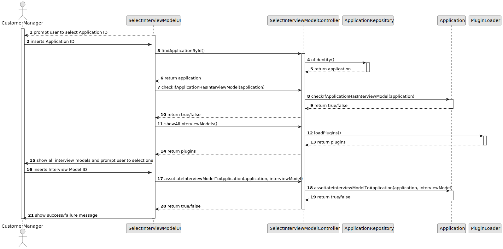

# US 1011

## 1. Context

*Along the recruitment process that is defined by the Customer Manager, there is an optional phase "Interview". During this phase, the Customer Manager may use a plugin that what configured by the Language Engineer that will help him create, validate and evaluate questions and answers for an Interview.*

## 2. Requirements

**US 1011** As Customer Manager, I want to select the interview model to use for the interviews of a job opening (for their evaluation/grading).

**Acceptance Criteria:**

- 1011.1. If a candidate was already interviewed, the Customer Manager can't change the interview model.


**Dependencies/References:**

*Regarding this requirement we understand that it relates to US1008 where the Language Engineer must first create and deploy the plugins that the Customer Manager will later on select.*


## 3. Analysis
### 3.1. Relevant Domain Model Excerpt


### 3.2. Questions and Answers
> **Question:** Cada questão de um interview model aceita um x tipos de respostas(ex escolha múltipla) ou é a interview model que aceita um x tipos de respostas em todas as suas questões? Assumimos que uma job opening só segue um interview model?
> 
> **Answer:** Sim, cada pergunta/resposta aceita um tipo de pergunta/resposta (um dos tipos que aparece no inicio da página 8). Na US1011, o Customer manager seleciona o interview model a usar nas entrevistas para um job opening. Ou seja, existirá apenas um interview model a usar nas entrevistas desse job opening.


### 3.3. Other Remarks
The plugins (jar files) are in directory plugins/interview/jar.

## 4. Design

### 4.1. Realization

| Interaction ID                                                                            | Question: Which class is responsible for...                            | Answer                    | Justification (with patterns) |
|:------------------------------------------------------------------------------------------|:-----------------------------------------------------------------------|:--------------------------|:------------------------------|
| Step 1 : Customer Manager requests to select an interview model for a certain application | 	... showing available interview models?                               | SelectInterviewModelUI    | Pure Fabrication              |
| 		                                                                                        | 	... showing available candidate applications?                         | SelectInterviewModelUI    | Pure Fabrication              |
| Step 2 : System assotiates interview model to application                                 | 	... coordination between users request and selecting interview model? | SelectInterviewController | Controller                    |
| 		                                                                                        | 	... accessing the plugin?                                             | PluginLoader              | Pure Fabrication              |
| 		                                                                                        | 	... saving the interview model?                                       | Application               | Information Expert            |
| Step 3 : System informs Customer Manager of success/failure of operation                  | 	... showing success/failure?                                          | SelectInterviewModelUI    | Pure Fabrication              |


According to the taken rationale, the conceptual classes promoted to software classes are:

* Application

Other software classes (i.e. Pure Fabrication) identified:

* SelectInterviewModelUI
* SelectInterviewController
* PluginLoader


### 4.2. Class Diagram


### 4.3. Sequence Diagram



### 4.4. Tests

**Test 1:** **

**Refers to Acceptance Criteria:** 1011.1


```java
@Test
void ensureApplicationDoesNotHaveInterviewModel() {
    // Arrange
    Application application = new Application("jobReference", null, null, null, null, null, null);
    // Act
    boolean result = application.checkIfApplicationHasInterviewModel();
    // Assert
    Assertions.assertFalse(result);
}

````


## 5. Implementation
****

**SelectInterviewModelUI**

```java
package presentation.CustomerManager;

import appUserManagement.domain.Role;
import applicationManagement.application.SelectInterviewModelController;
import applicationManagement.domain.Application;
import console.ConsoleUtils;
import infrastructure.authz.AuthzUI;
import plugins.Plugin;
import textformat.AnsiColor;

import java.util.List;

public class SelectInterviewModelUI {
    private SelectInterviewModelController ctrl = new SelectInterviewModelController();
    static Role managerRole;

    public void doShow(AuthzUI authzUI) {
        ConsoleUtils.buildUiHeader("Select Interview Model");

        // get user role, to be used as parameter on restricted user actions
        managerRole = authzUI.getValidBackofficeRole();
        if (!managerRole.showBackofficeAppAccess()) {
            ConsoleUtils.showMessageColor("You don't have permissions for this action.", AnsiColor.RED);
            return;
        }

        boolean success = false;
        String appID = "";
        System.out.println("Insert Application ID: ");
        appID = ConsoleUtils.readLineFromConsole("Application ID: ");
        Application application = ctrl.findApplicationById(appID);
        if (application == null) {
            System.out.println("Application not found");
        }
        success = ctrl.checkIfApplicationHasInterviewModel(application);
        if (success) {
            System.out.println("Application already has Interview Model");
        }
        List<Plugin> interviewModels = ctrl.getAllInterviewModels();
        int choice = selectInterviewModel(interviewModels);
        success = ctrl.associateInterviewModelToApplication(application, interviewModels.get(choice));
        if (success) {
            System.out.println("Interview Model associated to Application");
        } else {
            System.out.println("Error associating Interview Model to Application");
        }
    }


    private int selectInterviewModel(List<Plugin> interviewModels) {
        int i = 0;
        System.out.println("== INTERVIEW MODELS ==");
        for (Object interviewModel : interviewModels) {
            System.out.println(i + ". " + interviewModel.toString());
            i++;
        }
        int choice;
        do {
            choice = ConsoleUtils.readIntegerFromConsole("Choose a model (enter the number): ");
        } while (choice < 0 || choice >= interviewModels.size());
        return choice;
    }
}

```
**SelectInterviewModelController**

```java
package applicationManagement.application;

import applicationManagement.domain.Application;
import applicationManagement.repositories.ApplicationRepository;
import infrastructure.persistance.PersistenceContext;
import plugins.Plugin;
import plugins.PluginLoader;

import java.util.List;


public class SelectInterviewModelController {
    ApplicationRepository repo = PersistenceContext.repositories().applications();
    PluginLoader pluginLoader = new PluginLoader();
    String INTERVIEW_PLUGINS_DIRECTORY = "plugins/interview/jar";

    public Application findApplicationById(String id){
        return repo.ofIdentity(id).get();
    }

    public boolean checkIfApplicationHasInterviewModel(Application application){
        return application.checkIfApplicationHasInterviewModel();
    }

    public List<Plugin> getAllInterviewModels(){
        return pluginLoader.loadPlugins(INTERVIEW_PLUGINS_DIRECTORY);
    }

    public boolean associateInterviewModelToApplication(Application application, Object interviewModel){
        boolean success = false;
        success = application.associateInterviewModelToApplication(interviewModel);
        if(success){
            repo.update(application);
            return true;
        }
        return false;
    }
}


```

**PluginLoader**

```java
package plugins;

import java.io.File;
import java.net.URL;
import java.net.URLClassLoader;
import java.util.ArrayList;
import java.util.List;

public class PluginLoader {
    public List<Plugin> loadPlugins(String pluginsDirectory) {
        File pluginsDir = new File(pluginsDirectory);
        List<Plugin> plugins = new ArrayList<>();
        if (pluginsDir.isDirectory()) {
            File[] files = pluginsDir.listFiles((dir, name) -> name.endsWith(".jar"));
            if (files != null) {
                for (File file : files) {
                    try {
                        URLClassLoader classLoader = URLClassLoader.newInstance(new URL[]{file.toURI().toURL()});
                        Class<?> pluginClass = classLoader.loadClass("lapr4.Main");
                        Object pluginInstance = pluginClass.newInstance();
                        String jarName = file.getName();
                        Plugin plugin = new Plugin(pluginInstance, jarName);
                        plugins.add(plugin);
                    } catch (Exception e) {
                        e.printStackTrace();
                    }
                }
            }
        }
        return plugins;
    }
}

```

**Plugin**

```java
package plugins;

import java.io.Serializable;

public class Plugin implements Serializable {
    private Object pluginInstance;
    private String jarName;

    public Plugin(Object pluginInstance, String jarName) {
        this.pluginInstance = pluginInstance;
        this.jarName = jarName;
    }

    public Object getPluginInstance() {
        return pluginInstance;
    }

    public String getJarName() {
        return jarName;
    }

    @Override
    public String toString() {
        return jarName;
    }
}

```

## 6. Integration/Demonstration
In the PluginLoader class, the method loadPlugins receives a directory path as a parameter. This directory should contain the jar files of the plugins. The method will load all the jar files in the directory and return a list of Plugin objects. Each Plugin object contains the instance of the plugin and the name of the jar file.
For now, we are using a Class<?> that is expecting the following package: lapr4.Main 

"Class<?> pluginClass = classLoader.loadClass("lapr4.Main");"

In the next sprint, we will implement the plugin interface and the plugin class that will be used in the plugin jar files.


## 7. Observations

n/a