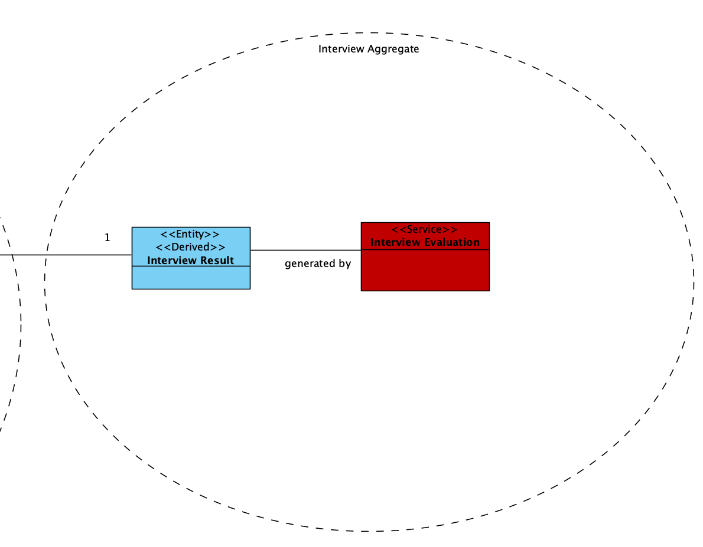
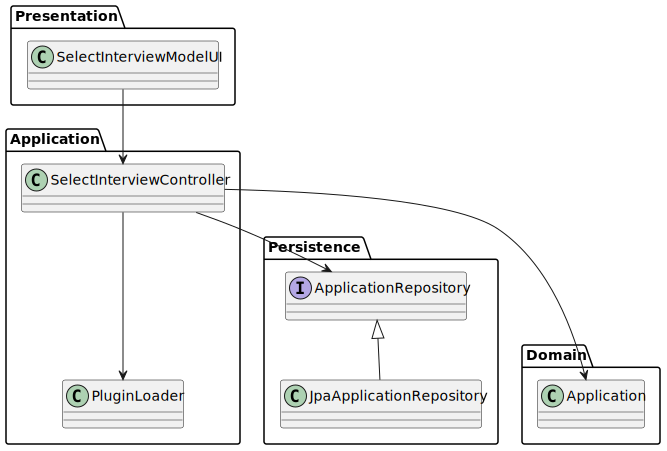
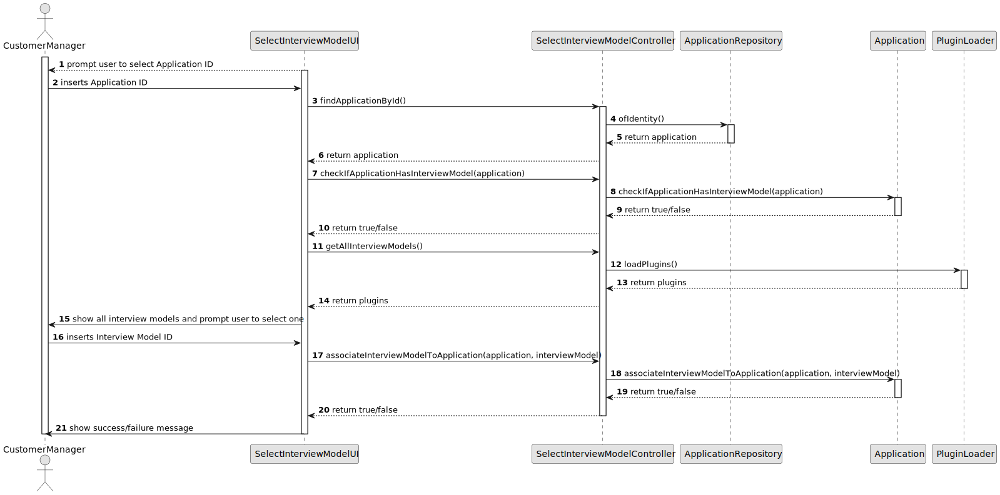

# US 1012 - Generate and export a template .txt to collect candidate answers

## 1. Context

*Along the recruitment process that is defined by the Customer Manager, there is an optional phase "Interview". During this phase, the Customer Manager may use a plugin that what configured by the Language Engineer that will help him create, validate and evaluate questions and answers for an Interview.*

## 2. Requirements

**US 1012** As Customer Manager, I want to generate and export a template text file to help collect the candidate answers during the interviews.

**Acceptance Criteria:**

- 1012.1 The Customer Manager must be able to generate a template text file with the questions that he wants to ask the candidate.


**Dependencies/References:**

*


## 3. Analysis
### 3.1. Relevant Domain Model Excerpt


### 3.2. Questions and Answers
> **Question:** 
> 
> **Answer:** 


### 3.3. Other Remarks
The plugins (jar files) are in directory plugins/interview/jar.

## 4. Design

### 4.1. Realization

| Interaction ID                                        | Question                                            | Answer                                  | Justification (with patterns)   |
|-------------------------------------------------------|-----------------------------------------------------|-----------------------------------------|----------------------------------|
| Step 1 : User initiates generation of answer file     | ... initiating the generation process?             | GenerateAnswerCollectionFileUI         | Controller                       |
|                                                       | ... retrieving the list of applications?           | ListApplicationsController              | Controller                       |
| Step 2 : System loads the selected application model | ... loading the selected application model?        | GenerateAnswerCollectionFileController | Controller                       |
|                                                       | ... accessing the plugin loader mechanism?         | PluginLoader                            | Controller                       |
| Step 3 : System generates the answer collection file  | ... generating the answer collection file?         | GenerateAnswerCollectionFileController | Controller                       |
| Step 4 : System notifies user of process completion   | ... displaying success/failure messages?           | GenerateAnswerCollectionFileUI         | Pure Fabrication                 |


* Application

Other software classes (i.e. Pure Fabrication) identified:

* GenerateAnswerCollectionFileUI
* GenerateAnswerCollectionFileController
* PluginLoader


### 4.2. Class Diagram



### 4.3. Sequence Diagram



### 4.4. Tests


```java

````


## 5. Implementation
****

**GenerateAnswerCollectionFileUI**

```java
package presentation.CustomerManager;

import appUserManagement.domain.Role;
import jobOpeningManagement.application.GenerateAnswerCollectionFileController;
import applicationManagement.application.ListApplicationsController;
import applicationManagement.application.RegisterApplicationController;
import applicationManagement.domain.Application;
import applicationManagement.repositories.ApplicationRepository;
import console.ConsoleUtils;
import eapli.framework.application.ApplicationService;
import infrastructure.authz.AuthzUI;
import plugins.Plugin;
import plugins.PluginLoader;
import textformat.AnsiColor;

import java.lang.reflect.Method;
import java.util.ArrayList;
import java.util.Iterator;
import java.util.List;
import java.util.Scanner;

public class GenerateAnswerCollectionFileUI{

    private final PluginLoader pluginLoader = new PluginLoader();
    static Role csutomerManagerRole;
    GenerateAnswerCollectionFileController generateAnswerCollectionFileController = new GenerateAnswerCollectionFileController();
    ListApplicationsController listApplicationsController = new ListApplicationsController();
    RegisterApplicationController registerApplicationController = new RegisterApplicationController();;

    protected boolean doShow(AuthzUI authzUI){
        ConsoleUtils.buildUiHeader("Generate a text file to collect the answers of an interview");

        // get user role, to be used as parameter on restricted user actions
        csutomerManagerRole = authzUI.getValidBackofficeRole();
        if (!csutomerManagerRole.showBackofficeAppAccess()) {
            ConsoleUtils.showMessageColor("You don't have permissions for this action.", AnsiColor.RED);
        }

        //show all applications
        Iterable<Application> applications = listApplicationsController.listApplications();
        List<Application> applicationList = new ArrayList<>();

        Scanner scanner = new Scanner(System.in);
        int i = 0;
        for (Application app : applications) {
            System.out.println(i + ". ID:" + app.getId() + " - " + app.jobReference());
            applicationList.add(app);
            i++;
        }

        // Prompt the user to choose a plugin
        System.out.print("Choose an Application (enter the number): ");
        int choice = scanner.nextInt();

        // Validate the user's choice
        if (choice >= 0 && choice < i) {
            try {
                Application app = registerApplicationController.findApplicationById(String.valueOf(applicationList.get(choice).getId()));
                String pluginPath = app.getInterviewModel();
                if(pluginPath == null){
                    System.out.println("No Interview Model associated with this application");
                    return false;
                }
                else{
                    generateAnswerCollectionFileController.generateAnswerCollectionFile(pluginPath);
                }

            } catch (Exception e) {
                e.printStackTrace();
            }
        } else {
            System.out.println("Invalid choice. Please enter a number between 0 and " + (i - 1) + ".");
        }

        return true;
    }

}


```
**GenerateAnswerCollectionFileController**

```java

package applicationManagement.application;

import plugins.Plugin;
import plugins.PluginLoader;

import java.lang.reflect.InvocationTargetException;
import java.lang.reflect.Method;
import java.util.List;

public class GenerateAnswerCollectionFileController {

    private final PluginLoader pluginLoader = new PluginLoader();
    private final String pluginsDirectory = "plugins/interview/jar";

    public void generateAnswerCollectionFile(String pluginPath) throws NoSuchMethodException, InvocationTargetException, IllegalAccessException {
        try {
//            List<Plugin> plugins = loadPlugins();
//            Object plugin = plugins.get(choice).getPluginInstance();

            Plugin plugin = pluginLoader.loadPlugin(pluginPath);
            Object pluginFinal = plugin.getPluginInstance();
            Method exportMethod = pluginFinal.getClass().getMethod("exportTemplateFile", String.class);
            exportMethod.invoke(pluginFinal, "plugins/interview/txt/answerSheet.txt");
        } catch (Exception e) {
            e.printStackTrace();
        }
    }

    public List<Plugin> loadPlugins() {
        List<Plugin> plugins = pluginLoader.loadPlugins(pluginsDirectory);
        return plugins;
    }

}


```

**PluginLoader**

```java
package plugins;

import java.io.File;
import java.net.URL;
import java.net.URLClassLoader;
import java.util.ArrayList;
import java.util.List;

public class PluginLoader {
    public List<Plugin> loadPlugins(String pluginsDirectory) {
        File pluginsDir = new File(pluginsDirectory);
        List<Plugin> plugins = new ArrayList<>();
        if (pluginsDir.isDirectory()) {
            File[] files = pluginsDir.listFiles((dir, name) -> name.endsWith(".jar"));
            if (files != null) {
                for (File file : files) {
                    try {
                        URLClassLoader classLoader = URLClassLoader.newInstance(new URL[]{file.toURI().toURL()});
                        Class<?> pluginClass = classLoader.loadClass("lapr4.Main");
                        Object pluginInstance = pluginClass.newInstance();
                        String jarName = file.getName();
                        Plugin plugin = new Plugin(pluginInstance, jarName);
                        plugins.add(plugin);
                    } catch (Exception e) {
                        e.printStackTrace();
                    }
                }
            }
        }
        return plugins;
    }
}

```

**Plugin**

```java
package plugins;

import java.io.Serializable;

public class Plugin implements Serializable {
    private Object pluginInstance;
    private String jarName;

    public Plugin(Object pluginInstance, String jarName) {
        this.pluginInstance = pluginInstance;
        this.jarName = jarName;
    }

    public Object getPluginInstance() {
        return pluginInstance;
    }

    public String getJarName() {
        return jarName;
    }

    @Override
    public String toString() {
        return jarName;
    }
}

```

## 6. Integration/Demonstration

n/a

## 7. Observations

n/a