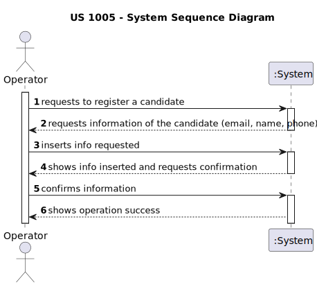

# US 2000a

*As Operator, I want to register a candidate and create a corresponding user*

## 1. Context

*Whenever an Operator intends to, he should be able to register a candidate and create the corresponding user*

## 2. Requirements

**US 2000a** As Operator, I want to register a candidate and create a corresponding user.

**Acceptance Criteria:**

>N/A

**Dependencies/References:**

*Regarding this requirement we understand that it relates to:*

> "1000 - As Administrator, I want to be able to register, disable/enable, and list users of the backoffice."


## 3. Analysis

**Questions/Answers:**

>"Q19:  Na criação de um utilizador no sistema o nome é definido pelo utilizador ou é o nome da pessoa (primeiro e último) e se a password é
definida pelo utilizador ou gerada pelo sistema?"
> 
>"A19. No âmbito da US 2000a o Operator cria utilizadores do sistema para candidatos que ainda não estejam no sistema. 
Tem de fazer isso com base nos dados recebidos na candidatura (que incluem email e nome). O email servirá para identificar a pessoa. 
Neste contexto é necessário ter uma password para esse novo utilizador. Uma vez que essa informação não é transmitida 
pelo candidato, suponho que a solução mais “aconselhada” será o sistema gerar uma password para esse utilizador. 
Como o utilizador/candidato irá receber essa informação (a forma de autenticação na app) está out of scope, no sentido
em que não existe nenhuma US que remete para isso."
> 
> "Q74 Pinto – US2000a – Relativamente ao registo dos candidatos, os dados devem ser inseridos manualmente ou importados 
do ficheiro com os dados do candidato?"
> 
> "A74. A US2000a refere-se a uma funcionalidade do Operador, manualmente, registar candidatos. (Nota:resposta actualizada em 2024/04/18)
"

### 3.1. System Sequence Diagram



## 4. Design

### 4.1. Realization

| Interaction ID                                                                    | Question: Which class is responsible for...                                       | Answer              | Justification (with patterns) |
|:----------------------------------------------------------------------------------|:----------------------------------------------------------------------------------|:--------------------|:------------------------------|
| Step 1 : Operator requests to register a Candidate                                | 	... requesting Candidate Info?                                                   | RegisterCandidateUI | Pure Fabrication              |
| 		                                                                                | 	... validating Operator inputs?                                                  | RegisterCandidateUI | Pure Fabrication              |
| Step 2 : System registers Candidate                                               | 	... coordination between users request and saving the Candidate in the Database? | CandidateController | Controller                    |
|                                                                                   | 	... creating the Candidate?                                                      | Candidate           | Creater                       |
|                                                                                   | 	... persisting the Candidate?                                                    | CandidateRepository | Information Expert            |
| Step 3 : System automatically creates a user                                      | 	... creating a user?                                                             | SignUpController    | Controller                    |
|                                                                                   | 	... persisting the user?                                                         | UserRepository      | Information Expert            |
| Step 4 : System informs the Operator of Success/insuccess of the operation			  		 | 	... Showing result?                                                              | RegisterCandidateUI | Pure Fabrication              |


* 
### 4.2. Class Diagram


### 4.3. Sequence Diagram


### 4.4. Tests

**Test 1: Verifies if the candidate is registered correctly**

```java
@Test
void testValidCandidateRegistration() {
    String name = "John Doe";
    String email = "john@example.com";
    String phone = "1234567890";

    CandidateDTO candidateDTO = new CandidateDTO(name, email, phone);

    assertEquals(name, candidateDTO.getName());
    assertEquals(email, candidateDTO.getEmail());
    assertEquals(phone, candidateDTO.getPhone());
}
````

## 5. Implementation

**OperatorUI**

```java
package presentation.Operator;

import console.ConsoleUtils;
import infrastructure.authz.AuthzUI;

public class OperatorUI {

    public OperatorUI() {
    }

    public boolean doShow(AuthzUI authzUI) {
        int option = 0;
        do{
            System.out.println("1. Register Application");
            System.out.println("2. Register Candidate");
            System.out.println("3. List Candidates");
            System.out.println("4. Generate Template To Collect Candidate Fields");
            System.out.println("0. Exit");
            option = ConsoleUtils.readIntegerFromConsole("Option: ");
            switch (option){
                case 1:
                    RegisterApplicationUI registerApplicationUI = new RegisterApplicationUI();
                    registerApplicationUI.show();
                    break;
                case 2:
                    RegisterCandidateUI registerCandidateUI = new RegisterCandidateUI();
                    registerCandidateUI.show();
                    break;
                case 3:
                    ListCandidatesUI listCandidatesUI = new ListCandidatesUI();
                    listCandidatesUI.show();
                    break;
                case 4:
                    GenerateCandidateFieldsFileUI generateCandidateFieldsFileUI = new GenerateCandidateFieldsFileUI();
                    generateCandidateFieldsFileUI.doShow(authzUI);
                    break;
                case 0:
                    return false;
                default:
                    System.out.println("Invalid option");
            }
        }while(option != 0);
        return true;
    }
}
```

**RegisterCandidateUI**

```java
package presentation.Operator;

import applicationManagement.application.CandidateController;
import applicationManagement.domain.dto.CandidateDTO;
import console.ConsoleUtils;
import eapli.framework.presentation.console.AbstractUI;

import java.util.Optional;


public class RegisterCandidateUI extends AbstractUI {

    private CandidateController ctrlCandidate = new CandidateController();

    @Override
    protected boolean doShow() {

        System.out.println("== Registration of new Candidate ==");

        String name = ConsoleUtils.readLineFromConsole("Insert the Candidate name: ");
        String email = ConsoleUtils.readLineFromConsole("Insert the Candidate email: ");
        String phone = ConsoleUtils.readLineFromConsole("Insert the Candidate phone: ");

        CandidateDTO candidateDTO = new CandidateDTO(name, email, phone);
        Optional<String> pwd = ctrlCandidate.registerCandidate(candidateDTO);

        if (pwd.isPresent()) {
            System.out.println("Candidate registered successfully");
            System.out.println("Candidate name: " + candidateDTO.getName() + ", email: " + candidateDTO.getEmail() + ", phone: " + candidateDTO.getPhone() + "password: " + pwd.get());
            return true;
        } else {
            System.out.println("Error registering Candidate");
            return false;
        }
    }

    @Override
    public String headline() {
        return "Candidate Registration";
    }
}
```

**CandidateController**

```java
package applicationManagement.application;

import appUserManagement.application.SignUpController;
import appUserManagement.domain.Email;
import appUserManagement.domain.Role;
import applicationManagement.domain.dto.CandidateDTO;
import infrastructure.persistance.PersistenceContext;
import applicationManagement.domain.Candidate;
import applicationManagement.repositories.CandidateRepository;

import java.util.Optional;


public class CandidateController {
    private final CandidateRepository repo = PersistenceContext.repositories().candidates();
    private final SignUpController signUpController = new SignUpController();

    public Optional<String> registerCandidate(CandidateDTO dto) {
        if(repo.createCandidate(dto)){
            Optional<String> pwd = signUpController.signUp(new Email(dto.getEmail()), Role.CANDIDATE);
            if(pwd.isPresent()){
                return pwd;
            }
            repo.deleteOfIdentity(dto.getEmail());
        }
        return Optional.empty();
    }
}

```

## 6. Integration/Demonstration

>

## 7. Observations

>