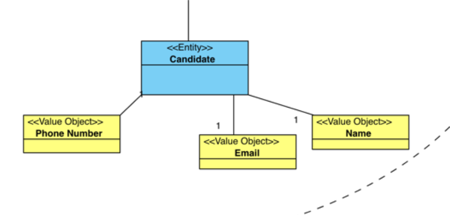
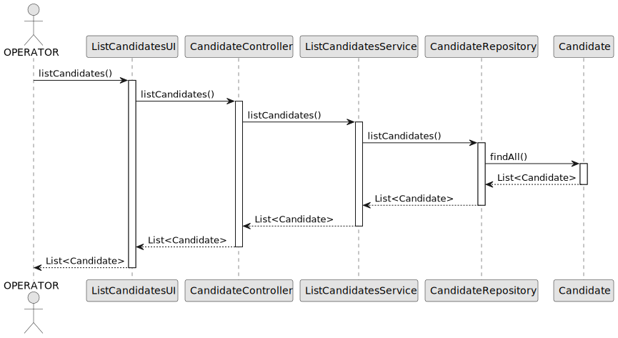

# US 2000c - List all Candidates

## 1. Context

*Operators of Jobs4U will be able to list candidates.*

## 2. Requirements

**US 2002** As Operator, I want to list all Candidates.

**Acceptance Criteria:**

- 2000c.1. It should be possible to list all existing candidates.
- 2000c.2. The listing should contain the Name and Email of each candidate.
- 2000c.3. The listing should be ordered by the candidate's name.

**Dependencies/References:**

* The US has dependency on 2000a, since it is here that an operator registers a candidate on the system.

## 3. Analysis
### 3.1. Relevant Domain Model Excerpt


### 3.2. Questions and Answers

> Q58 - "US 2000c, quando estiver a listar os candidatos basta listar os emails?" <br/>
> A58 - "Eu diria que faz sentido apresentar para cada candidato o seu email e o seu nome."


### 3.3. Other Remarks

* N/A

## 4. Design

### 4.1. Realization
According to the taken rationale, the conceptual classes promoted to software classes are:

- **Candidate** - Represents a candidate.

Other software classes (i.e. Pure Fabrication) identified:

* CandidateController
* 

### 4.2. Sequence Diagram



### 4.3. Tests

```java
@Test
    void TODOtest(){
        
    
    }
````


## 5. Implementation
**Candidate**
    
```java

package applicationManagement.domain;

import eapli.framework.domain.model.AggregateRoot;
import jakarta.persistence.*;

@Entity
public class Candidate implements AggregateRoot<String> {

    @Id
    private String email;

    @Column(unique = true)
    private String phoneNumber;

    @Column
    private String name;

    protected Candidate() {
        // for ORM
    }

    public Candidate(String email, String phoneNumber, String name) {
        this.email = email;
        this.phoneNumber = phoneNumber;
        this.name = name;
    }

    public String email() {
        return email;
    }

    public String phoneNumber() {
        return phoneNumber;
    }

    public String name() {
        return name;
    }

    @Override
    public String toString() {
        return "NAME: " + name +
                "\nEmail: " + email +
                "\nPhoneNumber: " + phoneNumber;
    }

    @Override
    public boolean sameAs(Object other) {
        Candidate candidate = (Candidate) other;
        return candidate.equals(candidate.email);
    }

    @Override
    public String identity() {
        return email;
    }
}

```

**ListCandidatesUI**

```java
package presentation.Operator;

import applicationManagement.application.CandidateController;
import applicationManagement.application.RegisterApplicationController;
import applicationManagement.domain.Candidate;
import console.ConsoleUtils;
import eapli.framework.presentation.console.AbstractUI;
import jobOpeningManagement.application.ListJobOpeningsController;
import jobOpeningManagement.domain.*;

import java.util.Iterator;


public class ListCandidatesUI extends AbstractUI{

    private CandidateController ctrlCandidate = new CandidateController();

    @Override
    protected boolean doShow() {
        Iterable<Candidate> candidates = ctrlCandidate.allCandidatesSortedByName();

        System.out.println("== CANDIDATES ==");
        if(candidates == null){
            System.out.println("No candidates present in the system!");
            return false;
        }
        for (Candidate candidate : candidates) {
            printCandidates(candidate.name(), candidate.email(), candidate.phoneNumber());
        }
        return true;
    }


    private Candidate selectCandidate() {
        Iterable<Candidate> candidates = ctrlCandidate.allCandidates();
        if(candidates == null){
            System.out.println("No candidates present in the system!");
            return null;
        }
        int i = 1;
        System.out.println("== CANDIDATES ==");
        for (Candidate candidate : candidates) {
            System.out.println(i + " - " + candidate.name());
        }
        int option = ConsoleUtils.readIntegerFromConsole("Select a Candidate: ");
        Iterator<Candidate> iterator = candidates.iterator();
        for (int j = 0; j < option - 1; j++) {
            iterator.next();
        }
        return iterator.next();
    }

    @Override
    public String headline() {
        return "CANDIDATE LISTING";
    }

    private void printCandidates(String name, String email, String phone){
        System.out.println("Name: " + name);
        System.out.println("Email: " + email);
        System.out.println("Phone: " + phone);
        System.out.println();
    }

}

```
**CandidateController**

```java
package applicationManagement.application;

import appUserManagement.application.SignUpController;
import appUserManagement.domain.Email;
import appUserManagement.domain.Role;
import applicationManagement.domain.Application;
import applicationManagement.domain.dto.CandidateDTO;
import applicationManagement.repositories.ApplicationRepository;
import infrastructure.persistance.PersistenceContext;
import applicationManagement.domain.Candidate;
import applicationManagement.repositories.CandidateRepository;

import java.util.List;
import java.util.Optional;


public class CandidateController {
    private final CandidateRepository repo = PersistenceContext.repositories().candidates();
    private final ListCandidatesService svc = new ListCandidatesService();
    private final SignUpController signUpController = new SignUpController();
    private final ApplicationRepository applicationRepo = PersistenceContext.repositories().applications();


    public Optional<String> registerCandidate(CandidateDTO dto) {
        if(repo.createCandidate(dto)){
            Optional<String> pwd = signUpController.signUp(new Email(dto.getEmail()), Role.CANDIDATE);
            if(pwd.isPresent()){
                return pwd;
            }
            repo.deleteOfIdentity(dto.getEmail());
        }
        return Optional.empty();
    }

    public Iterable<Candidate> allCandidates() {
        return svc.allCandidates();
    }

    public Iterable<Candidate> allCandidatesSortedByName() {
        return svc.allCandidatesSortedByName();
    }

    public Optional<Candidate> findCandidateByEmail(String email) { return repo.ofIdentity(email); }

    public List<Application> buildApplicationList(Candidate candidate) { return applicationRepo.ofCandidate(candidate); }
}

```

**ListCandidatesService**

```java
package applicationManagement.application;

import eapli.framework.application.ApplicationService;
import infrastructure.persistance.PersistenceContext;
import applicationManagement.domain.Candidate;
import applicationManagement.repositories.CandidateRepository;

import java.util.ArrayList;
import java.util.Comparator;
import java.util.List;
import java.util.stream.Collectors;

@ApplicationService
public class ListCandidatesService {
    private CandidateRepository candidateRepository = PersistenceContext.repositories().candidates();

    public Iterable<Candidate> allCandidates() {
        return candidateRepository.findAll();
    }

    public Iterable<Candidate> allCandidatesSortedByName() {
        Iterable<Candidate> candidates = candidateRepository.findAll();

        List<Candidate> candidateList = new ArrayList<>();
        candidates.forEach(candidateList::add);

        return candidateList.stream()
                .sorted(Comparator.comparing(Candidate::name))
                .collect(Collectors.toList());
    }

}

```

## 6. Integration/Demonstration

n/a

## 7. Observations

n/a