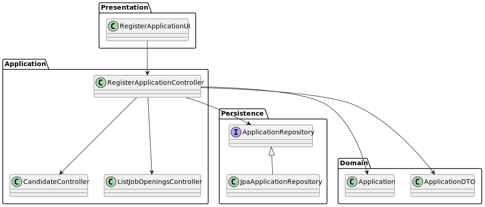

# US 2002 - Register an application of a candidate to a job opening

## 1. Context

*Operators of Jobs4U will be able to register applications of candidates to job openings, alongside importing all files received.*

## 2. Requirements

**US 2002** As Operator, I want to register an application of a candidate for a job opening and import all files received.

**Acceptance Criteria:**

- 2002.1. It should be possible to register only one application of a candidate for a job opening.
- 2002.2. The application should have the following attributes:
  - A candidate
  - A job Opening
  - A date of submission
  - A status (e.g., "Submitted")
  - A path to the interview model (if any)
  - A path to the files received
  - Comments
- 2002.3. The application should be associated with a candidate and a job opening.
- 
**Dependencies/References:**

- US 1002, where the Customer Manager needs to create a Job Opening, that will be associated with the application.
- US 1008, where the Language Engineer will have to create and deploy the Interview Model plugins that the Operator will be able to associate with the application.
- US 2000a, where the Operator needs to create a Candidate.

## 3. Analysis
### 3.1. Relevant Domain Model Excerpt


### 3.2. Questions and Answers

> **Question:** Na descrição da US o PO refere uma importação de ficheiros e depois na referência à mesma a importação dos dados do ficheiro. Poderia esclarecer a que se refere a importação? São importações distintas? Têm destinos diferentes?
>
> **Answer:** Nessa US refiro-me à importação dos ficheiros gerados pelo Application File Bot. Quando me refiro aos dados, serão os dados do ficheiro de texto “A text file with the data of the application and candidate”, secção 2.2.3, um dos ficheiros gerados.


### 3.3. Other Remarks

* N/A

## 4. Design

### 4.1. Realization

### 4.1. Realization

| Interaction ID                                                                           | Question: Which class is responsible for...                           | Answer                    | Justification (with patterns) |
|-----------------------------------------------------------------------------------------|------------------------------------------------------------------------|---------------------------|--------------------------------|
| Step 1 : Operator selects a candidate for a job opening                                   | ... displaying the list of available candidates?                     | RegisterApplicationUI     | Pure Fabrication              |
|                                                                                         | ... displaying the list of available job openings?                   | RegisterApplicationUI     | Pure Fabrication              |
|                                                                                         | ... capturing user input for candidate selection?                    | RegisterApplicationUI     | Controller                    |
| Step 2 : Operator registers the application for the selected candidate                   | ... coordinating between user input and application registration?    | RegisterApplicationController | Controller                    |
|                                                                                         | ... accessing the repository for job openings?                       | ListJobOpeningsController | Controller                    |
|                                                                                         | ... accessing the repository for candidates?                         | CandidateController       | Controller                    |
|                                                                                         | ... saving the application to the repository?                        | ApplicationRepository     | Information Expert            |
| Step 3 : System confirms the success/failure of the registration operation              | ... displaying success/failure messages?                             | RegisterApplicationUI     | Pure Fabrication              |

According to the taken rationale, the conceptual classes promoted to software classes are:

* Application

Other software classes (i.e. Pure Fabrication) identified:

* RegisterApplicationUI
* RegisterApplicationController
* ListJobOpeningsController
* CandidateController
* ApplicationRepository


### 4.2. Class Diagram



### 4.3. Sequence Diagram


### 4.4. Tests


```java
 @Test
public void testApplicationStatusChange() {
  // Arrange
  Candidate candidate = new Candidate("joao@email.com", "123456789", "Joao Silva");
  CompanyCode companyCode = new CompanyCode("123");
  Address companyAddress = new Address("Rua dos Testes", "Test", "1234");
  EmailAddress companyEmail = new Email("geral@company.com");
  Customer company = new Customer(companyCode, "Company",companyEmail ,companyAddress);
  Requirements requirements = new Requirements("DevOps");
  JobOpening jobOpening = new JobOpening("DevOps", ContractType.FULL_TIME, JobMode.HYBRID, companyAddress, company, 1, "teste", requirements);
  Application application = new Application("JobRef123", candidate
          , jobOpening, ApplicationStatus.SUBMITTED,
          new Date(), "", "", "", "");

  application.changeStatus(ApplicationStatus.PENDING);

  assertEquals(ApplicationStatus.PENDING, application.getStatus());
}
````


## 5. Implementation


**RegisterApplicationUI**

```java
package presentation.Operator;

import applicationManagement.domain.ApplicationStatus;
import applicationManagement.domain.Candidate;
import applicationManagement.domain.dto.ApplicationDTO;
import console.ConsoleUtils;
import eapli.framework.presentation.console.AbstractUI;
import applicationManagement.application.CandidateController;
import infrastructure.authz.AuthzUI;
import jobOpeningManagement.application.ListJobOpeningsController;
import applicationManagement.application.RegisterApplicationController;
import jobOpeningManagement.domain.*;
import presentation.CustomerManager.SelectInterviewModelUI;

import java.nio.file.Files;
import java.nio.file.Path;
import java.nio.file.Paths;
import java.util.Date;
import java.util.Iterator;


public class RegisterApplicationUI extends AbstractUI{

  private RegisterApplicationController ctrl = new RegisterApplicationController();
  private ListJobOpeningsController ctrlListJobOpening = new ListJobOpeningsController();
  private CandidateController ctrlCandidate = new CandidateController();

  @Override
  protected boolean doShow() {
    Candidate selectedCandidate = selectCandidate();

    JobOpening jobOpening = selectJobOpening();
    if(jobOpening == null){
      System.out.println("No Job Openings Available at the time!");
      return false;
    }
    String jobReference = jobOpening.jobReference();
    ApplicationStatus status = ApplicationStatus.SUBMITTED;
    String comment = ConsoleUtils.readLineFromConsole("Comment: ");

    String filePathString = "scomp/output/" + jobReference + "/" + selectedCandidate.email();
    String folderPath = "";
    Path path = Paths.get(filePathString);

    if (Files.exists(path)) {
      folderPath = "scomp/output/" + jobReference + "/" + selectedCandidate.email();
    }

    ApplicationDTO applicationDTO = new ApplicationDTO(jobReference, selectedCandidate, jobOpening, comment, new Date(),null, null, status,"", folderPath);
    boolean success = ctrl.registerApplication(applicationDTO);

    System.out.println("Deseja associar um interview model a esta candidatura?");
    boolean associateInterviewModel = ConsoleUtils.confirm("Associar Interview Model? (Y/N)");
    if(associateInterviewModel){
      AuthzUI authzUI = new AuthzUI();
      SelectInterviewModelUI selectInterviewModelUI = new SelectInterviewModelUI();
      selectInterviewModelUI.doShow(authzUI);
    }
    if (success){
      System.out.println("Application registered successfully");
      return true;
    }else{
      System.out.println("Error registering Job Opening");
      return false;
    }
  }

  private JobOpening selectJobOpening() {
    Iterable<JobOpening> jobOpenings = ctrlListJobOpening.listJobOpenings();
    if(jobOpenings == null){
      System.out.println("No job openings registered");
      return null;
    }
    int i = 1;
    System.out.println("== JOB OPENINGS ==");
    for (JobOpening jobOpening : jobOpenings) {
      System.out.println(i + " - " + jobOpening.title());
    }
    int option = ConsoleUtils.readIntegerFromConsole("Select a Job Opening: ");
    Iterator<JobOpening> iterator = jobOpenings.iterator();
    for (int j = 0; j < option - 1; j++) {
      iterator.next();
    }
    return iterator.next();
  }

  private Candidate selectCandidate() {
    Iterable<Candidate> candidates = ctrlCandidate.allCandidates();
    System.out.println("== CANDIDATES ==");
    if(candidates == null || candidates.spliterator().getExactSizeIfKnown() == 0){
      System.out.println("No candidates present in the system!");
      return null;
    }
    int i = 1;
    for (Candidate candidate : candidates) {
      System.out.println(i + " - " + candidate.name() + " | " + candidate.email());
    }
    int option = ConsoleUtils.readIntegerFromConsole("Select a Candidate: ");
    Iterator<Candidate> iterator = candidates.iterator();
    for (int j = 0; j < option - 1; j++) {
      iterator.next();
    }
    return iterator.next();
  }

  @Override
  public String headline() {
    return "APPLICATION REGISTRATION";
  }

}

```
**RegisterApplicationController**

```java
package applicationManagement.application;

import infrastructure.persistance.PersistenceContext;
import applicationManagement.domain.Application;
import applicationManagement.domain.dto.ApplicationDTO;
import applicationManagement.repositories.ApplicationRepository;

public class RegisterApplicationController {
    private ApplicationRepository repo = PersistenceContext.repositories().applications();


    public boolean registerApplication(ApplicationDTO dto) {
        Application application = new Application(dto.jobReference(),dto.candidate(),dto.jobOpening(), dto.status(),dto.applicationDate(),dto.comment(),dto.interviewModel(),dto.filePath(),dto.applicationFilesPath());
        application = repo.save(application);
        return application != null;
    }

    public Application findApplicationById(String id){
        return repo.ofIdentity(id).get();
    }

}

```

**ApplicationRepository**

```java
package applicationManagement.repositories;

import applicationManagement.domain.Candidate;
import eapli.framework.domain.repositories.DomainRepository;
import applicationManagement.domain.Application;

import java.util.List;

public interface ApplicationRepository extends DomainRepository<String, Application>{

    List<Application> ofCandidate(Candidate candidate);

    void update(Application entity);

}

```

**Application**

```java
package applicationManagement.domain;

import eapli.framework.domain.model.AggregateRoot;
import jakarta.persistence.*;
import jobOpeningManagement.domain.JobOpening;
import lombok.Cleanup;
import lombok.Getter;
import org.apache.logging.log4j.core.tools.picocli.CommandLine;

import java.io.Serializable;
import java.util.Date;

import java.time.LocalDate;
import java.util.Objects;

@Getter
@Entity
@Table(uniqueConstraints = @UniqueConstraint(columnNames = {"jobReference", "email"}))
public class Application implements AggregateRoot<String>, Serializable {
    @Id
    @GeneratedValue(strategy = GenerationType.SEQUENCE)
    private Long id;

    @Column
    private String jobReference;

    @ManyToOne
    @JoinColumn(name = "email")
    private Candidate candidate;

    @ManyToOne
    @JoinColumn(name = "jobOpening")
    private JobOpening jobOpening;

    @Column
    private ApplicationStatus status;

    @Column
    private LocalDate date;

    @Column
    private String JobRequirementSpecification;

    @Column
    private String InterviewModel;

    @Column
    private String comment;

    @Column
    private Date applicationDate;

    @Column
    private String filePath;

    @Column
    private String applicationFilesPath;


    protected Application() {
        // for ORM
    }

    public Application(String jobReference, Candidate candidate, JobOpening jobOpening, ApplicationStatus status, Date applicationDate, String comment
    , String interviewModel, String filePath, String applicationFilesPath) {
        this.jobReference = jobReference;
        this.candidate = candidate;
        this.jobOpening = jobOpening;
        this.status = status;
        this.applicationDate = applicationDate;
        this.comment = comment;
        this.InterviewModel = interviewModel;
        this.date = LocalDate.now();
        this.filePath = filePath;
        this.applicationFilesPath = applicationFilesPath;
    }

    public Application(String jobReference, Candidate candidate, JobOpening jobOpening, ApplicationStatus status, Date applicationDate, String comment
            ,String jobRequirementSpecification, String interviewModel, String filePath, String applicationFilesPath) {
        this.jobReference = jobReference;
        this.candidate = candidate;
        this.jobOpening = jobOpening;
        this.status = status;
        this.applicationDate = applicationDate;
        this.comment = comment;
        this.JobRequirementSpecification = jobRequirementSpecification;
        this.InterviewModel = interviewModel;
        this.date = LocalDate.now();
        this.filePath = filePath;
        this.applicationFilesPath = applicationFilesPath;
    }

    public String jobReference() {
        return jobReference;
    }

    public Candidate candidate() {
        return candidate;
    }

    public JobOpening jobOpening() {
        return jobOpening;
    }

    public ApplicationStatus status() {
        return status;
    }

    public Date applicationDate() {
        return applicationDate;
    }

    public String comment() {
        return comment;
    }

    public String jobRequirementSpecification() {
        return JobRequirementSpecification;
    }

    public String interviewModel() {
        return InterviewModel;
    }

    public String filePath() {
        return filePath;
    }

    public String applicationFilesPath() {
        return applicationFilesPath;
    }

    @Override
    public String toString() {
        return "Application{" +
                "Job Reference='" + jobReference + '\'' +
                ", Candidate =" + candidate +
                ", Job Opening=" + jobOpening +
                ", Status=" + status +
                //", InterviewModel=" + InterviewModel +
                ", Commend='" + comment + '\'' +
                ", Application Date=" + applicationDate +
                ", Interview Model Path='" + filePath + '\'' +
                ", Application Files Path='" + applicationFilesPath + '\'' +
                '}';
    }

    public boolean checkIfApplicationHasInterviewModel() {
        return InterviewModel != null;
    }

    public boolean checkIfApplicationHasJobRequirementSpecification() {
        return JobRequirementSpecification != null;
    }

    public boolean checkIfApplicationHasFilePath() {
        return !Objects.equals(filePath, "");
    }

    public boolean associateInterviewModelToApplication(String interviewModel){
        if(!checkIfApplicationHasInterviewModel()){
            this.InterviewModel = interviewModel;
            return true;
        }
        return false;
    }

    public boolean associateInterviewModelPathToApplication(String interviewModelPath){
        if(!checkIfApplicationHasInterviewModel()){
            this.filePath = interviewModelPath;
            return true;
        }
        return false;
    }

    @Override
    public boolean sameAs(Object other) {
        Application application = (Application) other;
        return jobReference.equals(application.identity());
    }

    @Override
    public String identity() {
        return id.toString();
    }

    public boolean associateJobRequirementSpecificationToApplication(String allJobRequirementSpecification) {
        if(!checkIfApplicationHasJobRequirementSpecification()){
            this.JobRequirementSpecification = allJobRequirementSpecification;
            return true;
        }
        return false;
    }
}

```

## 6. Integration/Demonstration

n/a

## 7. Observations

n/a