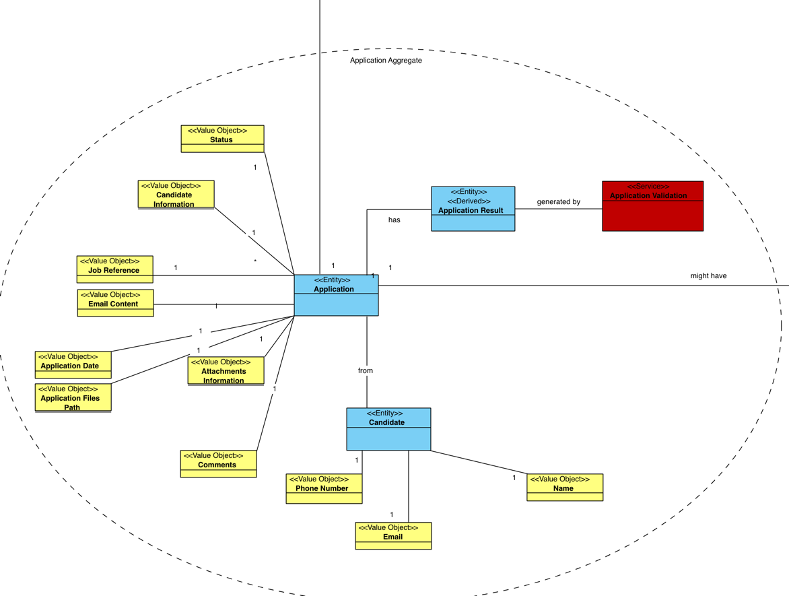

# US 2002 - Register an application of a candidate to a job opening

## 1. Context

*Operators of Jobs4U will be able to register applications of candidates to job openings, alongside importing all files received.*

## 2. Requirements

**US 2002** As Operator, I want to register an application of a candidate for a job opening and import all files received.

**Acceptance Criteria:**

- 2002.1. It should be possible to register only one application of a candidate for a job opening.
- 2002.2. The application should have the following attributes:
  - A candidate
  - A job Opening
  - A date of submission
  - A status (e.g., "Submitted")
  - A path to the interview model (if any)
  - A path to the files received
  - Comments
- 2002.3. The application should be associated with a candidate and a job opening.
- 
**Dependencies/References:**

**
**

## 3. Analysis
### 3.1. Relevant Domain Model Excerpt


### 3.2. Questions and Answers
TODO

### 3.3. Other Remarks
After analysing more deeply the Specification Document and asking some questions to the client, we made the following adjustments to the domain model:
* TODO
## 4. Design

### 4.1. Realization
TODO
According to the taken rationale, the conceptual classes promoted to software classes are:

TODO


### 4.2. Class Diagram

TODO

### 4.3. Sequence Diagram

TODO

### 4.4. Tests

**Test 1:** **

**Refers to Acceptance Criteria:**


```java
@Test
    void TODOtest(){
        
    }
````


## 5. Implementation
**Application**
    
```java
    

```

**RegisterApplicationUI**

```java

```
**RegisterApplicationController**

```java

```

**JpaApplicationRepository**

```java

```

## 6. Integration/Demonstration

n/a

## 7. Observations

n/a