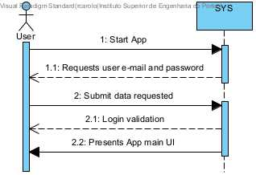

# US G007 - The system must support and apply authentication and authorization for all its users and functionalities

## 1. Context

This is the first time the US is assigned.
The US intends to be used as a mean to access the system, complying with the criteria set by the client.

## 2. Requirements

**US G007**  As a Project Manager, I want the system to support and apply authentication and authorization for all its users and functionalities.

**Acceptance Criteria:**

- G007.1. Only users known by the system can access any of its functionalities.
- G007.2. Users are identified by their e-mail.
- G007.3. The login is done through a non-empty password.
- G007.4. E-mail validation for any standard e-mail.
- G007.5. Password has 8+ characters, has caps and small characters, has at least one digit, has at least one symbol character.

**Dependencies/References:**

There are no dependencies identified.

**Question and Answers**

> *"A11. (...) No entanto, são referidos no nome da empresa e o seu endereço no âmbito de um job opening.
Quanto aos utilizadores (representante da empresa que acede à Customer App) eu diria que serão dados similares ao do Candidate.
Quando aos funcionários da empresa, eu diria que é importante garantir que é usado o email para identificar qualquer utilizador do sistema.
Penso que será importante para cada utilizador termos o nome completo assim como um short user name (que deverá ser único).
Actualização em 2024-03-21: O Product Owner reconsiderou e decidiu que o short user name é dispensável uma vez que para autenticação dos utilizadores se deve usar apenas o email e a password."*

> *"A54. (...) Regarding the password, I think the system can generate a unique password.
You may assume the candidate will be informed of his/her password by means that are outside the scope of what is to be developed for this version of the system."*

> *"A57. Sobre o telemóvel, seguir o Q56. ("Q56. No número de telémovel e no código postal as verificações (...) A56. Basta para o caso português.")
Sobre email, seria qualquer email válido.
Sobre a password, podemos seguir algo como: ter no mínimo 8 caracteres, letras maiúsculas e minúsculas, dígitos e pelo menos, um caracter não alfanumérico."*

> *"Será muito difícil controlar que uma pessoa não consegue ter mais do que uma forma de acesso ao sistema (por exemplo, uma pessoa que é Customer Manager poderá ser, no limite, também uma candidato a uma oferta de emprego).
Relativamente aos papéis “internos” eu diria que devemos considerar uma hierarquia de acessos.
O Admin pode fazer “tudo” o que os outros fazem.
Segue-se o Customer Manager e por último o Operator."*

## 3. Analysis

From the context and requirements, it was identified the following major features to take in consideration towards the design.
- User composed by an e-mail and password.
- Password generated by the system.
- Only users known by the system may use the app.
- E-mail validation for a standard e-mail: a character "@", preceded by the username with no spaces and proceeded by the domain. The domain is composed by two or more words separated by a dot.
- Password validation must follow the rules: 8+ characters long; caps and small letters (at least one of each); at least one numeric character; at least one symbol character.
- An e-mail with associated to a Customer must not have Candidate access options and vice-versa, hence this roles can't overlap.
- The internal staff (Backoffice Users) roles have a hierarchical topology regarding access: (Admin(Customer Manager(Operator))).

|    BACKOFFICE APP |  ACCESS ALL  | CUSTOMER MANAGER FEATURES |  OPERATOR FEATURES  |
|------------------:|:------------:|:-------------------------:|:-------------------:|
|     Administrator |      X       |             X             |          X          |
|  Customer Manager |              |             x             |          x          |
|          Operator |              |                           |          x          |

### 3.1. System Sequence Diagram



## 4. Design

### 4.1. Realization

(TODO)

### 4.2. Class Diagram

(TODO)


### 4.3. Applied Patterns

(TODO)

### 4.4. Tests

**Test 1:** *Verifies that only users known by the system can access any of its functionalities.*
<br> **Refers to Acceptance Criteria:** G007.1.

```
@Test
public void verifyThatOnlyKnownUsersAreAuthorized() { ... }
````
**Test 2:** *Verifies that users are identified solely through the e-mail.*
<br> **Refers to Acceptance Criteria:** G007.2.

```
@Test
public void verifyThatOnlyAnEmailIsValidOnUserField() { ... }
````

**Test 3:** *Verifies that login is not possible through an empty password field.*
<br> **Refers to Acceptance Criteria:** G007.3.

```
@Test
public void checkloginWithEmptyPasswordFails() { ... }
````

**Test 4:** *Verifies that e-mail follows standard configuration.*
<br> **Refers to Acceptance Criteria:** G007.4.

```
@Test
public void isValidEmail() { ... }
````

**Test 5:** *Verifies that password validation guarantees a password that has 8+ characters, has caps and small characters, has at least one digit, has at least one symbol character.*
<br> **Refers to Acceptance Criteria:** G007.5.

```
@Test
public void isPasswordValidationGuaranteingRules() { ... }
````

## 5. Implementation

(TODO)

## 6. Integration/Demonstration

(TODO)

## 7. Observations

(TODO)