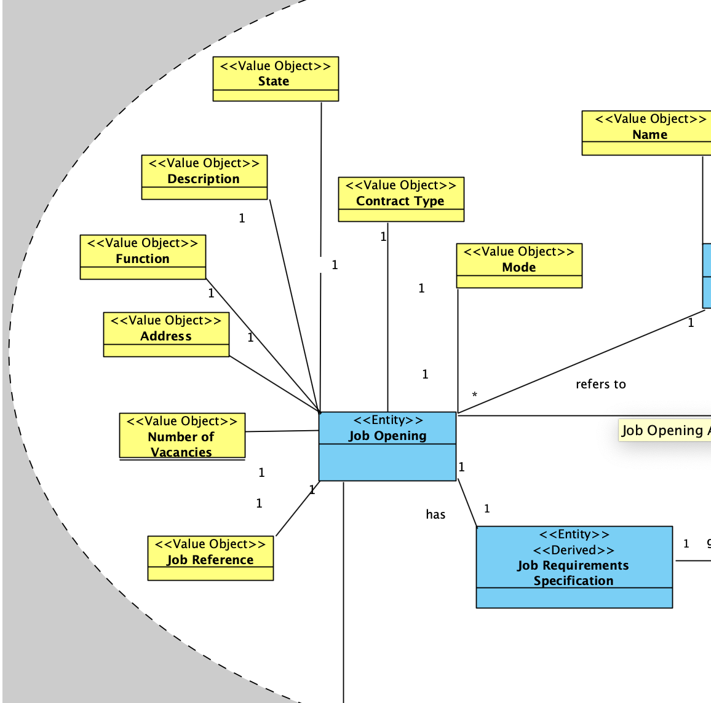
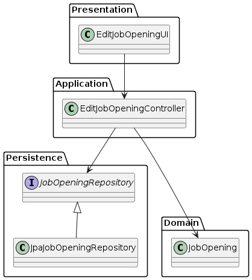
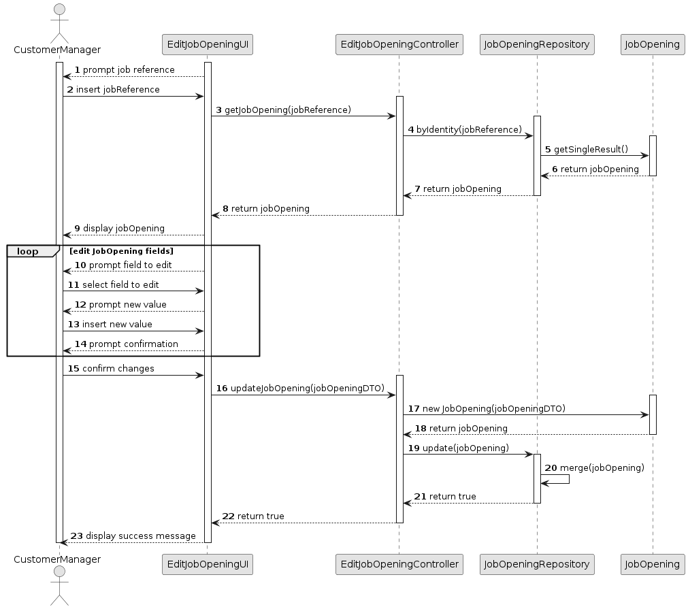

# US 1004

## 1. Context

*When Customers send job offers to job4u, Customer Managers create job openings. These job openings should be editable.*

## 2. Requirements

**US 1004** As Customer Manager, I want to edit a job opening.

**Acceptance Criteria:**

- 1004.1. It should not be possible to edit a job reference.
- 1004.2 It should not be possible to edit the contract type and the mode of the job opening.

**Dependencies/References:**

*Regarding this requirement we understand that it relates to US1002 (register job opening) and US1003(list job openings).*


## 3. Analysis
### 3.1. Relevant Domain Model Excerpt


### 3.2. Questions and Answers
> **Question:** No seguimento da US 1004 para permitir editar um job opening, estamos a assumir que é permitido alterar: Nº de vagas; Morada; Contract Type('FULL_TIME', 'PART_TIME'); Mode ('ON_SITE','REMOTE'); Description; Funcao. Estamos na linha de raciocício correta, ou é necessário alterar a lista para incluir outra informação adicional ou suprimir alguma desta lista?
>
> **Answer:** Por favor ver A109 e Q117. Do meu ponto de vista deve ser possível alterar “tudo” exceto o próprio job reference. Deve-se ter em conta a manutenção do estado de consistência do sistema.

> **Question:** Quando o Costumer Manager quer editar uma Job Opening, é suposto ele escolher qual Job Opening quer editar a partir de uma pesquisa pela referência?
> 
> **Answer:** Relacionada com a Q123. A questão refere-se um pouco a boas práticas de UI/UX. O contexto indicado na pergunta refere-se a uma situação em que o utilizador tem de identificar a entidade/objeto que deseja editar. Pode-se assumir que o utilizador sabe esse identificador. Mas, em termos de UX/UI deve ser possível obter esse identificar por outras vias (até porque é um identificar gerado pelo sistema). Penso que, para este caso particular, existe já uma US que permite fazer isso.
 
> **Question:** Em quais ou até que fases de recrutamento de um Job Opening em que pode-se editar as informações dela? E quais são as informações que podem ser editadas dentro de uma Job Opening?
> 
> **Answer:** As alterações devem ser compatíveis com o “momento” em que estamos nessa job opening. Por exemplo, não faz sentido alterar o contract type se já estamos a receber candidaturas. Essas candidaturas foram feitas segundo uma descrição da oferta de emprego e não faz sentido estar a alterar depois de as pessoas se candidatarem. Mas, por exemplo, deve ser possível alterar o job requirements specification (refere-se a outra US) enquanto as pessoas se candidatam, pois é um aspeto técnico, que não é do conhecimento público. Portanto, devem ter em conta este tipo de preocupações.


## 4. Design

### 4.1. Realization

| Interaction ID                      | Question: Which class is responsible for...      | Answer                   | Justification (with patterns) |
|:------------------------------------|:-------------------------------------------------|:-------------------------|:------------------------------|
| Step 1 : Select job opening to edit | 	... prompting the job reference?                | EditJobOepningUI         | Pure Fabrication              |
|                                     | 	... displaying job opening details?             | EditJobOepningUI         | Pure Fabrication              |
|                                     | 	... prompting which field is to be edited?      | EditJobOepningUI         | Pure Fabrication              |
| Step 2 : Edit job opening           | 	... coordination between user input and domain? | EditJobOpeningController | Controller                    |
|                                     | 	... validating the job opening details?         | Job Opening              | Information Expert            |
|                                     | 	... retrieving the selected job opening?        | JobOpeningRepository     | Information Expert            |
|                                     | 	... updating the job opening details?           | JobOpening               | Information Expert            |
|                                     | 	... storing the updated job opening?            | JobOpeningRepository     | Information Expert            |
| Step 3 : Confirm changes            | 	... displaying the updated job opening?         | EditJobOepningUI         | Pure Fabrication              |


According to the taken rationale, the conceptual classes promoted to software classes are:

* JobOpening

Other software classes (i.e. Pure Fabrication) identified:

* EditJobOepningUI
* EditJobOpeningController
* JobOpeningRepository


### 4.2. Class Diagram



### 4.3. Sequence Diagram



### 4.4. Tests

**Test 1:** *  *

**Refers to Acceptance Criteria:** 1004.1


```java


````


## 5. Implementation
**EditJobOpeningUI**

*I ended up showing the existing job openings first to make it more simple for the Customer Manager to choose.*
```java
protected void doShow(AuthzUI authzUI) {
        ConsoleUtils.buildUiHeader("Edit Job Opening");

        // get user role, to be used as parameter on restricted user actions
        managerRole = authzUI.getValidBackofficeRole();
        if (!managerRole.showBackofficeAppAccess()) {
            ConsoleUtils.showMessageColor("You don't have permissions for this action.", AnsiColor.RED);
            return;
        }

        System.out.println("Job Openings:");
        Iterable<JobOpening> jobOpenings = ctrlList.listJobOpenings();

        // Check if jobOpenings is empty
        if (!jobOpenings.iterator().hasNext()) {
            System.out.println("No job openings found.");
        }else {
            // Iterate over jobOpenings if it's not empty
            for (JobOpening jobOpening : jobOpenings) {
                System.out.println("Job Opening: " + jobOpening.getId() + " | Job reference: " + jobOpening.getJobReference() + " | Title: " + jobOpening.getTitle() + " | Description: " + jobOpening.getDescription() + " | State: " + jobOpening.getState());
            }
            String jobReference = ConsoleUtils.readLineFromConsole("Insert the Job Reference:");
        }

````

*Instead of using a DTO for updating a Job Opening, update the object using setters and use that object to update. Despite doing this in the UI, I considered that i whould be more simple this way.*

```java
while(!end){
       System.out.println("Which field do you want to edit?");
       System.out.println("1 - Title: " + jobOpening.title());
       System.out.println("2 - Address : " + jobOpening.address());
       System.out.println("3 - Number of vacancies: " + jobOpening.numberOfVacancies());
       System.out.println("0 - Exit\n");

       int option = ConsoleUtils.readIntegerFromConsole("Option: ");
       switch (option) {
           case 1:
               String title = ConsoleUtils.readLineFromConsole("Insert the new title:");
               jobOpening.setTitle(title);
               break;
           case 2:
               Address address = setAddress();
               if (address != null){
                   jobOpening.setAddress(address);
                   break;
               }
               else{
                   System.out.println("Address not updated.");
                   break;
               }
           case 3:
               int numberOfVacancies = ConsoleUtils.readIntegerFromConsole("Insert the new number of vacancies:");
               jobOpening.setNumberOfVacancies(numberOfVacancies);
               break;
           case 0:
               end = true;
               break;
           default:
               System.out.println("Invalid option.");
               break;
       }
   }

   boolean success = ctrlEdit.updateJobOpening(jobOpening);
````

**EditJobOpeningController**

*I used "id" instead of "job reference" because that was what the repository was expecting*

```java
public class EditJobOpeningController {
    JobOpeningRepository repo = PersistenceContext.repositories().jobOpenings();

    public JobOpening getJobOpening(String id) {
        JobOpening jobOpening = repo.ofIdentity(id).get();
        return jobOpening;
    }
````   
## 6. Integration/Demonstration

n/a

## 7. Observations

n/a