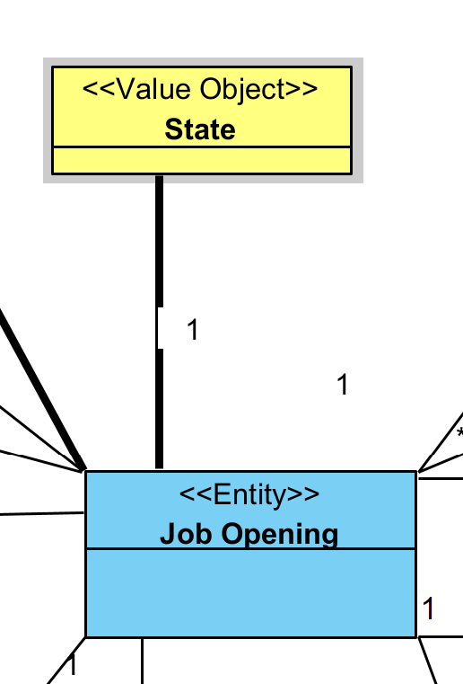
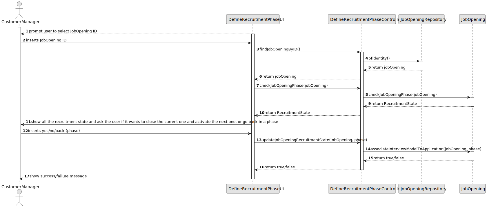

# US 1010

## 1. Context

*A recruitment process has five different phases, application, screening, interviews, analysis and result.
It is the job of the costumer manager to define in which phase of the recruitment the process is in and define the ones on going, closed on and to do phases.*

## 2. Requirements

**US 1010** As Customer Manager, I want to open or close phases of the process for a job opening.

**Acceptance Criteria:**

- 1010.1. For example, if the job opening has the interview phase closed, the application and screening should also be "closed". If analysis in "on going", the result phase should be "open".
- 1010.2. The user should be able to go back in the phases.
- 1010.3. When the result phase is closed, the job opening must become inactive.

**Dependencies/References:**

*Regarding this requirement we understand that it relates to US1007. The JobOpening has the attribute RecruitmentState that was being updated automatically in the previous US, and it the user should also be able to do it manually this time around.*


## 3. Analysis
### 3.1. Relevant Domain Model Excerpt


### 3.2. Questions and Answers
> **Question:** Relativamente à secção 2.2.1 e às fases do processo de recrutamento, para passarmos para a fase seguinte a anterior tem de fechar ou podemos avançar sem ter a anterior fechada
> 
> **Answer:** A resposta curta é que as fases devem ser sequenciais e não sobrepostas. Quando fecha uma fase abre a próxima. A US 1007 prevê a definição das fases. A US 1010 prevê a abertura e fecho de fases do processo. A decisão do Customer Manager de fechar uma fase deve assumir que o processo avança para a próxima fase automaticamente (independentemente das datas definidas para as fases).

> **Question:** Open or close phases of the process for a job opening. – Quando o Customer Manager deseja abrir ou fechar uma fase de recrutamento, este deve ter a oportunidade de escolher qual fase deseja abrir ou fechar, ou automaticamente ele avança para a próxima fase, isto é fecha a fase atual e abre a seguinte.
>
> **Answer:** Resumindo, a ideia desta US é permitir avançar nas fases de um job opening. As fases devem ser sempre sequenciais. Podemos considerar que o fecho de uma fase resulta na abertura da fase seguinte (e o avançar para a fase seguinte, significa fechar a anterior). Não deve ser possível “saltar” fases, a não ser fases que não façam parte do processo (por exemplo, se não tiver entrevistas).

> **Question:** Gostaria de saber em quê que consiste abrir ou fechar as fases de uma job opening, tendo em conta a US1007 as datas já foram definidas para cada fase.
> 
> **Answer:** Esta US permite que o processo mude de fase (tipicamente para avançar no processo). As fases têm datas mas, como referido em Q16, podemos “ativar” uma fase mesmo que ainda não estejamos no seu intervalo temporal. As datas das fases são “indicativas”, no sentido em que sugerem, em particular ao Customer Manager, como gerir temporalmente o processo. Existem “operações” que devem acontecer quando a fase respetiva esta “ativa”

> **Question:** Quando consideramos o caso de chegarmos á ultima fase, quando fecharmos a fase devemos também mudar o estado do job opening?
>
> **Answer:** Quando se fecha a última fase de um processo esse processo termina, ou seja, esse job opening já não está “activo”.

> **Question:** O utilizador deve escolher a fase que quer abrir ou fechar?
> 
> **Answer:** Penso que uma possibilidade seria o sistema apresentar a fase atual do processo e indicar o que é possível fazer. Se for possível avançar ou recuar, deve indicar que é possível e qual a fase resultante. Se não (ainda) possível avançar/recuar deve indicar a justificação desse facto

> **Question:** Consideramos que uma fase "open" não é o mesmo que uma fase "active". A fase "open" é uma fase que está disponível para ser executada, enquanto que a fase "active" é uma fase que está a ser executada. Concorda com esta distinção? Porque se o sistema quando fecha uma fase automaticamente considera a fase seguinte como "open" e se "open" for o mesmo que "active/in progress" então nunca vai ser possível "recuar" de fase.
> 
> **Answer:** Sim, penso que o que refere está de acordo com o que tentei explicar nas perguntas anteriores sobre esta US. Usei o termo “open” e “close” para indicar a abertura e o fecho das fases. Usei o termo “active” para indicar que alguma operação especifica da fase já teria sido executada (ou estava em execução) e consierava então essa fase como “activa”, o que significava que não podia mudar de fase enquanto essas “operações” não terminassem.


## 4. Design

### 4.1. Realization

| Interaction ID                                                           | Question: Which class is responsible for... | Answer                           | Justification (with patterns) |
|:-------------------------------------------------------------------------|:--------------------------------------------|:---------------------------------|:------------------------------|
| Step 1 : Customer Manager requests to select a job opening               | 	... showing available job opening?         | DefineRecruitmentPhaseUI         | Pure Fabrication              |
| 		                                                                       | 	... showing job openings?                  | DefineRecruitmentPhaseUI         | Pure Fabrication              |
| Step 2 : System updates the recruitment phase                            | 	... updating the status                    | DefineRecruitmentPhaseController | Controller                    |
|                                                                          | 	... saving the status                      | JobOpening                       | Information Expert            |
| Step 3 : System informs Customer Manager of success/failure of operation | 	... showing success/failure?               | SelectInterviewModelUI           | Pure Fabrication              |


According to the taken rationale, the conceptual classes promoted to software classes are:

* Job Opening

Other software classes (i.e. Pure Fabrication) identified:

* DefineRecruitmentPhaseUI
* DefineRecruitmentPhaseController
* JobOpeningRepository


### 4.2. Class Diagram


### 4.3. Sequence Diagram



### 4.4. Tests

**Test 1:** *  *

**Refers to Acceptance Criteria:** 1010.1


```java
    @Test
    public void testSetJobOpeningRecruitmentState() {
        RecruitmentState newState = RecruitmentState.INTERVIEWS;

        controller.setJobOpeningRecruitmentState(jobOpening, newState);

        assertEquals(newState, jobOpening.getState());

        JobOpening retrievedJobOpening = repo.ofIdentity(jobOpening.identity()).get();
        assertEquals(newState, retrievedJobOpening.getState());
    }

````

**Test 2:** *  *

**Refers to Acceptance Criteria:** 1010.2

```java
    @Test
    public void testSetJobOpeningRecruitmentStateToSubsequentState() {
        RecruitmentState initialState = RecruitmentState.RESULT;
        RecruitmentState finalState = RecruitmentState.SCREENING;
        jobOpening.setState(initialState);

        controller.setJobOpeningRecruitmentState(jobOpening, finalState);

        assertEquals(finalState, jobOpening.getState());
        
        JobOpening retrievedJobOpening = repo.ofIdentity(jobOpening.identity()).get();
        assertEquals(finalState, retrievedJobOpening.getState());
    }

````


## 5. Implementation
**Customer**

```java


````


## 6. Integration/Demonstration

A manager can view and change the recruitment phase of job openings. The UI checks if the user has manager permissions, lists job openings, and prompts for a job ID. It then displays the current recruitment phase and allows the manager to select a new phase. The controller fetches job openings, lists recruitment states, and updates the job opening’s state. The JobOpening class holds job details and manages the recruitment state.

## 7. Observations

n/a