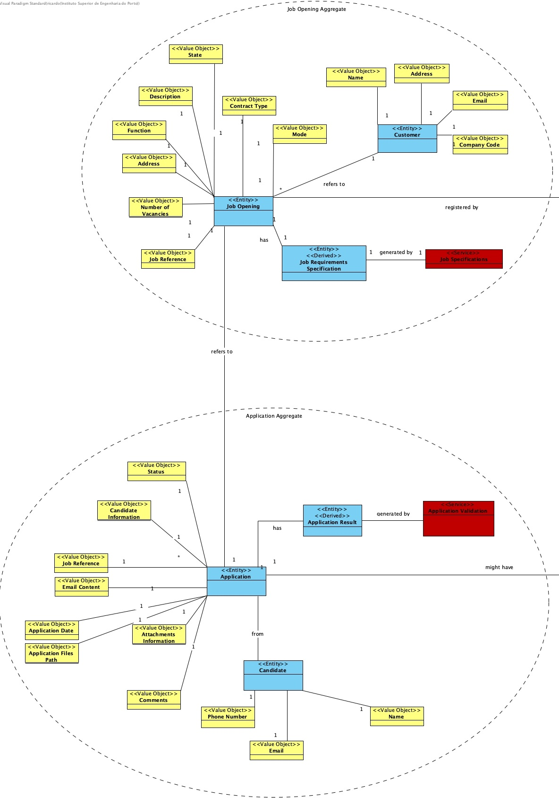

# US 1013 - As a Customer Manager, I want to rank the candidates for a job opening.

## 1. Context

* *The customer manager will be able to rank the candidates for a job opening as he pleases*

## 2. Requirements

**US 1013** 

**Acceptance Criteria:**

- The client didn't give any acceptance criteria in the system specification pdf file.

**Dependencies/References:**

*Regarding this requirement we understand that it relates to *

- 1002: As Customer Manager, I want to register a job opening.
- 2002: As Operator, I want to register an application of a candidate for a job opening and
  import all files received.


## 3. Analysis
### 3.1. Relevant Domain Model Excerpt


### 3.2. Questions and Answers
> **Question 142: Mr. Client mention a manual ranking (Q17). If the pontuation of an interview is not essential 
for the candidate's rank, what criteria is to be used when ranking?** 
> 
> **Answer 142: The ranking is a decision of the Customer Manager based on all the data that he/she may have during 
the process (including CV and other attached documents and the interviews as well as other data/information 
that may not be part of the system).**
> 
> **Question 148: A minha questão é relativa a como o ranking é feito. O customer manager dá uma nota a cada candidatura
e o sistema ordena por ordem crescente sendo assim atribuído o ranking de cada candidatura?
Se for assim, a nota terá que escala? Caso ainda seja assim ele só pode atribuir uma nota quando tiver conhecimento de todas?
Ou pode ir colocando e o ranking só é atribuído quando todas as candidaturas já estiverem avaliadas?**
> 
> **Answer 148: A ordenação dos candidatos (ranking) é da responsabilidade do customer manager.
Ele pode basear-se no resultado das entrevistas e de outra informação, mas o ranking não é automático.
Não há nota nem escala a usar. As candidaturas são ordenadas.**
> 
> **Question 155:  Is there a limit on rank entries? Let's say that 100 candidates apply for a job opening.
Does the Customer Manager have to sort all 100 candidates?**
> 
> **Answer 155: The order of candidates should include at least all the first candidates within the vacancy number and 
some following candidates. At the moment, I do not know exactly the number of the following candidates to be ordered.
Therefore, I would like for it to be a global configuration property in the system. 
It could be a number representing a magnitude from the vacancy number. 
For instance, 1 could mean exactly the same number of vacancies, 2 the double, 0,5 half the number of vacancies.
The remainder of the candidates could be just tagged as not ranked.**
> 
> **Question 160: Edit ranking - The customer manager can change the rank of a candidate after assigning it?**
> 
> **Answer 160: That should be possible if none of the interested parties were yet notified of the results**


## 4. Design

### 4.1. Realization

| Interaction ID                                         | Question: Which class is responsible for...      | Answer                   | Justification (with patterns)      |
|:-------------------------------------------------------|:-------------------------------------------------|:-------------------------|:-----------------------------------|
| Step 1 : asks to rank the candidates for a job opening | ... interacting with the user                    | RankCandidatesUI         | No reason for other class to do it |
|                                                        | ... coordinating the us?                         | RankCandidatesController | Controller                         |
| Step 2 : requests the job opening ID                   | ... requesting information?                      | RankCandidatesUI         | Pure Fabrication                   |
| Step 3 : inserts information                           | ... validating the information?                  | JobOpening               | Information Expert                 |
|                                                        | ... get applications for the job opening?        | RankCandidatesController | Controller                         |
|                                                        | ... having the applications?                     | ApplicationRepository    | Information Expert                 |
|                                                        | ... knowing the data of the Application          | Application              | Information Expert                 |
|                                                        | ... get number of vacancies for the job opening? | RankCandidateController  | Controller                         |
|                                                        | ... having the job openings?                     | JobOpeningRepository     | Information Expert                 |
|                                                        | ... knowing the number of vacancies?             | JobOpening               | Information Expert                 |
| Step 4 : requests to insert the applications ordered   | ... requesting information?                      | RankCandidatesUI         | Pure Fabrication                   |
| Step 5 : inserts information                           | ... validating the information?                  | Application              | Information Expert                 |   
|                                                        | ... create the ranking?                          | RankCandidates           | Pure Fabrication                   |
|                                                        | ... persisting the ranking?                      | RankCandidatesRepository | Information Expert                 |
| Step 6: show success of operation                      | ... interacting with user?                       | RankCandidatesUI         | Pure Fabrication                   |

According to the taken rationale, the conceptual classes promoted to software classes are:

* RankCandidatesUI
* RankCandidates
* RankCandidatesController
* RankCandidateRepository

Other software classes (i.e. Pure Fabrication) identified:

* JobOpening
* Application
* ApplicationRepository
* JobOpeningRepository


### 4.2. Class Diagram


### 4.3. Sequence Diagram


### 4.4. Tests

**Test 1:** *  *

**Refers to Acceptance Criteria:** 1013.1


```java


````


## 5. Implementation
**Customer**

```java


````


## 6. Integration/Demonstration

n/a

## 7. Observations

n/a