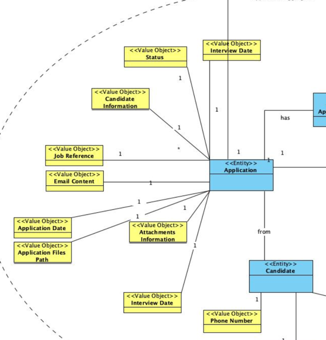
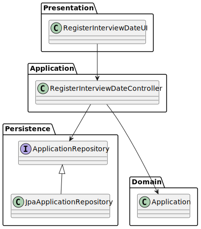
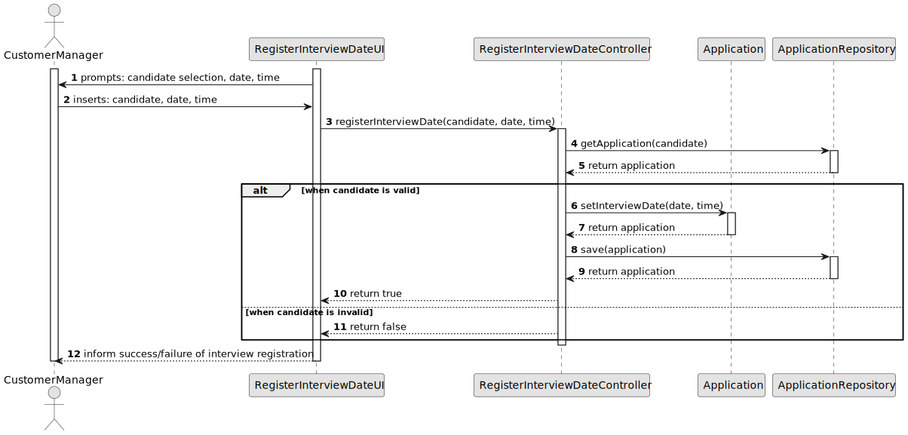

# US 1014 - Record the date and time of an Interview with a candidate

## 1. Context

* Customer Managers are required to record the date and time of an interview with a candidate. This information is important for the Customer Manager to be able to schedule the interview with the candidate and to be able to follow up on the interview. 

## 2. Requirements

**US 1014** 

**Acceptance Criteria:**

- 1014.1. The system should allow the Customer Manager to record the date and time of an interview with a candidate.
- 1014.2. The date and time of the interview should be valid.

**Dependencies/References:**

*Regarding this requirement we understand that it relates to *


## 3. Analysis
### 3.1. Relevant Domain Model Excerpt


### 3.2. Questions and Answers
> **Question:** 
> 
> **Answer:** 


## 4. Design

### 4.1. Realization

| Interaction ID                | Question: Which class is responsible for... | Answer | Justification (with patterns) |
|:------------------------------|:--------------------------------------------|:-------|:------------------------------|
| Step 1 :                      | 	...                                        |        |                               |


According to the taken rationale, the conceptual classes promoted to software classes are:

* 

Other software classes (i.e. Pure Fabrication) identified:

* 


### 4.2. Class Diagram



### 4.3. Sequence Diagram



### 4.4. Tests

**Test 1:** *  *

**Refers to Acceptance Criteria:** 1014.1


```java


````


## 5. Implementation
**Customer**

```java


````


## 6. Integration/Demonstration

n/a

## 7. Observations

n/a