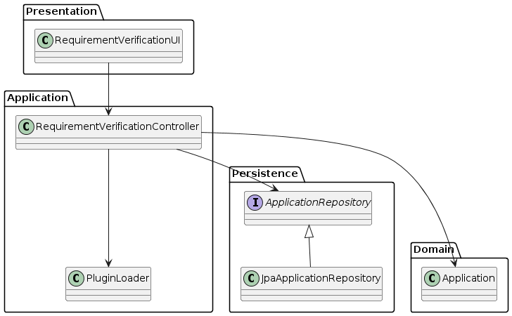
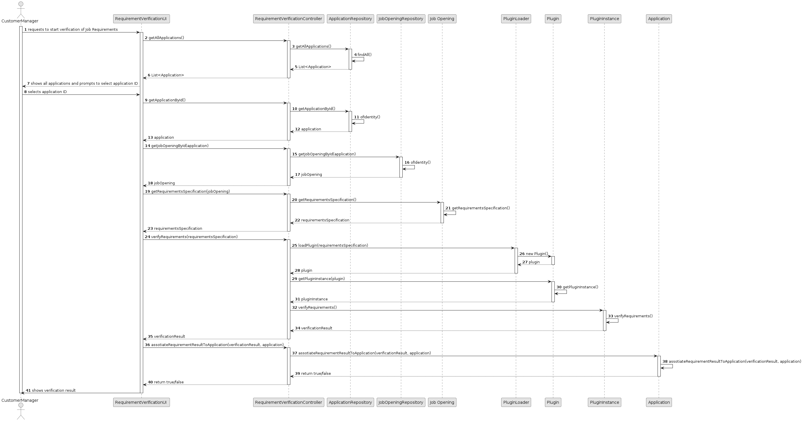

# US 1015

## 1. Context

*Each Job Opening has certain requirements that are previously defined before being open for applications. The Customer Manager must be able to use a plugin (created by the language engineer) that verifies if a candidate's application meets the requirements for that specific job opening or not.*

## 2. Requirements

**US 1015** As Customer Manager, I want to execute the process of veri￿cation of requirements of applications for a job opening.

**Acceptance Criteria:**

- 1015.1. It should only be possible to execute the process of verifying the requirements of applications for a job opening if, previously, the Customer Manager has selected the requirements specification model for that job opening.

**Dependencies/References:**

*Regarding this requirement we understand that it relates to US1016 since only after verifing the requirements can the Customer Manager notify the candidates of the result.*


## 3. Analysis
### 3.1. Relevant Domain Model Excerpt


### 3.2. Questions and Answers
> **Question:** Deve ser executado o processo para todos os candidatos ou apenas para alguns (segundo algum critério)?
> 
> **Answer:** Os ficheiros com as respostas aos requisitos vão entrando no sistema gradualmente. Talvez seja mais “simples” que o processo execute (ou seja, faça a verificação dos requisitos) para os candidatos para os quais já foi submetido o ficheiro de requisitos. Nalgum momento o processo irá executar com todos os candidatos já com os ficheiros de requisitos submetidos.

> **Question:** 1016 - Notify candidates - This user story has a functional dependency with 1015. I would like to know if an error occurs, do I need to delete what happened in US 1015, as if it were a transaction?
>
> **Answer:** The process of notification (US1016) must be done after the verification (US1015) but an error in the notification does not invalidate the “results” of the verification process.


## 4. Design

### 4.1. Realization

| Interaction ID                                                                                           | Question: Which class is responsible for... | Answer                            | Justification (with patterns) |
|:---------------------------------------------------------------------------------------------------------|:--------------------------------------------|:----------------------------------|:------------------------------|
| Step 1 : Customer Manager requests to verify job requirements from application and enters Job Opening ID | 	... prompting the Job Opening ID?          | RequirementVerificationUI         | Pure Fabrication              |
| Step 2 : System loads the plugin that is assotiated to the job opening and starts verification           | 	... ... loading th plugin?                 | RequirementVerificationController | Controller                    |
| 		                                                                                                       | 	... accessing the plugin?                  | PluginLoader                      | Pure Fabrication              |
| 		                                                                                                       | 	... showing the result?                    | RequirementVerificationUI         | Pure Fabrication              |
| Step 3 : System showthe result and assotiates it to the Candidate Application                            | 	... saving the result?                     | Application                       | Information Expert            |


According to the taken rationale, the conceptual classes promoted to software classes are:

* Application

Other software classes (i.e. Pure Fabrication) identified:

* RequirementVerificationUI
* RequirementVerificationController
* PluginLoader


### 4.2. Class Diagram



### 4.3. Sequence Diagram



### 4.4. Tests

**Test 1:** *Ensure that Job Opening has a Requirement Specification Model*

**Refers to Acceptance Criteria:** 1015.1


## 5. Implementation
**Customer**

```java


````


## 6. Integration/Demonstration

n/a

## 7. Observations

n/a