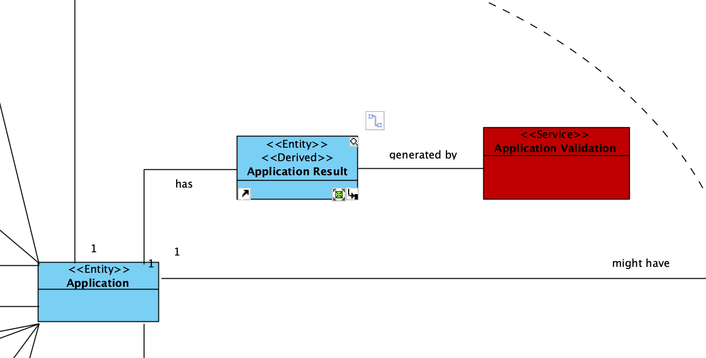

# US 1015

## 1. Context

*Each Job Opening has certain requirements that are previously defined before being open for applications. The Customer Manager must be able to use a plugin (created by the language engineer) that verifies if a candidate's application meets the requirements for that specific job opening or not. *

## 2. Requirements

**US 1015** As Customer Manager, I want to execute the process of veri￿cation of requirements of applications for a job opening.

**Acceptance Criteria:**

- 1015.1. 

**Dependencies/References:**

*Regarding this requirement we understand that it relates to US1016 since only after verifing the requirements can the Customer Manager notify the candidates of the result.*


## 3. Analysis
### 3.1. Relevant Domain Model Excerpt


### 3.2. Questions and Answers
> **Question:** Deve ser executado o processo para todos os candidatos ou apenas para alguns (segundo algum critério)?
> 
> **Answer:** Os ficheiros com as respostas aos requisitos vão entrando no sistema gradualmente. Talvez seja mais “simples” que o processo execute (ou seja, faça a verificação dos requisitos) para os candidatos para os quais já foi submetido o ficheiro de requisitos. Nalgum momento o processo irá executar com todos os candidatos já com os ficheiros de requisitos submetidos.

> **Question:**
>
> **Answer:**

> **Question:**
>
> **Answer:**

> **Question:**
>
> **Answer:**

## 4. Design

### 4.1. Realization

| Interaction ID                | Question: Which class is responsible for... | Answer | Justification (with patterns) |
|:------------------------------|:--------------------------------------------|:-------|:------------------------------|
| Step 1 :                      | 	...                                        |        |                               |


According to the taken rationale, the conceptual classes promoted to software classes are:

* 

Other software classes (i.e. Pure Fabrication) identified:

* 


### 4.2. Class Diagram


### 4.3. Sequence Diagram


### 4.4. Tests

**Test 1:** *  *

**Refers to Acceptance Criteria:** 1015.1


```java


````


## 5. Implementation
**Customer**

```java


````


## 6. Integration/Demonstration

n/a

## 7. Observations

n/a