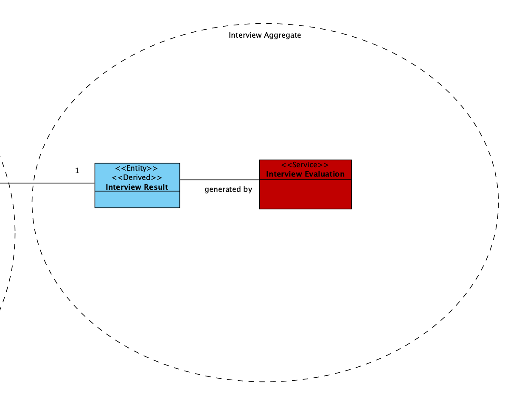
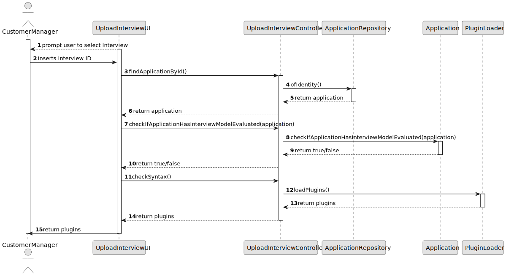

# US 1014

## 1. Context

*In the recruiting and screening phase, the customer manager will use the system to validate the format of the file and the syntax of the answers to the interview questions.*

## 2. Requirements

**US 1017** As Customer Manager, I want to upload a text file with the candidate responses for an interview.

**Acceptance Criteria:** 

- 1017.1 The system shall allow the Customer Manager to upload a text file in .txt format containing candidate responses.
- 1017.2 The system shall use ANTLR to parse and validate the syntax of the candidate responses based on predefined rules.
- 1017.3 The predefined rules for the syntax validation are as follows:
- 1017.3.1 Each question must be formatted as "#<number> <question text>".
- 1017.3.2 Each answer must be preceded by "Answer:" and must conform to the specified format for each question:
- 1017.3.2.1 True/False questions should have answers "True" or "False".
- 1017.3.2.2 Short text answers should be strings.
- 1017.3.2.3 Multiple choice answers should be one of the provided options.
- 1017.3.2.4 Multiple selections should be a list of the provided options separated by semicolons.
- 1017.3.2.5 Integer answers should be valid integers.
- 1017.3.2.6 Decimal answers should be valid decimal numbers.
- 1017.3.2.7 Date answers should be in the format dd/mm/yyyy.
- 1017.3.2.8 Time duration answers should be in the format hh:mm.
- 1017.3.2.9 Likert scale answers should be an integer between 0 and 5.
- 1017.4 If the file fails any validation checks, the system shall reject the upload and display an error message indicating the reason for the failure.

**Dependencies/References:**

*Regarding this requirement we understand that it relates to thr US1008, because we need to generate an interview model so it can be filled, upload and checked syntactically.*

## 3. Analysis
### 3.1. Relevant Domain Model Excerpt


### 3.2. Questions and Answers
> **Question:** O nosso grupo tem uma dúvida em relação ao processamento dos ficheiros de respostas dos candidatos para a entrevista. No caso de upload de um ficheiro, se a pergunta que requer um número como resposta for preenchida com um formato inválido, por exemplo, uma letra, devemos considerar isso como um formato inválido na US 1017 (e pedir para o user voltar a dar upload a um ficheiro válido) ou devemos, na US1018, considerar que está incorreta e atribuir 0 pontos automaticamente para essa resposta inválida? Isto é, na US 1017, devemos apenas verificar o formato do ficheiro ou devemos verificar também se as respostas são preenchidas com o tipo de dados correto.
> 
> **Answer:** O caso mencionado deve ser considerado um erro de validação do ficheiro (ou seja, o ficheiro submetido não corresponde à gramática definida).


## 4. Design

### 4.1. Realization

| Interaction ID                | Question: Which class is responsible for... | Answer | Justification (with patterns) |
|:------------------------------|:--------------------------------------------|:-------|:------------------------------|
| Step 1 :                      | 	...                                        |        |                               |


According to the taken rationale, the conceptual classes promoted to software classes are:

* 

Other software classes (i.e. Pure Fabrication) identified:

* 


### 4.2. Class Diagram


### 4.3. Sequence Diagram



### 4.4. Tests

**Test 1:** *  *

**Refers to Acceptance Criteria:** 1017.1


```java


````


## 5. Implementation
**Customer**

```java


````


## 6. Integration/Demonstration

n/a

## 7. Observations

n/a