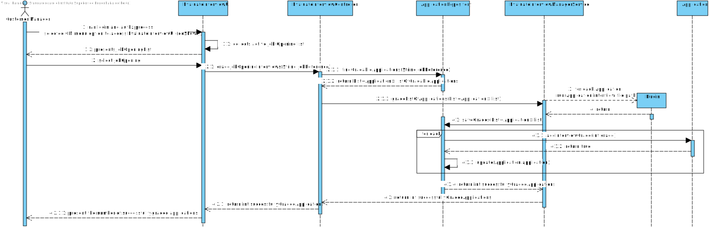

# US 1018 - Execute the process that evaluates (grades) the interviews

## 1. Context

The US will allow the user customer manager, using the Backoffice App, to swiftly grade the interview answers available for a job opening.
It implies that only the Applications that had interviews and the record of them will be taken in consideration for the grading.
The result is then associated to the Application on a scale 0-100.

## 2. Requirements

**US 1018** As Customer Manager, I want to execute the process that evaluates (grades) the interviews for a job opening.

**Acceptance Criteria:**

- 1018.1. Only Applications that have interview files will be graded.
- 1018.2. Result is stored within Application.

**Dependencies/References:**

It is dependent on [US 1012](../../Sprint B/us_1012/readme.md), since it needs that the system generates the template file.

**Question and Answers**

> "*A199. A US1018 não deve alterar a fase actual. A US1010 permite fazer a mudança de fases do processo de recrutamento.*"

> "*Q214. (...) No caso de upload de um ficheiro, se a pergunta que requer um número como resposta for preenchida com um formato inválido, por exemplo, uma letra, devemos considerar isso como um formato inválido na US 1017 (e pedir para o user voltar a dar upload a um ficheiro válido) ou devemos, na US1018, considerar que está incorreta e atribuir 0 pontos automaticamente para essa resposta inválida? <br>
> Isto é, na US 1017, devemos apenas verificar o formato do ficheiro ou devemos verificar também se as respostas são preenchidas com o tipo de dados correto? <br>
> A214. O caso mencionado deve ser considerado um erro de validação do ficheiro (ou seja, o ficheiro submetido não corresponde à gramática definida).*"

> "*A235. Na secção 2.3.4: “The system should provide a justification, such as "A minimum Bachelor degree is required for the job position”.
> A similar approach is used for job interviews, but in this case, the goal is not to approve or reject a candidate but to evaluate the answers and calculate a grade for the interview in the range 1-100”.
> Sim, seria importante apresentar uma listagem ordenada pelas notas.
> Devia ainda ser possivel, para cada entrevista, saber a justfificação para a nota.
> Pode ser considerada justificação saber para cada pergunta a nota obtida e qual foi a resposta data pelo candidato (por exemplo).*"

## 3. Analysis

From the context and requirements, it was identified the following major features to take in consideration towards the design.
- The Backoffice APP, through Customer Manager UI, will display an option to grade all the available interviews of a given Job Opening.
- Once selected, it must verify it there is an interview grade already assigned to each Application associated with the Job Opening.
- It will then work with only those Applications that do not have an interview grade assigned, and have an interview ready to be graded.
- With this "filtered" list, grading must be done by the system for each Application.
- The grade must be stored along all other Application details.
- Process outcome shall be displayed to CM, with the amount of gradings executed.

## 4. Design

### 4.1. Realization

Customer Manager UI will provide a UI to Evaluate Interviews. <br>
The UI will straight away display the list of active JobOpenings. <br>
Customer Manager will select one Job Opening. <br>
The system will the handle the process. <br>
First by getting a list of gradable applications associated to the job opening selected. <br>
Then each application interview file path will be handed to the correspondent plugin to evaluate the interview. <br>
Afterward the result will be collected by the Application object, from the updated file, that now has the grade written in it. <br>
The repository will update itself with the updated Application, if there's a valid evaluation. <br>
At last, the amount of graded application interviews will be returned to the UI and presented to the user.

#### Grade of Applications Interview

| Interaction ID                                                                        | Question: Which class is responsible for...                                                                   | Answer                               | Justification (with patterns) |
|:--------------------------------------------------------------------------------------|:--------------------------------------------------------------------------------------------------------------|:-------------------------------------|:------------------------------|
| Step 1 : Present job opening list, and then application management options            | ... presenting options?                                                                                       | EvaluateInterviewUI                  | Pure Fabrication              |
|                                                                                       | ... collect option?                                                                                           | EvaluateInterviewUI                  | Pure Fabrication              |
| Step 2 : Identify Applications that have not been graded and have an interview stored | ... coordinating request?                                                                                     | EvaluateInterviewController          | Controller                    |
|                                                                                       | ... finding the list of Applications of a given Job Opening that are not graded and have interview available? | ApplicationRepository                | Information Expert            |
| Step 3 : Request respective plugin to grade the interview for each Application        | ... coordinating request?                                                                                     | EvaluateInterviewController          | Controller                    |
|                                                                                       | ... execute grading?                                                                                          | Plugin (associated with Job Opening) | Plugin                        |
| Step 4 : Stores result of interview grading for each Application                      | ... coordinating request?                                                                                     | EvaluateInterviewController          | Controller                    |
|                                                                                       | ... gather result of grading?                                                                                 | EvaluateInterviewManagerService      | Service                       |
|                                                                                       | ... save the result within Application?                                                                       | Application                          | Information Expert            |
|                                                                                       | ... update Application?                                                                                       | ApplicationRepository                | Information Expert            |
| Step 5 : Display result of the process                                                | ... presenting result?                                                                                        | EvaluateInterviewUI                  | Pure Fabrication              |

According to the taken rationale, the conceptual classes promoted to software classes are:

* Application

Other software classes (i.e. Pure Fabrication) identified:

* EvaluateInterviewUI
* EvaluateInterviewController
* EvaluateInterviewManagerService
* JobOpeningRepository
* ApplicationRepository

### 4.2. Sequence Diagram



### 4.3. Tests

**Test 1:** *Assure that only Applications with no graded interviews and interview files associated are listed.* <br>
**Refers to Acceptance Criteria:** 1018.1.

```java
@Test
public void validateListOfValidApplicationsToGrade() {  }
````

**Test 2:** *US outcome reflects on Application interview grade updated.* <br>
**Refers to Acceptance Criteria:** 1018.2.

```java
@Test
public void applicationWithEmptyInterviewGradeChangesToGraded() {  }
````

## 5. Implementation

Functionality added to Backoffice App, Customer Manager UI.

> Commit list (descending)
>
> ...

## 6. Integration/Demonstration

An EvaluateInterviewManagerService was created to manage requests related with the interview object/file associated with the Application.
Previous gradings and ready to be graded criteria had to be met, in order for the client's requirements to be achieved.

## 7. Observations

N/A