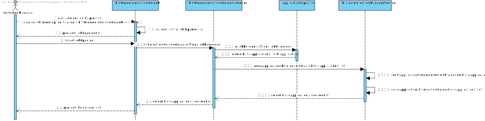

# US 1019 - Get an ordered list of candidates, using the job interview points (grades).

## 1. Context

The US will allow the user customer manager, using the Backoffice App, to quickly observe the ordered list of graded candidates of a job opening.
It implies that only the Job Openings that had gone through the Interview phase are eligible for this use-case scenario.
The ordered list will place on the top the candidates with better interview results.

## 2. Requirements

**US 1019** As Customer Manager, I want to get an ordered list of candidates, using the job interview points (grades), to help me analyse the candidates.

**Acceptance Criteria:**

- 1019.1. Only Job Openings that had/have interview phase will be available.
- 1019.2. All candidates to a given Job Opening are listed, even if they haven't received an interview grade.
- 1019.3. List ordered by interview grade or alphabetically in case of a tie.

**Dependencies/References:**

It is dependent on [US 1018](../us_1018/readme.md), since it needs that the system executes the interview analysis.

**Question and Answers**

> "*A169. Sim, a ordenação é relativa a candidaturas para um job opening. <br>
> A ordenação deve ser descendente, do que tem maior pontuação para o que tem menor pontuação.*"

> "*A177. (...) Relativamente ao exemplo que apresenta parece-me que satisfaz o que pretendo. <br>
> Job Opening : XXX <br>
> Nome | Email | Grade <br>
> Jane Doe| jane@doe.pt | 85 <br>
> John Doe | john@doe.pt | 70*"

> "*A197. Esta US não faz sentido para processos que não tenham entrevista.*"

> "*A226. A referência a “analize the candidates” é apenas para passar a ideia que se pretende nesta US que o sistema disponibilize uma forma do Customer Manager conseguir consultar o resultado das entrevistas de forma a ajudar a decidir o ranking dos candidatos. <br>
> Nada mais. <br>
> O ranking doa candidatos é registado no sistema através da US 1013.*"

> "*A236. Não vejo isso como uma obrigação, mas penso que faz mais sentido nessa fase admitindo que apenas nessa fase seja garantido que todas as entrevistas foram efetuadas e todos os candidatos “avaliados” pelas entrevistas.*"

## 3. Analysis

From the context and requirements, it was identified the following major features to take in consideration towards the design.
- The Backoffice APP, through Customer Manager UI, will display an option to list all the interview graded Candidates of a given Job Opening.
- Once selected, it must verify if there is any interview evaluation pending for that Job Opening.
- If YES, then present message and stop US execution, requesting to run the evaluation process.
- If NOT it will then work with the Applications of the Job Opening, ordering them by interview grade, or alphabetically if tied.
- Process outcome shall be displayed to CM, as per requirement (example below):

> Job Opening : XXX <br>
> Nome | Email | Grade <br>
> Jane Doe| jane@doe.pt | 85 <br>
> John Doe | john@doe.pt | 70 <br>


## 4. Design

### 4.1. Realization

Customer Manager UI will provide a UI to List Candidates ordered by interview grade. <br>
The UI will straight away display the list of JobOpenings that have gone through Interview phase (or are currently at). <br>
Customer Manager will select one Job Opening. <br>
The system will then verify if there is pending interview evaluations to be done. <br>
If NOT, it will order the Applications by grade (descendent), or alphabetically in case of a tie. <br>
At last, the list will be returned to the UI and presented to the user as per requirement.

#### Ordered List of Applications by Interview Grade

| Interaction ID                                                                                   | Question: Which class is responsible for...                                                                   | Answer                              | Justification (with patterns) |
|:-------------------------------------------------------------------------------------------------|:--------------------------------------------------------------------------------------------------------------|:------------------------------------|:------------------------------|
| Step 1 : Present job opening list, and then application management options                       | ... presenting options?                                                                                       | ListOrderedInterviewGradeUI         | Pure Fabrication              |
|                                                                                                  | ... collect option?                                                                                           | ListOrderedInterviewGradeUI         | Pure Fabrication              |
| Step 2 : Verify if there are Applications that have not been graded and have an interview stored | ... coordinating request?                                                                                     | ListOrderedInterviewGradeController | Controller                    |
|                                                                                                  | ... finding the list of Applications of a given Job Opening that are not graded and have interview available? | ApplicationRepository               | Information Expert            |
| Step 3 : Order Applications by interview grade (or alphabetically in case of a tie)              | ... coordinating request?                                                                                     | ListOrderedInterviewGradeController | Controller                    |
|                                                                                                  | ... execute ordering?                                                                                         | EvaluateInterviewManagerService     | Service                       |
| Step 5 : Display result of the process                                                           | ... presenting result?                                                                                        | ListOrderedInterviewGradeUI         | Pure Fabrication              |

According to the taken rationale, the conceptual classes promoted to software classes are:

* n/a

Other software classes (i.e. Pure Fabrication) identified:

* ListOrderedInterviewGradeUI
* ListOrderedInterviewGradeController
* EvaluateInterviewManagerService
* JobOpeningRepository
* ApplicationRepository

### 4.2. Sequence Diagram



### 4.3. Tests

**Test 1:** *Assure that the list is ordered by grade.* <br>
**Refers to Acceptance Criteria:** 1019.3.

```java
@Test
public void validateListOrderedByGrade() {  }
````

**Test 2:** *Assure that applications with tied interview grades (or no grades at all) are ordered alphabetically.* <br>
**Refers to Acceptance Criteria:** 1019.3.

```java
@Test
public void validateApplicationsTiedGradesAlphabeticallyOrdered() {  }
````

## 5. Implementation

Functionality added to Backoffice App, Customer Manager UI.

> Commit list (descending)
>
> ...

## 6. Integration/Demonstration

Used EvaluateInterviewManagerService created previously.

## 7. Observations

N/A