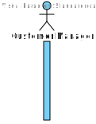
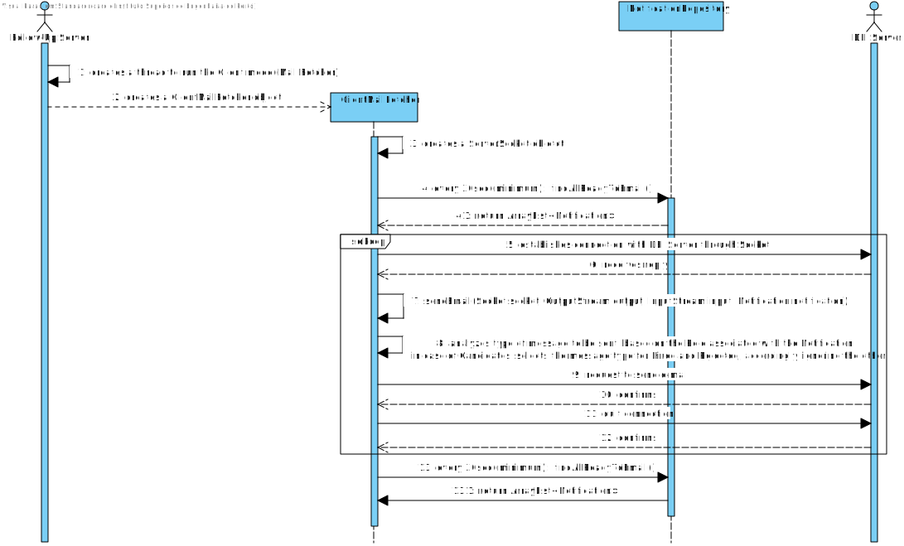

# US 1020 - Publish the results of the selection of candidates for a job opening, so that candidates and customer are notified by email of the result

## 1. Context

The US will allow the user customer manager, using the Backoffice App, to notify all the stakeholders of a given job opening.
Candidates and Customer will be receiving an e-mail with the job opening process outcome.
The notification will also be generated for Customer and Candidate App visualization.

## 2. Requirements

**US 1020** As Customer Manager, I want to publish the results of the selection of candidates for a job opening, so that candidates and customer are notified by email of the result.

**Acceptance Criteria:**

- 1020.1. Email must be sent through the Follow-Up server (FUS), on SMTP communication by the DEI server.
- 1020.2. The client side of the FUS must be looking for new e-mails to be sent every 30 seconds.
- 1020.3. There must be a ranking defined, before the notification is raised.
- 1020.4. The option to post a notification must only be available once the ranking is done.

**Dependencies/References:**

It is dependent on [US 1013](../us_1013/readme.md), as per client requirement.

**Question and Answers**

> *"Q48. (...) relativamente ao envio das notificações por email, é necessário guardar que esse envio foi feito?
> A48. (...) do ponto de vista de gestão do processo da jobs4u parece-me adequado que essa informação fique registada."*

> *"A51. A publicação refere-se a informar os candidatos e o cliente, por email.
> Os candidatos que são selecionados devem receber um email a indicar que para a sua candidatura ao job opening foram selecionados e irão ser contactados pela empresa.
> No que se refere à empresa, esta deve receber um email com a lista dos candidatos selecionados que deve incluir o nome e dados de contacto do candidato."*

> *"Q190. (...) Regarding the selection of candidates, should we assume that the first N candidates in the ranking (where N is the number of job vacancies) are chosen, or should we allow the customer manager to select the N candidates?
> A190. The first option (using the results from US1013)."*

> *"Q224. (...) a minha pergunta seria se este processo só pode acontecer quando a job opening estiver encerrada ou se executar esta operação terminaria a job opening.
> A224. Esta US é relativa à última fase do processo.
> Se as notificações executarem todas com sucesso em princípio já não existe mais nada a fazer neste processo."*

## 3. Analysis

From the context and requirements, it was identified the following major features to take in consideration towards the design.
- The Backoffice APP, through Customer Manager UI, will display an option to notify stakeholders (Candidates and Customer) of a given Job Opening that has been ranked.
- Once the option to notify is selected, the selected Job Opening will be set to the state of being ready to be notified.
- The FUS shall then be able to identify any pending notification to be sent and establish an SMTP communication with the DEI server in order to send e-mails through it.
- For each e-mail that was properly sent, it must be identified as such, or else, an error message must be stored.
- An option shall be displayed to the CM to check if the e-mail notifications were sent or not, or even if an error occurred with a given notification.

## 4. Design

### 4.1. Realization

Customer Manager UI to list job openings ready to be notified.
When selected, it shall show the status of each notification (per Candidate, and for the Customer), if there is any, and a message if there's none.
System asks if the user wants to notify the selected application stakeholders.
Being a positive response, it will trigger the notification service:
    
    - It will validate if there's been a notification for a given application.
    - If yes, validates if the current status is the same as the one previously notified.
    - If it is the same, nothing happens.
    - If it is different, the status of the notification changes and the notification is set to "Ready to be sent".
        - It also updates Customer notification record to "Ready to be sent".
    - If it doesn't exist at all, the notification is created and set to "Ready to be sent".
        - It also updates Customer notification record to "Ready to be sent".

On the FUS side, a thread is created to be focused on finding new e-mail notifications to be sent. <br>
Every 30 seconds, it collects a list of "Ready to be sent" notifications. <br>
It executes the SMTP connection to send the e-mails.
After sending each e-mail, the status of the notification is updates, accordingly to the outcome of the previous task (SENT or FAILED).

#### Publish Results of Applications

| Interaction ID                                                                   | Question: Which class is responsible for...          | Answer                                | Justification (with patterns) |
|:---------------------------------------------------------------------------------|:-----------------------------------------------------|:--------------------------------------|:------------------------------|
| Step 1 : Present notification management options                                 | ... presenting options?                              | NotificationUI                        | Pure Fabrication              |
|                                                                                  | ... collect option?                                  | NotificationUI                        | Pure Fabrication              |
| Step 2 : Identify Job Openings in result phase                                   | ... coordinating request?                            | ListJobOpeningsController             | Controller                    |
|                                                                                  | ... finding the list of Job Opening in Result phase? | JobOpeningRepository                  | Information Expert            |
| Step 3 : Request for the Job Opening associated with stakeholders to be notified | ... presenting available Job Opening?                | NotificationUI                        | Pure Fabrication              |
|                                                                                  | ... collect option?                                  | NotificationUI                        | Pure Fabrication              |
| Step 4 : Save notification information to be fetched by the Follow-up Server     | ... coordinating request?                            | NotificationCustomerManagerController | Controller                    |
|                                                                                  | ... save the correct instance of Notification?       | NotificationRepository                | Information Expert            |
| Step 5 : Display result of the process                                           | ... presenting result?                               | NotificationUI                        | Pure Fabrication              |

#### Send e-mail to pending notifications

| Interaction ID                                       | Question: Which class is responsible for...                | Answer                 | Justification (with patterns) |
|:-----------------------------------------------------|:-----------------------------------------------------------|:-----------------------|:------------------------------|
| Step 1 : Initialize Client mode                      | ... create a thread to run Client class?                   | FollowUpServer         | Creator                       |
| Step 2 : Obtain pending Email Notifications          | ... request pending email Notifications list?              | ClientMailFetcher      | Controller                    |
|                                                      | ... finding pending email Notifications list?              | NotificationRepository | Information Expert            |
| Step 3 : Establish connection with DEI Server        | ... open socket with DEI Server?                           | ClientMailFetcher      | Controller                    |
| Step 4 : Analyze type of email to be sent            | ... choose what type of email to be sent? (if sent at all) | ClientMailFetcher      | Information Expert            |
| Step 5 : Request to send email with given parameters | ... request email to be sent?                              | ClientMailFetcher      | Controller                    |
| Step 6 : Save outcome, based on DEI Server reply     | ... analyzes reply?                                        | ClientMailFetcher      | Information Expert            |
|                                                      | ... requests to update Notification?                       | ClientMailFetcher      | Controller                    |
|                                                      | ... saves update?                                          | NotificationRepository | Information Expert            |

According to the taken rationale, the conceptual classes promoted to software classes are:

* FollowUpServer
* Notification
* ClientMailFetcher

Other software classes (i.e. Pure Fabrication) identified:

* NotificationUI
* ListJobOpeningsController
* JobOpeningRepository
* NotificationCustomerManagerController
* NotificationRepository

### 4.2. Sequence Diagram





### 4.3. Tests

**Test 1:** *Guarantee good communication with DEI server or proper handle of failed connection.* <br>
**Refers to Acceptance Criteria:** 1020.1.

```java
@Test
public void validateConnectionToDeiServerHandling() {  }
````

**Test 2:** *Requests to DEI server must be executed within 30 seconds or more time span.* <br>
**Refers to Acceptance Criteria:** 1020.2.

```java
@Test
public void emailRequestAreWithinTimeSpan() {  }
````

**Test 3:** *Option to notify stakeholders must only be available for a ranked Job Opening.* <br>
**Refers to Acceptance Criteria:** 1020.4.

```java
@Test
public void optionToNotifyIsOnlyAvailableForRankedJobOpening() {  }
````

## 5. Implementation

Functionality added to Backoffice App, Customer Manager UI. <br>
Functionality added to Follow-Up Server App, Client thread.

> Commit list (descending)
>
> 3487891 <br>
> 5ba8373 <br>
> ba80199 <br>
> 5d93dd0 <br>
> 4fa945b <br>
> aae500a <br>
> ee6f4f9 <br>
> 00c4816 <br>
> f478f7c <br>
> 18d3999 <br>
> c65c6ab <br>
> 404ae6c

## 6. Integration/Demonstration

SMTP communication with DEI server was implemented, by using the FUS as client. <br>
Action chain was ensured to guarantee a periodic execution of notifications identification and e-mail requests sent to DEI server. <br>
Threads were applied, so that multiple requests can interact with DEI server.

## 7. Observations

N/A