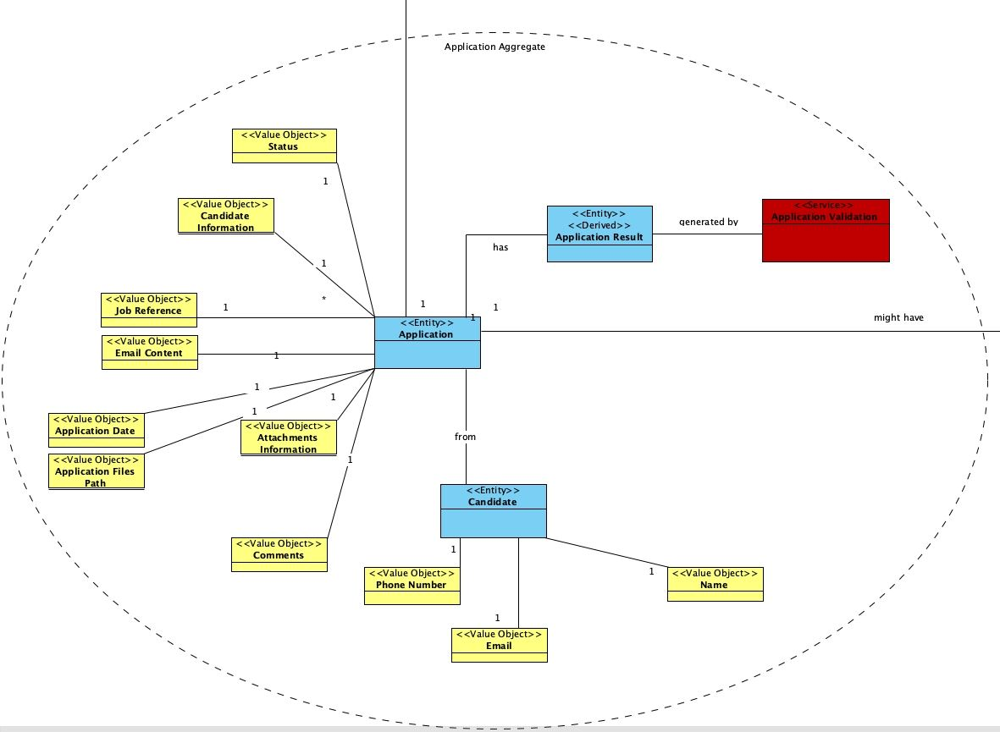
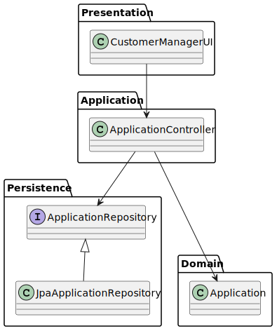
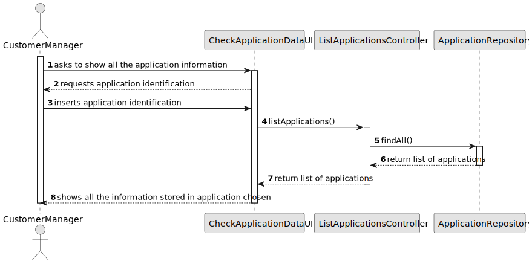

# US 1021 - As a Customer Manager, I want to display all the data of an application

## 1. Context

* * With this user story the customer manager wants to be able to access the imported files and all generated data, 
such as interviews, from a job application of a candidate.

## 2. Requirements

** **

**Acceptance Criteria:**

- The client didn't give any acceptance criteria in the system specification pdf file. 

**Dependencies/References:**

*Regarding the requirements we understand that it relates to:

- 2002: As Operator, I want to register an application of a candidate for a job opening and import all files received.


## 3. Analysis
### 3.1. Relevant Domain Model Excerpt


### 3.2. Questions and Answers
> **Question 36: O que é "all data of an application? O que é uma job application?** 
> 
> **Answer 36: Uma job application é uma candidatura (de um candidato) a uma job opening. 
Relativamente ao “all data of an application” refere-se a todos os dados de uma candidatura, nomeadamente, 
os ficheiros submetidos pelos candidato assim como dados recolhidos ou gerados durante o processo 
(como as entrevistas e processamento de requisitos).** 
>


## 4. Design

### 4.1. Realization

| Interaction ID                               | Question: Which class is responsible for... | Answer                     | Justification (with patterns) |
|:---------------------------------------------|:--------------------------------------------|:---------------------------|:------------------------------|
| Step 1 : ask to show application information | ... interacting with the user?              | CheckApplicationDataUI     | No reason to delegate         |
|                                              | ... coordinating the us?                    | ListApplicationsController | Controller                    |
| Step 2 : request application id              | ... requesting data?                        | CheckApplicationDataUI     | Pure Fabrication              |                               |
| Step 3 : insert information                  | ... store information?                      | CheckApplicationDataUI     | Pure Fabrication              |                               |
|                                              | ... get list of applications?               | ListApplicationsController | Controller                    |
|                                              | ... having the list of applications?        | ApplicationRepository      | Information Expert            |
|                                              | ... knowing the data of the applications?   | Application                | Information Expert            |
| Step 4 : show the application data           | ... show the data of the application?       | CheckApplicationDataUI     | Pure Fabrication              |

According to the taken rationale, the conceptual classes promoted to software classes are:

* CheckApplicationDataUI

Other software classes (i.e. Pure Fabrication) identified:

* Application
* ApplicationRepository
* ListApplicationsController


### 4.2. Class Diagram



### 4.3. Sequence Diagram



### 4.4. Tests

**Test 1:** * Application Not Found  *


```java
public void applicationNotFound (){
    ListApplicationsController ctrl = new ListApplicationsController();

    ByteArrayOutputStream result = new ByteArrayOutputStream();
    System.setOut(new PrintStream(result));
    ctrl.getApplication(1000L);

    assertEquals("Applications not found!\n", result.toString());
}

````


## 5. Implementation
**CustomerManagerUI**

It was necessary to add an option in the customer manager UI so that he can access the UI created. 

```java

(...)

public void doShow(AuthzUI authzUI) {

    // set option variable, list of options, selection message, and exit name (eg.: exit / cancel / etc.)
    int option;
    List<String> options = new ArrayList<>();
    options.add("Register Customer");                       // 1
    options.add("Register Job Opening");                    // 2
    options.add("List Job Openings");                       // 3
    options.add("Select Interview Model");                  // 4
    options.add("List Candidate Personal Data");            // 5
    options.add("Test Plugin");                             // 6
    options.add("List Applications For Job Opening");       // 7
    options.add("Generate Interview File");         // 8
    options.add("Select Job Requirements Specifications");  // 9
    options.add("Edit Job Opening");                        // 10
    options.add("Generate Job Requirement Specification File");  // 11
    options.add("Check Application Data");                  //12
    String message = "What do you want to do?";
    String exit = "Exit";
    
    (...)

    case 12:
    CheckApplicationDataUI checkApplicationDataUI = new CheckApplicationDataUI();
    checkApplicationDataUI.doShow(authzUI);
    break;
    default:
    ConsoleUtils.showMessageColor("Invalid option! Try again.", AnsiColor.RED);

    (...)
````
**ListApplicationsController**

Instead of creating a new controller to do the checking of an application we used the existing controller that list all the applications and implemented a function that returns the data from a single application

```java

(...)

public void getApplication(Long applicationID) {
    Iterable<Application> applications = listApplications();

    // Check if application is empty
    if (!applications.iterator().hasNext()) {
        System.out.println("Applications not found!");
    } else {
        // Iterate over applications if it's not empty
        for (Application application : applications) {
            if (applicationID == application.getId())
                System.out.println("Application ID: " + application.getId() +
                        "\nApplication Status: " + application.getStatus() +
                        "\n\n\u001B[4mCandidate Information\u001B[0m \n" + application.getCandidate() +
                        "\n\n\u001B[4mJob Opening Information\u001B[0m" +
                        "\nJob Reference: " + application.getJobOpening().getJobReference() +
                        "\nTitle: " + application.getJobOpening().getTitle() +
                        "\nContract Type: " + application.getJobOpening().getContractType() +
                        "\nMode: " + application.getJobOpening().getMode() +
                        "\n" + application.getJobOpening().getAddress() +
                        "\nCompany: " + application.getJobOpening().getCompany().getName() +
                        "\nNumber of Vacancies: " + application.getJobOpening().getNumberOfVacancies() +
                        "\nJob Specifications: " + application.getJobOpening().getJobSpecifications() +
                        "\nJob Description: " + application.getJobOpening().getDescription() +
                        "\nJob Requirements: " + application.getJobOpening().getRequirements() +
                        "\nJob Recruitment State: " +application.getJobOpening().getState() +
                        "\n\nApplication Date: " + application.getApplicationDate() +
                        "\nInterview Model: " + application.getInterviewModel() +
                        "\nInterview Model Path: " + application.filePath() +
                        "\nApplication Files Path: " + application.applicationFilesPath());
        }
    }
}
    (...)
````

## 6. Integration/Demonstration

n/a

## 7. Observations

n/a