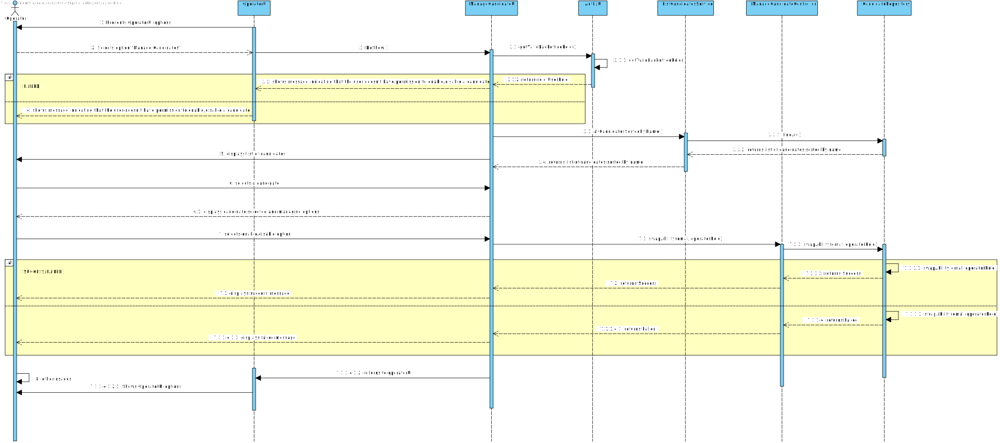

# US 2000b - As Operator, I want to enable/disable a candidate

## 1. Context

This US will allow the Operator to manage all candidates access within the system.

## 2. Requirements

**US 2000b** As Operator, I want to enable/disable a candidate

**Acceptance Criteria:**

- 2000b.1. Only the operator can enable/disable a candidate.
- 2000b.2. The candidate needs to have an ability (enabled by default).
- 2000b.2. When registering a candidate, it must be enabled by default.
- 2000b.3. Enabling/disabling a candidate does not invalidate his applications, only his access to the system.
- 2000b.4. The system must present a list of candidates for the operator to choose one to enable/disable.

**Dependencies/References:**
It has dependency on [G007](../../Sprint%20B/us_g007/readme.md), due to authentication and authorization process.
It has dependency on  [2000a](../../Sprint%20B/us_2000a/readme.md), because candidates must exist in the system for this US.  

### 2.1. Questions and Answers
> **Question:**
US2000b, o que é o enable/disable do candidato?
> **Answer:**
Refere-se a desativar o acesso do candidato ao sistema (i.e., Candidate App)
> **Question:**
For the use case 2000b which states "As Operator, I want to enable/disable a candidate". I would like to know if the client would like two different menus to be created, with each menu responsible for either activating or deactivating candidates.
> **Answer:**
I have no specific requirements for the UX/UI but I want you to follow best practices.
> **Question:**
Na us 2000b, é suposto ao desativar um candidato, apenas lhe retirar a role e deixa-lo como user ao desativa-lo completamente?
> **Answer:**
Considero que o objetivo desta US é permitir bloquear e desbloquear o acesso de um candidato ao sistema. Isso não deve invalidar as candidaturas dessa pessoa, apenas o acesso desse candidato ao sistema.

## 3. Analysis

From the context and requirements, it was identified the following major features to take in consideration towards the design. <br>
- A candidate needs to have an ability towards the system: enable/disable -, and no null or dubious ability. <br>
- The Operator is the only user that can enable/disable candidates.<br>
- Listing the candidates must present the name, email, phone and ability of each candidate ordered by name. <br>
- Bootstrapping data can be generated. <br>

## 4. Design

### 4.1. Realization

Operator UI has an option to enable/disable candidates. <br>

It will also be added the value object ABILITY to the Candidate, and to be set as enable, by default, upon candidate registration. <br>

The enable/disable feature will work as a switch button. <br>
Taking this action on Operator UI will only be possible by Operator users. <br>
The action only changes the current ability of the candidate: if it is enabled, it will be disabled, and vice-versa. <br>

| Interaction ID                                                                | Question: Which class is responsible for... | Answer                    | Justification (with patterns) |
|:------------------------------------------------------------------------------|:--------------------------------------------|:--------------------------|:------------------------------|
| Step 1 : System presents Operator options                                     | ... presenting the Operator options?        | Operator UI               | Pure Fabrication              |
| Step 2 : Operator selects an option                                           | ... gathering option?                       | Operator UI               | Pure Fabrication              |
|                                                                               | ... calling specific option UI?             | Operator UI               | Pure Fabrication              |
| Step 3 : System builds a list of candidates (name, email, phone and ability)  | ... requesting list to be built?            | ListCandidatesService     | Service                       |
| Step 4 : System presents a list of candidates available with name and ability | ... show result?                            | ManageCandidateUI         | Pure Fabrication              |
| Step 5 : Operator selects one candidate                                       | ... gathering candidates selected?          | ManageCandidateUI         | Pure Fabrication              |
| Step 6 : System displays the candidate selected and managing options          | ... display candidate selected?             | ManageCandidateUI         | Pure Fabrication              |
|                                                                               | ... display managing options?               | ManageCandidateUI         | Pure Fabrication              |
| Step 7 : Operator selects enable/disable option                               | ... gather option selected?                 | ManageCandidateUI         | Pure Fabrication              |
|                                                                               | ... coordinating ability swap?              | ManageCandidateController | Controller                    |
|                                                                               | ... swapping the candidate ability?         | CandidateRepository       | Information Expert            |
| Step 6 : System presents feedback (Success or Failed)                         | ... show result?                            | ManageCandidateUI         | Pure Fabrication              |


According to the taken rationale, the conceptual classes promoted to software classes are:

* CandidateAbility

Other software classes (i.e. Pure Fabrication) identified:

* OperatorUI
* ManageCandidateUI
* ManageCandidateController
* CandidateRepository

### 4.2. Sequence Diagram



### 4.3. Tests

**Test 1:** *  *

**Refers to Acceptance Criteria:** 2000b.1


```java


````

## 5. Implementation
**Operator**

Functionalities added to Operator UI. <br>
It was added CandidateAbility value object to Candidate, since only an enabled candidate can enter the system. <br>

## 6. Integration/Demonstration

Changes to previous US had to be made, in order to support the CandidateAbility parameter. <br>
Also, enabling/disabling required a new layer of validation that checks if the role that made the action was an operator. <br>

## 7. Observations

A bootstrap was created to generate base users (one operator at least and candidates for this US were required) and other data upon app start. <br>