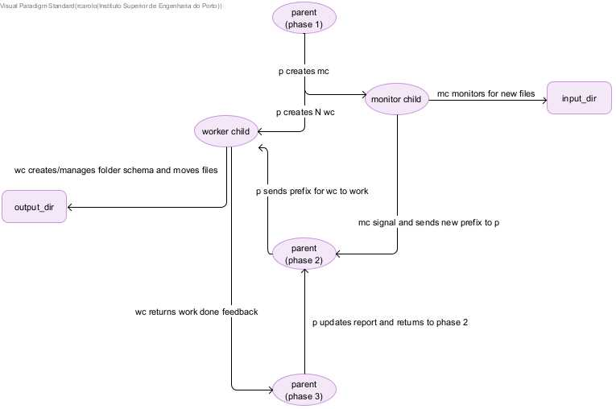

# US 1014

## 1. Context

*Previously, we implemented the File Bot that automatically processes files coming from the Email Bot. We used concurrency between processes for this functionality to be more effiecient. The processes shared information between eachother using signals and pipes. Although efficient, in a few moments processes could be kept waiting. To mitigate this, we are now going to use shared memory and semaphores instead of signals and pipes. *

## 2. Requirements

**US 2001b** As Product Owner,I want the system to, continuously, process the￿ files produced by the Applications Email Bot, so that they can be imported into the system by initiative of the Operator.

**Acceptance Criteria:**

- 2001b.1. An alternative solution for the upload of ￿les must be implemented following speci￿c technical requirements such as the use of the C programming lan- guage with shared memory and semaphores.

**Dependencies/References:**

*Regarding this requirement we understand that it relates to *

## 3. Analysis

> **Shared Memory**
>
> "**Shared Memory** is an efficeint means of passing data between programs. One program will create a memory portion which other processes (if permitted) can access." @[About Shared Memory](https://www.cs.unibo.it/~sacerdot/doc/C/corso2/node27.html)

> **Semaphores**
>
> "**Semaphores** are just normal variables used to coordinate the activities of multiple processes in a computer system. They are used to enforce mutual exclusion, avoid race conditions, and implement synchronization between processes.
The process of using Semaphores provides two operations: wait (P) and signal (V). The wait operation decrements the value of the semaphore, and the signal operation increments the value of the semaphore. When the value of the semaphore is zero, any process that performs a wait operation will be blocked until another process performs a signal operation.
Semaphores are used to implement critical sections, which are regions of code that must be executed by only one process at a time. By using semaphores, processes can coordinate access to shared resources, such as shared memory or I/O devices." @[About Semaphores](https://www.geeksforgeeks.org/semaphores-in-process-synchronization/)

## 4. Design

### 4.1. Realization

The solution design is highly impacted by the sprint non-functional requirements set by SCOMP teachers.
The team interpretation is expressed through a flow diagram, on the item below.

### 4.2. Flow diagram

## 5. Implementation
The previous code was altered in 3 main parts:

1- The monitor child warns the parent that new files have arrived using a semaphore instead of a signal.

2- The parent shares the files prefixes using shared memory instead of pipes.

3- The worker children send the report information to the parent using shared memory instead of pipes.

## 6. Integration/Demonstration

n/a

## 7. Observations

n/a