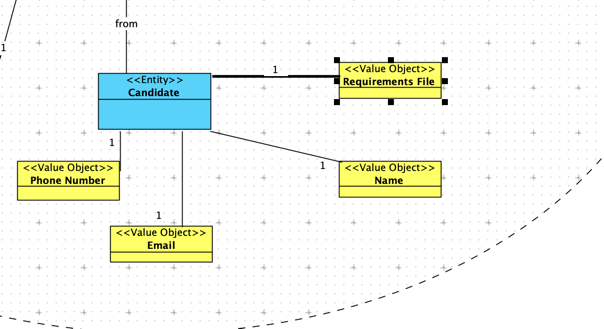

# US 2004 - As Operator, I want to upload a text file with the data fields (requirements ) of a candidate for its verification.

## 1. Context

* The operator needs to upload a text file with the data fields of a candidate to be verified. 

## 2. Requirements

**US 2004** As Operator, I want to upload a text file with the data fields (requirements ) of a candidate for its verification.

**Acceptance Criteria:**

- 2004.1. The system shall validate the file uploaded by the operator, verifying it's a valid file.
- 2004.2. The system shall allow the operator to upload a text file with the data fields of a candidate for its verification.

**Dependencies/References:**

*.*


## 3. Analysis
### 3.1. Relevant Domain Model Excerpt


### 3.2. Questions and Answers
> **Question: US2004 - Requirements Answers - I'm having trouble understading where are the requirements answer obtained from the candidates, so that the operator can then register their answers in the template previously generated and submit them to the system. Are these answers already within the files processed by tge application fie bot?** 
> 
> **Answer: Please see Q15, Q102, Q119 and Q123. We can assume that the operator has access to all the files submitted by the candidates (since he/she is the one that imports the files into the system – US2002). He/she can than consult these files in order to answer the questions in the requirements template file. She/he then submits the file with the answers (US2004).** 

> **Question: US2004 - Candidate Answers - Does US2004 only deals with the upload of the file to the system or also the registration of the candidate's answer by the Operator? I've seen many mentions about the file's answers but I want to understand if that aspect is also part of US2004.**
> 
> **Answer: In US2003 the Operator downloads a template file that he/she uses to register the candidate requirements. In US 2004, the Operator uploads a file with the requirements and the system should validate the file (verify of the syntax is correct). US 1015 is the one that executes the verification of requirements for the candidates (based on the previously uploaded files).**


## 4. Design

### 4.1. Realization

| Interaction ID | Question: Which class is responsible for...                 | Answer                                | Pattern            |
|:---------------|:------------------------------------------------------------|:--------------------------------------|:-------------------|
| Step 1         | Initiating the file upload process                          | UploadCandidateRequirementsFileUI     | Pure Fabrication   |
| Step 2         | Handling the file input and forwarding it to the controller | UploadCandidateRequirementsFileController | Controller      |
| Step 3         | Updating the Candidate entity with the file data            | Candidate                             | Information Expert |
| Step 4         | Saving the candidate data                                   | JpaCandidateRepository                | Information Expert |
| Step 5         | Informing the Operator of the upload result                 | UploadCandidateRequirementsFileUI     | Pure Fabrication   |


According to the taken rationale, the conceptual classes promoted to software classes are:

* 

Other software classes (i.e. Pure Fabrication) identified:

* 


### 4.2. Class Diagram


### 4.3. Sequence Diagram


### 4.4. Tests

**Test 1:** *  *

**Refers to Acceptance Criteria:** 2004.1


```java

@Test
    void testUploadValidCandidateRequirementsFile() {
        Candidate candidate = new Candidate("test@example.com","123456789","Name");
        candidateRepository.save(candidate);

        boolean result = controller.uploadCandidateRequirementsFile("test@example.com", "path/to/valid/file.txt");

        assertTrue(result);
        Optional<Candidate> updatedCandidate = candidateRepository.ofIdentity("test@example.com");
        assertTrue(updatedCandidate.isPresent());
        assertEquals("path/to/valid/file.txt", updatedCandidate.get().requirementsFilePath());
    }

````


## 5. Implementation
**Candidate**

```java
package applicationManagement.domain;

import appUserManagement.domain.Ability;
import eapli.framework.domain.model.AggregateRoot;
import jakarta.persistence.*;

@Entity
public class Candidate implements AggregateRoot<String> {

    @Id
    private String email;

    @Column(unique = true)
    private String phoneNumber;

    @Column
    private String name;

    @Column
    private String requirementsFilePath;

    protected Candidate() {
        // for ORM
    }

    public Candidate(String email, String phoneNumber, String name) {
        this.email = email;
        this.phoneNumber = phoneNumber;
        this.name = name;
    }

    public String email() {
        return email;
    }

    public String phoneNumber() {
        return phoneNumber;
    }

    public String name() {
        return name;
    }

    public String requirementsFilePath() {
        return requirementsFilePath;
    }

    public void setRequirementsFilePath(String requirementsFilePath) {
        this.requirementsFilePath = requirementsFilePath;
    }

    @Override
    public String toString() {
        return "Name: " + name +
                "\nEmail: " + email +
                "\nPhoneNumber: " + phoneNumber;
    }

    @Override
    public boolean sameAs(Object other) {
        Candidate candidate = (Candidate) other;
        return candidate.equals(candidate.email);
    }

    @Override
    public String identity() {
        return email;
    }
}


````

**CandidateRepository**

```java

package applicationManagement.repositories;

import appUserManagement.domain.Role;
import appUserManagement.domain.dto.AppUserDTO;
import applicationManagement.domain.dto.CandidateDTO;
import eapli.framework.domain.repositories.DomainRepository;
import applicationManagement.domain.Candidate;

import java.util.List;
import java.util.Optional;

public interface CandidateRepository extends DomainRepository<String, Candidate>{

    boolean createCandidate(CandidateDTO dto);
}


````
UploadCandidateRequirementsFileController

```java
package jobOpeningManagement.application;

import applicationManagement.domain.Candidate;
import applicationManagement.repositories.CandidateRepository;
import infrastructure.persistance.PersistenceContext;

import java.util.Optional;

public class UploadCandidateRequirementsController {

    private final CandidateRepository candidateRepository = PersistenceContext.repositories().candidates();

    public Iterable<Candidate> getAllCandidates() {
        return candidateRepository.findAll();
    }

    public Optional<Candidate> getCandidateByEmail(String email) {
        return candidateRepository.ofIdentity(email);
    }

    public boolean uploadCandidateRequirementsFile(String email, String filePath) {
        Optional<Candidate> candidate = getCandidateByEmail(email);
        if(candidate.isEmpty()){
            return false;
        }
        candidate.get().setRequirementsFilePath(filePath);
        return true;
    }

}


````

UploadCandidateRequirementsFileUI

```java
package presentation.Operator;

import appUserManagement.domain.Role;
import applicationManagement.domain.Candidate;
import console.ConsoleUtils;
import infrastructure.authz.AuthzUI;
import jobOpeningManagement.application.GenerateCandidateFieldsFileController;
import jobOpeningManagement.application.UploadCandidateRequirementsController;
import plugins.Plugin;
import plugins.PluginLoader;
import textformat.AnsiColor;

import java.util.ArrayList;
import java.util.List;
import java.util.Optional;
import java.util.Scanner;

public class UploadCandidateRequirementsFileUI {

    static Role operatorRole;
    UploadCandidateRequirementsController uploadCandidateRequirementsController = new UploadCandidateRequirementsController();

    protected boolean doShow(AuthzUI authzUI){
        ConsoleUtils.buildUiHeader("Upload Candidate Requirements File");

        operatorRole = authzUI.getValidBackofficeRole();
        if (!operatorRole.showBackofficeAppAccess()) {
            ConsoleUtils.showMessageColor("You don't have permissions for this action.", AnsiColor.RED);
        }

        Iterable<Candidate> candidates = uploadCandidateRequirementsController.getAllCandidates();
        System.out.println("Candidates:");
        for(Candidate candidate : candidates){
            System.out.println(candidate.name() + "- " + candidate.email());
        }
        String choice = ConsoleUtils.readLineFromConsole("Choose a Candidate by its email: ");
        Optional<Candidate> candidate = uploadCandidateRequirementsController.getCandidateByEmail(choice);
        if(candidate.isEmpty()){
            ConsoleUtils.showMessageColor("Candidate not found", AnsiColor.RED);
            return false;
        }

        ConsoleUtils.readLineFromConsole("Path to the file: ");
        if(uploadCandidateRequirementsController.uploadCandidateRequirementsFile(candidate.get().email(), choice))
            ConsoleUtils.showMessageColor("File uploaded successfully", AnsiColor.GREEN);


        return true;
    }

}

````

## 6. Integration/Demonstration

n/a

## 7. Observations

n/a