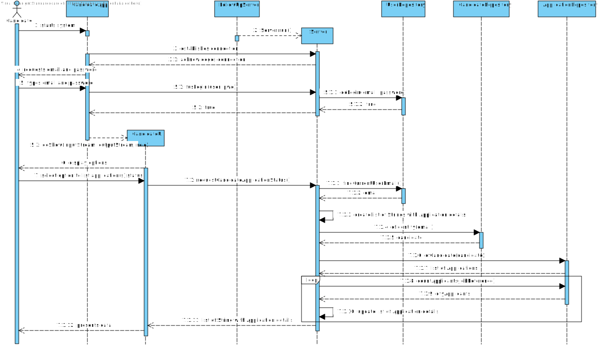

# US 3000 - List all applications and their state (including the number of applicants).

## 1. Context

The US will allow the user candidate, using the Candidate App, to obtain information about the job openings he has applied.
Namely, the list of all applications he has made.
Along with the list of applications, the candidate will be able to get the state for each of his applications, as well as the number of applicants to that job opening.

## 2. Requirements

**US 3000** As Candidate, I want to list all my applications and their state (including the number of applicants).

**Acceptance Criteria:**

- 3000.1. Data request must be made through the Follow-Up server.
- 3000.2. A message must be displayed in case there is no list of applications.

**Dependencies/References:**

It is dependent on [US 2002](../../Sprint B/us_2002/readme.md), being the US responsible for registering applications.

**Question and Answers**

> *"A176. Devem ser listadas todas as “applications” (candidaturas) do candidato, o estado delas, assim como o número de 
candidaturas que cada job opening teve (assim o candidato tem uma noção da “concorrência” que teve para cada uma das suas candidaturas)."*

## 3. Analysis

From the context and requirements, it was identified the following major features to take in consideration towards the design. <br>
- The Candidate app will need to establish a connection with the Follow-up Server (FUS) to perform requests of data within the database.
- The user needs a single option, within the app, to list his applications, and the required data for the present US.
- The app must request all user applications.
- The app must request user status for each of the applications.
- The app must request the number of applicants for each job opening the candidate is/was enrolled.

## 4. Design

### 4.1. Realization

Candidate UI has an option to list user's Applications. <br>

The Candidate App (CA) will establish a TCP connection with the FUS. <br>
The CA will send a request message with a code that will trigger FUS to handle the US. <br>
FUS will gather, from the database 3 information: <br>
    String with the reference of the job opening; <br>
    String with Candidate current status on the job opening; <br>
    Integer, cast to a String with the quantity of candidates that applied to the job opening.

Data will then be displayed as:

*Job Opening Reference: [job opening reference]* <br>
*Current Status: [candidate status on the job opening]* <br>
*# Applicants: [##] candidates applied* <br>

#### List Application details

| Interaction ID                                                                        | Question: Which class is responsible for...             | Answer                | Justification (with patterns) |
|:--------------------------------------------------------------------------------------|:--------------------------------------------------------|:----------------------|:------------------------------|
| Step 1 : System presents UI options                                                   | ... presenting Candidate options?                       | CandidateUI           | Pure Fabrication              |
| Step 2 : User selects option to list his Applications                                 | ... gather option selected?                             | CandidateUI           | Pure Fabrication              |
|                                                                                       | ... coordinating request?                               | Server                | Service                       |
| Step 3 : System collects data regarding User Applications                             | ... creating List of Strings?                           | Server                | Creator                       |
|                                                                                       | ... gathering user applications and status?             | ApplicationRepository | Information Expert            |
|                                                                                       | ... updating List of Strings?                           | Server                | Service                       |
| Step 4 : System gathers number of applicants for each Job Opening the user as applied | ... gathering the number of applicants per job opening? | ApplicationRepository | Information Expert            |
|                                                                                       | ... updating each String on the List of Strings?        | Server                | Service                       |
| Step 5 : System displays data accordingly                                             | ... display data contained on the List of Strings?      | CandidateUI           | Pure Fabrication              |

According to the taken rationale, the conceptual classes promoted to software classes are:

* Server

Other software classes (i.e. Pure Fabrication) identified:

* CandidateUI
* ApplicationRepository

### 4.2. Sequence Diagram



### 4.3. Tests

**Test 1:** *Validate that requests to Jobs4U database is only made through socket client/server request, through the FUS.*
<br> **Refers to Acceptance Criteria:** 3000.1.

```java
@Test
public void validateDatabaseRequestIsMadeThroughFUS() {  }
````

**Test 2:** *Validate that an adequate message is displayed whenever there's no data to be presented, or an error occurred.*
<br> **Refers to Acceptance Criteria:** 3000.2.

```java
@Test
public void validateMessageDisplayedForNullOrErrorResponse() {  }
````

## 5. Implementation

Functionality added to Candidate App UI.
New methods were added to Application and JobOpening Repositories, in order to accommodate the present US.

> Commit list (descending)
>
> f0cbfe620ff38e4262cfdffcc65ff85fd5f68a3c <br>
> 645dfcbd4d30e2bd5a7b5e7b38a5162c05b1becd <br>
> 63bd5b070e4dbcd9d8342ef800fb30ad0e7a5f56 <br>

## 6. Integration/Demonstration

Client/Server connection through socket was implemented, by using the FUS as server.
Action chain was ensured for each client request to have its corresponding response.
Threads were applied, so that multiple clients can interact with FUS server mode.

## 7. Observations

N/A