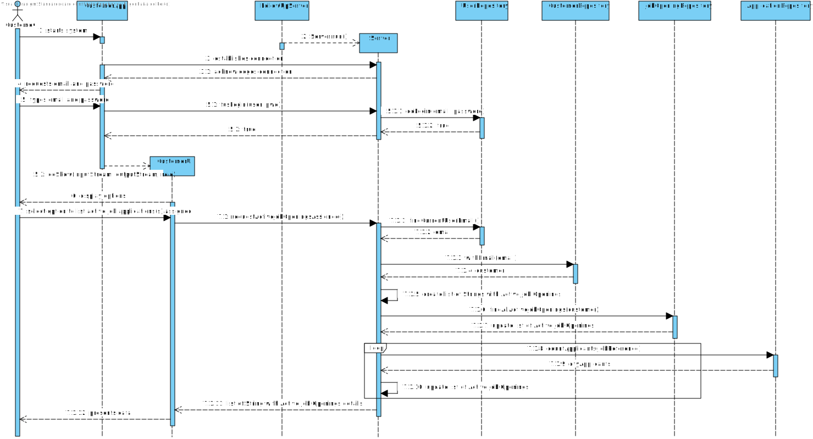

# US 3002 - List all job openings, including job reference, position, active since, number of applicants

## 1. Context

The US will allow the user customer, using the Customer App, to obtain information about the job openings assigned to him that are currently active.
Along with the list of job openings, the candidate will be able to view the job reference, title/function name, the date that the job opening started and the number of applicants.

## 2. Requirements

**US 3002** As Customer, I want to list all my job openings, including job reference, position, active since, number of applicants.

**Acceptance Criteria:**

- 3002.1. Data request must be made through the Follow-Up server.
- 3002.2. Display only active job openings
- 3002.3. Display only job openings assigned to him
- 3002.4. Display alert message when there's no job openings active or assigned at all

**Dependencies/References:**

It is dependent on [US 1002](../../Sprint B/us_1002/readme.md), being the US responsible for registering job openings.

**Question and Answers**

> *"A34. Nessa US quando referimos “position” tem o mesmo significado que “title or function” na secção 2.2.2."*

> *"A172. In the context of this US, “active since” means the date from the start of the process, the “application” phase (since that date, candidates can apply).
This functionality should include all the “active” job openings."*

## 3. Analysis

From the context and requirements, it was identified the following major features to take in consideration towards the design. <br>
- The Customer app will need to establish a connection with the Follow-up Server (FUS) to perform requests of data within the database.
- The user needs a single option, within the app, to list the job openings assigned to him, and the required data for the present US.
- The app must request all job applications assigned to user, and that are currently active.
- The app must gather information for each of the job openings.
- The app must request the number of applicants for each job opening the customer has assigned to him.

## 4. Design

### 4.1. Realization

Customer UI has an option to list user's assigned Job Openings. <br>

The Customer App (CA) will establish a TCP connection with the FUS. <br>
The CA will send a request message with a code that will trigger FUS to handle the US. <br>
FUS will gather, from the database 3 information: <br>
    String with the reference of the job opening; <br>
    String with the job title of the job opening; <br>
    Date, cast to a String with the date that the job opening started; <br>
    Integer, cast to a String with the quantity of candidates that applied to the job opening.

Data will then be displayed as:

*Job Opening: [job opening reference] [job title]* <br>
*Active Since: [job opening start date]* <br>
*# Applicants: [##] candidates applied* <br>

#### List Application details

| Interaction ID                                                                       | Question: Which class is responsible for...             | Answer                | Justification (with patterns) |
|:-------------------------------------------------------------------------------------|:--------------------------------------------------------|:----------------------|:------------------------------|
| Step 1 : System presents UI options                                                  | ... presenting Customer options?                        | CustomerUI            | Pure Fabrication              |
| Step 2 : User selects option to Job Openings assigned to him                         | ... gather option selected?                             | CustomerUI            | Pure Fabrication              |
|                                                                                      | ... coordinating request?                               | Server                | Service                       |
| Step 3 : System collects data regarding Job Openings assigned to him that are active | ... creating List of Strings?                           | Server                | Creator                       |
|                                                                                      | ... gathering job openings assigned to user?            | JobOpeningRepository  | Information Expert            |
|                                                                                      | ... updating List of Strings?                           | Server                | Service                       |
| Step 4 : System gathers number of applicants for each Job Opening                    | ... gathering the number of applicants per job opening? | ApplicationRepository | Information Expert            |
|                                                                                      | ... updating each String on the List of Strings?        | Server                | Service                       |
| Step 5 : System displays data accordingly                                            | ... display data contained on the List of Strings?      | CustomerUI            | Pure Fabrication              |

According to the taken rationale, the conceptual classes promoted to software classes are:

* Server

Other software classes (i.e. Pure Fabrication) identified:

* CustomerUI
* JobOpeningRepository
* ApplicationRepository

### 4.2. Sequence Diagram



### 4.3. Tests

**Test 1:** *Validate that requests to Jobs4U database is only made through socket client/server request, through the FUS.*
<br> **Refers to Acceptance Criteria:** 3002.1.

```java
@Test
public void validateDatabaseRequestIsMadeThroughFUS() {  }
````

**Test 2:** *Validate that job openings gathered from the database are all active ones.*
<br> **Refers to Acceptance Criteria:** 3002.2.

```java
@Test
public void validateGatheredJobOpeningsAreActive() {  }
````

**Test 3:** *Validate that job openings gathered from the database are all assigned to requester user.*
<br> **Refers to Acceptance Criteria:** 3002.3.

```java
@Test
public void validateGatheredJobOpeningsAreAssignedToUserRequester() {  }
````

**Test 4:** *Validate that empty query is handled.*
<br> **Refers to Acceptance Criteria:** 3002.4.

```java
@Test
public void validateErrorMessageIsIssuedForEmptyQuery() {  }
````

## 5. Implementation

Functionality added to Customer App UI.
New methods were added to JobOpening Repositories, in order to accommodate the present US.

> Commit list (descending)
>
> 819bce8 <br>
> 4c8e544 <br>
> c65c6ab <br>
> 404ae6c

## 6. Integration/Demonstration

Client/Server connection through socket was updated, by using the FUS as server.
Action chain was ensured for new client request to have its corresponding response.
Threads were applied, so that multiple clients can interact with FUS server mode.

## 7. Observations

N/A