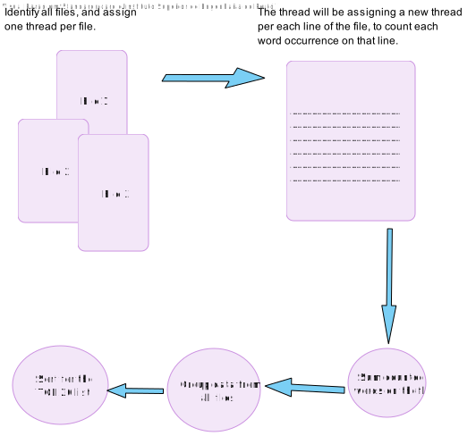
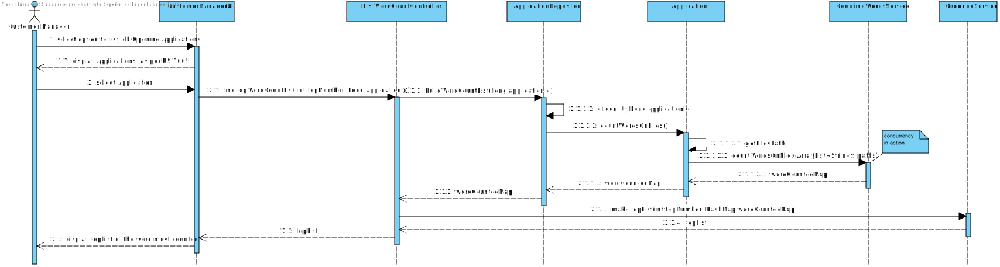

# US 4000 - Display a top 20 of the most referenced words in the files uploaded by a candidate and where they are in the document

## 1. Context

The US will allow the user customer manager to obtain additional information about the candidate application deliverables.
Namely, the list of the top 20 words most referenced, across all files sent.
The US will be integrated along with previous US's developed to display candidate data to the same system user.

## 2. Requirements

**US 4000** As a Customer Manager, when displaying the candidate data, I expect the system to present a top 20 list of the most frequently referenced words from files uploaded by a candidate.
Additionally, I require a comprehensive list of the files in which these words appear.

**Acceptance Criteria:**

- 4000.1. Developed in Java and utilize threads along with the synchronization mechanisms outlined in SCOMP.
- 4000.2. Utilization of any Java concurrency mechanisms beyond those covered in class, including thread pools, streams, etc., is strictly prohibited.
- 4000.3. Avoid employing data types that inherently support concurrent access.
- 4000.4. Include the number of occurrences of each word.
- 4000.5. Include the files in which each word appears.
- 4000.6. Only present applications the Customer Manager is managing.

**Dependencies/References:**

It is dependent on [US 1005](../../Sprint B/us_1005/readme.md), being the US responsible for listing the applications for a given job opening.

**Question and Answers**

> *"Q170. (...) pretende escolher uma candidatura desse mesmo candidato e criar a respetiva lista, ou se pretende que esta lista seja criada, tendo em conta todas as candidaturas associadas a esse candidato.
> A170 A lista de palavras é relativa a uma candidatura em particular"*

> *"A185. Yes, the order is important.
> The system must present a top 20 list, from most referenced words to less referenced words."*

> *"Q186. (...) should all types of words be counted, or are there words that don't make sense to count, such as conjunctions?
> A186. For the moment there are no restrictions like the one you mention since they depend on the language used in the text (the solution could/would be complex)."* 

> *"A187. (...) This regards all the possible applications of a candidate that the customer manager is managing."*

> *"A220. (...) para cada palavra em que ficheiros aparece."*

## 3. Analysis

From the context and requirements, it was identified the following major features to take in consideration towards the design. <br>
- The Customer Manager (CM) will have to be able to select a single application from the job openings he is managing.
- The CM will select one job opening he is managing.
- The CM will then select one application.
- The system must use the files path stored within the application to find the files to process.
- The system will process all files and list the top 20 most used words.
- No restriction to be applied on the type of word, such as "I", "AM", "AND", etc.
- No case (upper-case vs lower-case) restriction to be applied.
- The system must present the application data, with US required data along with it.

## 4. Design

### 4.1. Realization

Customer Manager UI has an option to list Applications for a given Job Opening. <br>
With the present US development, it will be then able to use one of the Application listed to visualize additional data. <br>
Namely, the Application Top 20 Words count from the files submitted.

The system will use concurrent threads to read each file. <br>
It will also use concurrent threads to count words in each line. <br>
The file thread will also start a thread to manage the word count of each line. <br>
Finally, the main thread will combine data from each file thread and sort it. <br>
The information will be kept only during runtime, to ensure that only the most updated files will be taken in consideration.

Data will then be displayed as:

*[other application details to be displayed as per US 1005]*

*| APPLICATION TOP 20 WORDS |*

*[word index ascending] | [word] | [times found] | [files separated by semicolon] |* <br>

#### List top 20 most referenced words

| Interaction ID                                                     | Question: Which class is responsible for...         | Answer                  | Justification (with patterns) |
|:-------------------------------------------------------------------|:----------------------------------------------------|:------------------------|:------------------------------|
| Step 1 : Candidate selects Application from the list               | ... collect selected Application?                   | CustomerManagerUI       | Pure Fabrication              |
|                                                                    | ... coordinating request?                           | ListWordCountController | Controller                    |
| Step 2 : System finds Application and it's files location          | ... find selected Application?                      | ApplicationRepository   | Information Expert            |
|                                                                    | ... requesting word count Map?                      | ApplicationRepository   | Information Expert            |
| Step 3 : System counts words on files to an HashMap                | ... find valid files associated to the Application? | Application             | Information Expert            |
|                                                                    | ... requesting word count Map?                      | Application             | Information Expert            |
|                                                                    | ... counting words on files to a Map?               | CountingWordsService    | Service                       |
| Step 4 : System Builds an array with the top 20 words most counted | ... ordering words on the Map to a top list array?  | OrderingService         | Service                       |
| Step 5 : System displays list                                      | ... displaying list to user?                        | CustomerManagerUI       | Pure Fabrication              |

According to the taken rationale, the conceptual classes promoted to software classes are:

* CountingWordsService
* OrderingService

Other software classes (i.e. Pure Fabrication) identified:

* CustomerManagerUI
* ListWordCountController
* ApplicationRepository
* Application

### 4.2. Logical and Sequence Diagram





### 4.3. Tests

**Test 1:** *Ensure that the list of words returned only contains words known in the files.* <br>
**Refers to Acceptance Criteria:** 4000.4.

```java
@Test
public void onlyFileWordsArePartOfTheList() {  }
````

**Test 2:** *Ensure the word count is equal to the known word count.* <br>
**Refers to Acceptance Criteria:** 4000.4.

```java
@Test
public void validateWordCount() {  }
````

**Test 3:** *The list only contains known files.* <br>
**Refers to Acceptance Criteria:** 4000.5.

```java
@Test
public void displayOnlyKnownFiles() {  }
````

## 5. Implementation

Functionality added to Backoffice App, Customer Manager UI. <br>
It was implemented with thread concurrency. <br>
Critical data was assured using synchronization methods. <br>

The implementation had minor changes, since the UI already had access to a list of Applications, thus making it irrelevant to collect that data from the repository.

> Commit list (descending)
>
> ...

## 6. Integration/Demonstration

A new UI feature was added to US 1005 UI option of listing Applications of a given Job Opening. <br>
The user is now able to select one of the applications and list its details, being US 4000 part of them.

## 7. Observations

N/A