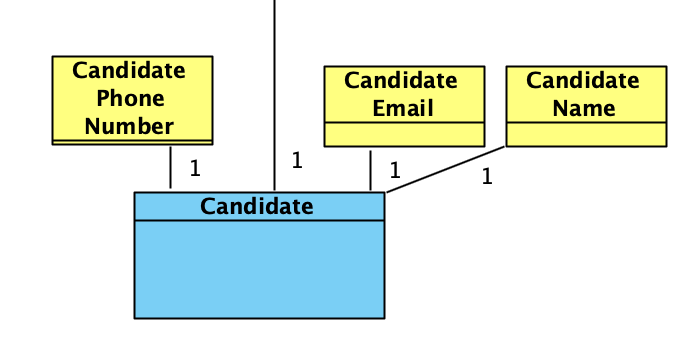
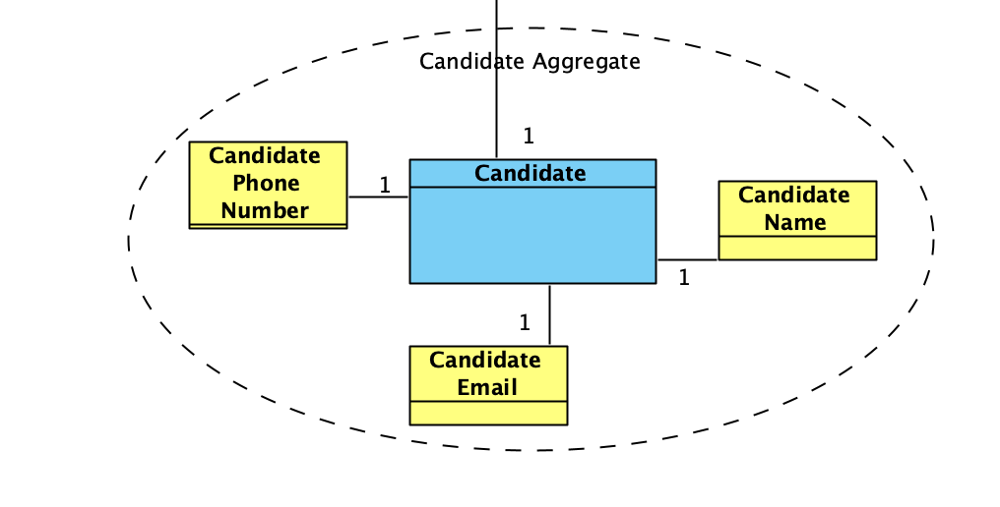
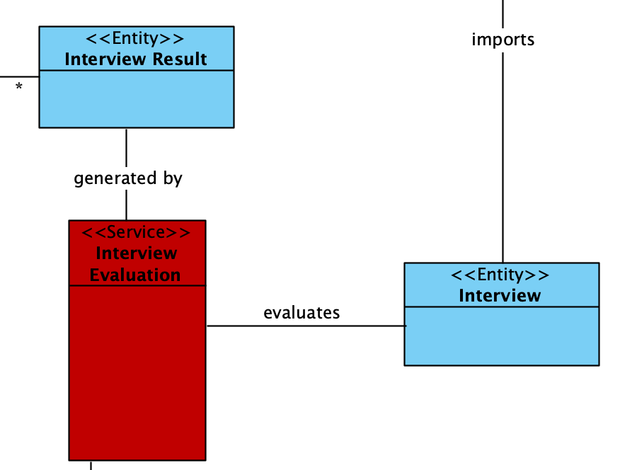
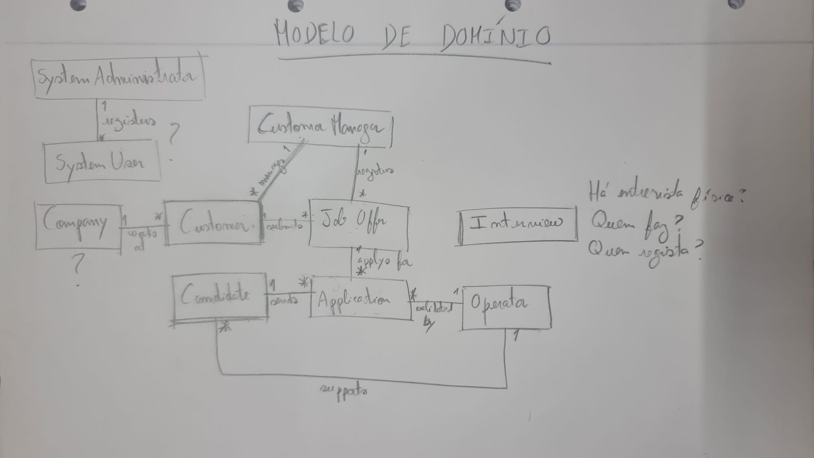

# US G006

*Elaborate the Domain Model using DDD.*

## 1. Context

*This is a new task. DDD stands for "Domain-Driven Design" which is a software develompent appproach that focuses on the processes and rules of the projects domain.*

## 2. Requirements

**US G006** s Project Manager, I want the team to elaborate a Domain Model using DDD.

**Acceptance Criteria:**

- G006.1. The entities should be identified.
- G006.2. The value objects should be identified.
- G006.3. The aggregates should be identified.
- G006.4. If responsibility atribution of a task is not clear, a service should be created for executing it.

**Dependencies/References:**

*Regarding this requirement we understand that it relates to the future Class Diagram.*

## 3. Analysis

### 3.1. Entities and Value Objects 

The folowing screenshot was taken from https://blog.sapiensworks.com/post/2016/07/29/DDD-Entities-Value-Objects-Explained.

 
So, entities need to be single identifiable items that matter to the buisness.
Based on this information, we defined the following entities inside the business domain:

- Customer Manager
- Customer
- Candidate
- Operator
- Job Offer
- Application
- Application Result
- Interview
- Interview Result
- Language Engineer
- Requirement Specefications Module
- Interview Module

On the other hand, value objects are objects that are not defined by their identity, but rather by a set of attributes. They are immutable and are used to describe entities.
We associated each entity with it´s respective value objects.

For example:

### 3.2. Aggregates
The folowing screenshot was taken from https://moodle.isep.ipp.pt/ (Author: Prof. Pedro Gandra Sousa)

Based on this definition, we aggregated the entities with their respective value objects since they are related.

For example:

### 3.3. Services
The follwing screenshot was taken from https://enterprisecraftsmanship.com/posts/domain-vs-application-services/

When the responsibility atribution of a task is not clear, a service can be created for executing it.
There were also some taks that we identified as services because they woulh overwelm the entities if they were included in them.
For example, the evaluation of an interview could have been included in the Interview entity, but it would make it too complex.

Example:

## 4. Design

### 4.1. Realization

### Domain Model 1

*This was the first domain model aproach.*

*Problems:*
* Usage of system users which are irrelevant for the domain model.
* Not kwoing the difference between entities and value objects yet.
* Not knowing how "Interview" should be represented.
* Too simple.

*At this point we started asking the client questions and improved our aproach.*

**Question:** "As entrevistas são feitas presencialmente? Se sim, quem é responsável por registar essas respostas no sistema?"

**Answer:** "O meio usado para as entrevistas está fora do âmbito do sistema. Podem ser presenciais, remotas (ex: telefone ou outro meio). Independentemente do meio, o Customer Manager é o responsável por registar as respostas no sistema, através da submissão (upload) do ficheiro de texto com as respostas do candidato."

**Question:** "Quem é responsável por analisar as candidaturas (applications)?"

**Answer:** "Será o Customer Manager. Este analisa as candidaturas e decide o ranking dos candidatos."

### Domain Model 2

*In our second aproach, we started to distinguish entities from value objects and added services.*

*Problems:*
* Sharing value objects might not be necessary.
* It is not the Candidate who uses the "Interview Serivce", but the Customer Manager.
* The services do not have the correct names.
* Each object must be identified with a stereotype (entity, value object, service).
* The "requirement specification service" does not generate anything.

### 4.2. Applied Patterns
We applied a Domain-Driven Design approach to the development of the domain model.

### 4.3. Tests

**Test 1:** *Verifies that the entities were identified.*

**Refers to Acceptance Criteria:** G006.1

**Test 2:** *Verifies that the vale objects were identified.*

**Refers to Acceptance Criteria:** G006.2

**Test 3:** *Verifies that the aggregates were identified.*

**Refers to Acceptance Criteria:** G006.3

**Test 4:** *Verifies that services were identified, when needed.*

**Refers to Acceptance Criteria:** G006.4

## 5. Implementation

*In this section the team should present, if necessary, some evidencies that the implementation is according to the design. It should also describe and explain other important artifacts necessary to fully understand the implementation like, for instance, configuration files.*

*It is also a best practice to include a listing (with a brief summary) of the major commits regarding this requirement.*

## 6. Integration/Demonstration

*In this section the team should describe the efforts realized in order to integrate this functionality with the other parts/components of the system*

*It is also important to explain any scripts or instructions required to execute an demonstrate this functionality*

## 7. Observations

*This section should be used to include any content that does not fit any of the previous sections.*

*The team should present here, for instance, a critical prespective on the developed work including the analysis of alternative solutioons or related works*

*The team should include in this section statements/references regarding third party works that were used in the development this work.*