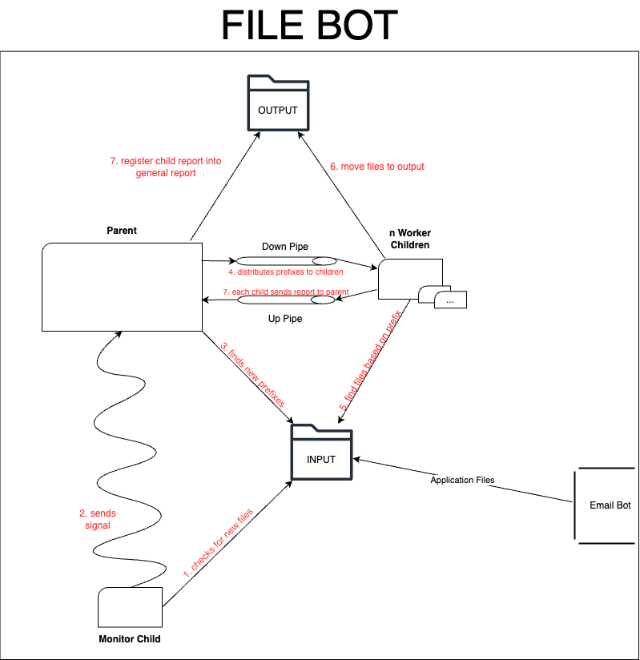

# SCOMP 23/24

## Percentagem de contribuição de cada elemento do grupo no sprint

|  NUMERO | NOME              | % CONTRIBUICAO |
|--------:|:------------------|:--------------:|
| 1191814 | JORGE SANTOS      |      25 %      |
| 1212045 | NUNO VENÂNCIO     |      25 %      |
| 1212047 | RAFAEL CAROLO     |      25 %      |
| 1221720 | RICARDO GONÇALVES |      25 %      |

## As funcionalidades implementadas e a respectiva percentagem funcional

| Funcionalidade                                                      | % Funcional |
|:--------------------------------------------------------------------|:-----------:|
| Monitorizar novos ficheiros                                         |    100 %    |
| Mover ficheiros e gerar dados para relatório de forma concorrente   |    100 %    |
| Compilar trabalho efetuado no relatório                             |    100 %    |
| Terminar todos os processos quando executado comando de interrupção |    100 %    |
| Testes unitários às funcionalidades do programa                     |    100 %    |

### Nos casos em que uma funcionalidade não esteja 100% implementada de acordo com o previsto, devem ser indicadas todas as situações que determinam essa percentagem

N/A

## Um diagrama que explique os diversos componentes usados e as suas interacções

## Outros aspetos que entendam ser importante referir

* No documento de especificações é solicitado para copiar do diretório input para o diretório output.  
Contudo, após termos questionado o cliente, este apenas exigiu que fosse garantida a consistência dos dados.